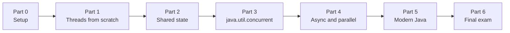

# Java Concurrency and Multithreading: The Course

This course has 27 lessons. It starts with "I have never started a thread" and ends with a program that fetches and processes work concurrently on virtual threads, with executors, concurrent collections and `CompletableFuture` doing their jobs along the way.

Most concurrency tutorials start at `ExecutorService` and never explain why `counter++` is broken. This one builds from the ground up. You create raw threads, you break things on purpose with race conditions, deadlocks and lost updates, and then you learn the tool Java provides to fix each problem. By the time you reach virtual threads and structured concurrency, you know what problem they solve.

---

## How to use this course

Each lesson follows the same shape:

- **What you'll learn**: three or four things you'll walk away with
- **Why this matters**: the problem the concept solves, explained before the mechanism
- **The concept**: explanation and diagrams
- **Hands-on**: complete programs you type in and run yourself
- **Try it yourself**: exercises, with no answers given
- **Common mistakes**: the ones that actually bite people
- **Check your understanding**: a short quiz with reveal-on-click answers
- **Recap**

Work through the lessons in order. Each one builds on the last, and the quizzes assume you ran the code.

### Every sample is one file

Every program in this course is a single, self-contained Java 25 file that you run directly:

```bash
java RaceCondition.java
```

You don't need Maven, a project or an IDE. [Lesson 00](part-0-setup/00-running-the-samples.md) shows you how.

### Prerequisites

You should be comfortable with core Java: classes, interfaces, lambdas, collections and exceptions. You don't need any prior concurrency experience.

---

## The path



---

## Part 0: Setup

| # | Lesson |
|---|---|
| 00 | [Running the samples](part-0-setup/00-running-the-samples.md) |

## Part 1: Threads From Scratch

| # | Lesson |
|---|---|
| 01 | [Concurrency vs parallelism](part-1-threads-from-scratch/01-concurrency-vs-parallelism.md), processes and threads |
| 02 | [Your first thread](part-1-threads-from-scratch/02-your-first-thread.md) |
| 03 | [The thread lifecycle](part-1-threads-from-scratch/03-thread-lifecycle.md): states, `sleep`, `join`, daemons |
| 04 | [Interruption](part-1-threads-from-scratch/04-interruption.md): stopping a thread politely |

## Part 2: Shared State

| # | Lesson |
|---|---|
| 05 | [Race conditions](part-2-shared-state/05-race-conditions.md) |
| 06 | [`synchronized` and intrinsic locks](part-2-shared-state/06-synchronized.md) |
| 07 | [Visibility, `volatile` and happens-before](part-2-shared-state/07-visibility-and-volatile.md) |
| 08 | [`wait`, `notify` and guarded blocks](part-2-shared-state/08-wait-and-notify.md) |
| 09 | [Deadlock, livelock and starvation](part-2-shared-state/09-liveness.md) |

## Part 3: `java.util.concurrent`

| # | Lesson |
|---|---|
| 10 | [Executors and thread pools](part-3-java-util-concurrent/10-executors.md) |
| 11 | [`Callable` and `Future`](part-3-java-util-concurrent/11-callable-and-future.md) |
| 12 | [Atomic variables and CAS](part-3-java-util-concurrent/12-atomics.md) |
| 13 | [Explicit locks](part-3-java-util-concurrent/13-explicit-locks.md) |
| 14 | [Synchronizers](part-3-java-util-concurrent/14-synchronizers.md): latches, barriers, semaphores |
| 15 | [Concurrent collections](part-3-java-util-concurrent/15-concurrent-collections.md) |
| 16 | [Sharing safely without locks](part-3-java-util-concurrent/16-immutability-threadlocal-scopedvalue.md): immutability, `ThreadLocal`, `ScopedValue` |

## Part 4: Async and Parallel

| # | Lesson |
|---|---|
| 17 | [Scheduled executors](part-4-async-and-parallel/17-scheduled-executors.md) |
| 18 | [`CompletableFuture`](part-4-async-and-parallel/18-completablefuture.md) |
| 19 | [Fork/Join and work stealing](part-4-async-and-parallel/19-fork-join.md) |
| 20 | [Parallel streams](part-4-async-and-parallel/20-parallel-streams.md) |

## Part 5: Modern Java

| # | Lesson |
|---|---|
| 21 | [Virtual threads](part-5-modern-java/21-virtual-threads.md) |
| 22 | [Structured concurrency](part-5-modern-java/22-structured-concurrency.md) |
| 23 | [Concurrency patterns](part-5-modern-java/23-concurrency-patterns.md) |
| 24 | [Debugging and testing concurrent code](part-5-modern-java/24-debugging-and-testing.md) |
| 25 | [Capstone: a concurrent word counter](part-5-modern-java/25-capstone.md) |

## Part 6: Final Exam

| # | Lesson |
|---|---|
| 26 | [Final exam](part-6-final-exam/26-final-exam.md) |

---

## Demos already in this repository

The repository also has some hands-on demos and deeper notes. Here is where each one fits:

| File | Goes with |
|---|---|
| [`org/javaguy/Main.java`](../src/main/java/org/javaguy/Main.java), [`CustomThread.java`](../src/main/java/org/javaguy/CustomThread.java), [`CustomRunnableThread.java`](../src/main/java/org/javaguy/CustomRunnableThread.java) | Lessons 02–04 |
| [`multithread/Main.java`](../src/main/java/org/javaguy/multithread/Main.java) | Lesson 02 (named, coloured threads running side by side) |
| [`synchronizedkey/BankAccount.java`](../src/main/java/org/javaguy/synchronizedkey/BankAccount.java) | Lesson 06 |
| [`executors/ExecutorThread.java`](../src/main/java/org/javaguy/executors/ExecutorThread.java) | Lesson 10 |
| [`callable/CallableDemo.java`](../src/main/java/org/javaguy/callable/CallableDemo.java) | Lesson 11 |
| [`concurrentcollections/ConcurrentHashMapDemo.java`](../src/main/java/org/javaguy/concurrentcollections/ConcurrentHashMapDemo.java) | Lesson 15 |
| [`concurrentcollections/CC.MD`](../src/main/java/org/javaguy/concurrentcollections/CC.MD) | Lesson 15 deep dive |
| [`docs/map-internals.md`](../docs/map-internals.md) | Lesson 15 deep dive (how `ConcurrentHashMap` works inside) |

---

## Versions

| | Version |
|---|---|
| Java | 25 (LTS) |
| Build tool | none; every sample runs with `java File.java` |

Features used in this course, and where each one stands in Java 25:

| Feature | Status in Java 25 |
|---|---|
| Compact source files and instance `main` (`void main()`) | Final (JEP 512) |
| `java.lang.IO` (`IO.println`) | Final (JEP 512) |
| Virtual threads | Final since Java 21 |
| No pinning inside `synchronized` | Final since Java 24 (JEP 491) |
| `ScopedValue` | Final (JEP 506) |
| `StructuredTaskScope` | **Preview** (JEP 505), needs `--enable-preview` |

---

## Reference

The book that pairs best with this course is Jay Wang, *Java Concurrency and Parallelism* (Packt). Chapters 1–5 cover the same ground as Parts 1–5 here. For the Java Memory Model in depth, read Goetz et al., *Java Concurrency in Practice*.

---

Ready? **[Start with Lesson 00](part-0-setup/00-running-the-samples.md)**
