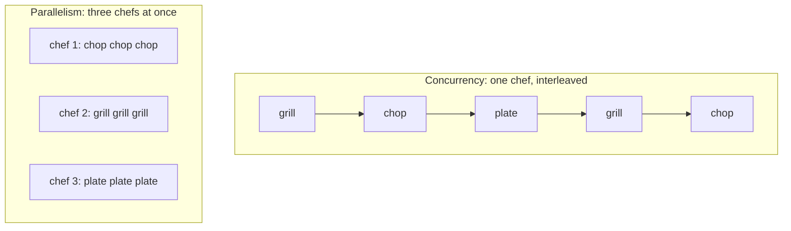
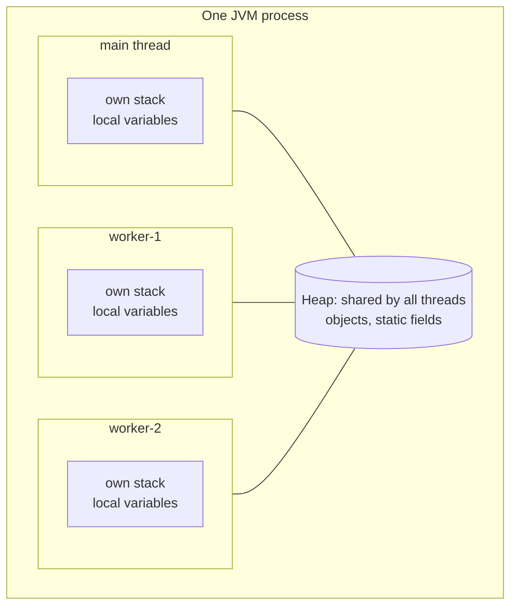

# Lesson 01: Concurrency vs Parallelism

## What you'll learn

- The difference between concurrency and parallelism, and why people mix them up
- What a process is, what a thread is, and what they share
- Why threads help when a program is *waiting* (I/O-bound) and when it is *computing* (CPU-bound), and why the reasons differ

---

## Why this matters

A web server receives 500 requests a second. Each one spends 5 ms computing and 95 ms waiting for a database. If the server handled one request at a time, it would manage about 10 requests a second and spend most of its life idle.

Threads are how Java does something useful during that wait. But threads also bring every hard problem in this course: race conditions, deadlocks and invisible writes. Before you touch any of that, you need a clear picture of what threads buy you.

---

## The concept

### The restaurant kitchen

Picture a kitchen that has three dishes to prepare: chop vegetables, grill a steak and plate a dessert.

**One chef, switching between tasks (concurrency).** The chef puts the steak on the grill, and while it cooks, chops vegetables, then plates the dessert, then flips the steak. Only one pair of hands is working at any instant, but all three dishes are *in progress* at the same time. The chef makes progress by switching whenever a task is waiting.

**Three chefs, each on a task (parallelism).** Each chef works on one dish. At any instant, three pairs of hands are moving. The work literally happens at the same time.



In one sentence each:

- **Concurrency** is about *structure*: dealing with many things at once, by managing several tasks that overlap in time.
- **Parallelism** is about *execution*: doing many things at once, by running several tasks on several CPU cores at the same instant.

A concurrent program runs correctly on a single core, where the operating system switches between its threads. On a multi-core machine, the same program may also run in parallel. You write concurrent code, and the hardware decides how much parallelism you get.

### Processes and threads

A **process** is a running program, with its own memory space. Your IDE, your browser and every `java` command you launch are separate processes. One process cannot read another's memory directly. This isolation is what keeps a crashed browser tab from taking down your editor.

A **thread** is a path of execution *inside* a process. Every process starts with one thread (in Java, the `main` thread), and it can create more.



This is the most important picture in the course:

| | Process | Thread |
|---|---|---|
| Memory | Own, isolated | **Shares the heap** with every other thread in the process |
| Local variables | n/a | Own stack, private to the thread |
| Cost to create | High (new memory space) | Lower (a stack and a scheduler entry) |
| Communicating | Sockets, pipes, files | Just read and write the same objects |
| Failure | Isolated | An unhandled exception kills only that thread, but corrupted shared data affects everyone |

Threads share the heap, which is why they are so easy to coordinate: every thread can see the same `List`, the same `Map` and the same `balance` field. It is also why they are dangerous, because two threads can change that same field at the same time. Part 2 of the course is about that danger.

**Local variables are safe. Shared objects are not.** A local variable lives on one thread's stack, and no other thread can touch it. Anything reachable from a field or a static field lives on the heap, where every thread can reach it.

### Context switching

A machine with 12 cores can run at most 12 threads *at the same instant*. If there are more threads than that, the operating system's **scheduler** gives each thread a short slice of time and then switches to another. That swap is a **context switch**: save one thread's registers and stack pointer, then load another's.

Context switches are cheap, but they aren't free. A few thousand platform threads is fine. A million is not. That limit is why virtual threads exist (Lesson 21).

### I/O-bound vs CPU-bound

Why add threads at all? It depends on what your task spends its time doing.

- **I/O-bound**: the task mostly *waits* for a database, an HTTP call, a disk or a sleep. Threads help because while one waits, another runs. You can usefully have far more threads than cores.
- **CPU-bound**: the task mostly *computes*, like crunching numbers, compressing or hashing. Threads help only up to the number of cores. After that, extra threads just take turns on the same cores.

---

## Hands-on

### 1. The one-chef kitchen, sequential

`SequentialKitchen.java`:

```java
void main() throws InterruptedException {
    long start = System.currentTimeMillis();

    cook("Chopping vegetables", 600);
    cook("Grilling steak", 800);
    cook("Plating dessert", 400);

    IO.println("Total: " + (System.currentTimeMillis() - start) + " ms");
}

void cook(String task, long millis) throws InterruptedException {
    IO.println(task + "...");
    Thread.sleep(millis);
    IO.println(task + " done");
}
```

```
Chopping vegetables...
Chopping vegetables done
Grilling steak...
Grilling steak done
Plating dessert...
Plating dessert done
Total: 1804 ms
```

600 + 800 + 400 = 1800 ms. Each task waits for the one before it.

### 2. The same kitchen with threads

`Thread.sleep` stands in for waiting: a grill heating up, or a database answering. Give each task its own thread. Don't worry about the syntax yet, because Lesson 02 covers it line by line.

`ConcurrentKitchen.java`:

```java
void main() throws InterruptedException {
    long start = System.currentTimeMillis();

    Thread chop = new Thread(() -> cook("Chopping vegetables", 600));
    Thread grill = new Thread(() -> cook("Grilling steak", 800));
    Thread plate = new Thread(() -> cook("Plating dessert", 400));

    chop.start();
    grill.start();
    plate.start();

    chop.join();
    grill.join();
    plate.join();

    IO.println("Total: " + (System.currentTimeMillis() - start) + " ms");
}

void cook(String task, long millis) {
    IO.println(task + "...");
    try {
        Thread.sleep(millis);
    } catch (InterruptedException e) {
        Thread.currentThread().interrupt();
        return;
    }
    IO.println(task + " done");
}
```

One run (yours will be ordered differently):

```
Grilling steak...
Plating dessert...
Chopping vegetables...
Plating dessert done
Chopping vegetables done
Grilling steak done
Total: 805 ms
```

Two things to notice:

1. **The total is the longest task (800 ms), not the sum.** All three waits overlapped.
2. **The start order is not the order you called `start()`.** You started `chop` first, but `grill` printed first. The scheduler decides who runs when, and you get no guarantee. Get used to that now, because it is true for everything in this course.

### 3. CPU-bound work: the core count matters

Sleeping threads use almost no CPU, so they overlap perfectly. Real computation is different. `CpuBound.java` counts primes, which is pure CPU work:

```java
void main() throws InterruptedException {
    int cores = Runtime.getRuntime().availableProcessors();
    IO.println("Cores: " + cores);

    long start = System.currentTimeMillis();
    for (int i = 0; i < 4; i++) {
        countPrimes(2_000_000);
    }
    IO.println("Sequential, 4 jobs: " + (System.currentTimeMillis() - start) + " ms");

    start = System.currentTimeMillis();
    List<Thread> threads = new ArrayList<>();
    for (int i = 0; i < 4; i++) {
        Thread thread = new Thread(() -> countPrimes(2_000_000));
        threads.add(thread);
        thread.start();
    }
    for (Thread thread : threads) {
        thread.join();
    }
    IO.println("Parallel, 4 jobs:   " + (System.currentTimeMillis() - start) + " ms");
}

long countPrimes(int limit) {
    long count = 0;
    for (int n = 2; n < limit; n++) {
        if (isPrime(n)) {
            count++;
        }
    }
    return count;
}

boolean isPrime(int n) {
    for (int divisor = 2; (long) divisor * divisor <= n; divisor++) {
        if (n % divisor == 0) {
            return false;
        }
    }
    return true;
}
```

On a 12-core machine:

```
Cores: 12
Sequential, 4 jobs: 3341 ms
Parallel, 4 jobs:   1174 ms
```

That is real parallelism: four cores computing at the same instant. Notice it isn't a perfect 4× speedup. The sequential run's first job also paid for JIT warm-up, the threads compete for memory bandwidth, and the CPU may lower its clock speed when several cores are busy. Speedups in real life are always less than the core count.

---

## Try it yourself

1. In `ConcurrentKitchen`, delete the three `join()` calls. What does `Total` print now, and why?
2. In `CpuBound`, change both loops from `4` jobs to `cores * 2` jobs. Does the parallel version still get faster as you add threads? At what point does it stop?
3. Run `ConcurrentKitchen` five times in a row. Write down the order the `...` lines appear in each run.

---

## Common mistakes

- **"Concurrent means faster."** Concurrency is a way to structure work. It only speeds things up when tasks wait (I/O) or when there are free cores (CPU). Four CPU-bound threads on a one-core machine are *slower* than one, because of the context switches.
- **"More threads, more speed."** For CPU-bound work, going past the core count gains nothing. For I/O-bound work, platform threads cost memory, and thousands of them start to hurt (until Lesson 21).
- **Assuming start order equals run order.** `a.start(); b.start();` does not mean `a` runs first.
- **Forgetting that the heap is shared.** A field on an object that two threads can reach is shared state, whether or not you meant it to be.

---

## Check your understanding

**1. A single-core machine runs a program with four threads. Is it concurrent, parallel or both?**

<details>
<summary>Reveal answer</summary>

Concurrent, not parallel. The four threads are all in progress, and the scheduler interleaves them on one core. Only one executes at any instant, so nothing runs in parallel.

</details>

**2. Two threads each run a method that declares `int total = 0;` and adds to it in a loop. Can they interfere with each other's `total`?**

<details>
<summary>Reveal answer</summary>

No. `total` is a local variable, so each thread has its own copy on its own stack. Interference is only possible through shared heap state: fields, static fields and objects both threads can reach.

</details>

**3. A service spends 90% of each request waiting for HTTP calls. On an 8-core machine, is 8 the right number of threads?**

<details>
<summary>Reveal answer</summary>

No, it's far too few. The work is I/O-bound, so each thread spends most of its time waiting and using no CPU. You can run many more threads than cores and keep the CPUs busy. The core count is the right guide for CPU-bound work, not for waiting.

</details>

**4. Why did `ConcurrentKitchen` take about 800 ms and not 1800 ms?**

<details>
<summary>Reveal answer</summary>

The three sleeps overlapped. All three threads were waiting at the same time, so the total became the length of the longest task (800 ms) and not the sum of all three.

</details>

**5. What do threads in one process share, and what does each thread keep for itself?**

<details>
<summary>Reveal answer</summary>

They share the heap: every object and every static field. Each thread has its own stack, which holds its local variables and its chain of method calls.

</details>

---

## Recap

- **Concurrency** is structuring overlapping tasks. **Parallelism** is executing tasks at the same instant on multiple cores.
- A **process** has isolated memory. **Threads** inside it share the heap and each have a private stack.
- Threads help I/O-bound work by overlapping the waits, and CPU-bound work only up to the core count.
- The scheduler decides the order threads run in. Never rely on it.

**Next: [Lesson 02, Your first thread](02-your-first-thread.md)**
