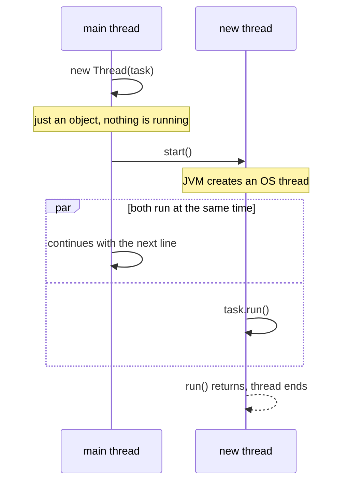

# Lesson 02: Your First Thread

## What you'll learn

- Four ways to create a thread, and which one to prefer
- Why `start()` creates a thread and `run()` does not
- Why output from two threads interleaves differently on every run
- Why a thread can be started only once

---

## Why this matters

Everything higher-level in Java concurrency (executors, `CompletableFuture`, virtual threads, Spring's `@Async`) ends in the same place: a `Thread` running a `Runnable`. Once you've created threads by hand, the frameworks stop being magic, and the bugs they hide become easy to recognise.

---

## The concept

A `Thread` object represents a thread of execution. What the thread *does* is a `Runnable`, an interface with one method:

```java
@FunctionalInterface
public interface Runnable {
    void run();
}
```

Think of it as a job and a worker. The `Runnable` is the job description, and the `Thread` is the worker who carries it out. Keeping the two separate is what later lets a thread pool reuse one worker for thousands of jobs.

Creating a `Thread` object does *not* create an operating-system thread. That happens only when you call `start()`:



`start()` returns immediately. From that moment, two threads run side by side, and the scheduler decides which one moves when.

---

## Hands-on

### 1. Four ways to create a thread

`FourWays.java`:

```java
void main() throws InterruptedException {
    Thread first = new PrinterThread();

    Thread second = new Thread(new PrinterTask());

    Thread third = new Thread(() -> printFrom("lambda"));

    Thread fourth = Thread.ofPlatform()
            .name("builder-thread")
            .unstarted(() -> printFrom("builder"));

    first.start();
    second.start();
    third.start();
    fourth.start();

    first.join();
    second.join();
    third.join();
    fourth.join();
    IO.println("main is done");
}

void printFrom(String style) {
    IO.println(style + " running on " + Thread.currentThread().getName());
}

class PrinterThread extends Thread {
    @Override
    public void run() {
        IO.println("subclass running on " + getName());
    }
}

class PrinterTask implements Runnable {
    @Override
    public void run() {
        IO.println("runnable running on " + Thread.currentThread().getName());
    }
}
```

One run:

```
subclass running on Thread-0
runnable running on Thread-1
builder running on builder-thread
lambda running on Thread-2
main is done
```

`join()` makes `main` wait until each thread finishes. It gets a full explanation in Lesson 03. The four styles compare like this:

| Style | Verdict |
|---|---|
| `extends Thread` | Avoid. It ties the job to the worker. Your class can't extend anything else, and you can't hand the job to a thread pool later. |
| `new Thread(Runnable)` with a named class | Fine when the task has state or is reused. |
| `new Thread(() -> ...)` with a lambda | The usual choice for short tasks. |
| `Thread.ofPlatform()` builder | The modern API (Java 21+). It sets the name, daemon flag and priority in one readable chain, and the same builder style gives you virtual threads with `Thread.ofVirtual()` in Lesson 21. |

**Name your threads.** `Thread-2` in a thread dump tells you nothing. `invoice-sender` tells you everything. Every constructor has an overload that takes a name: `new Thread(task, "invoice-sender")`.

### 2. `start()` vs `run()`

`StartVsRun.java`:

```java
void main() throws InterruptedException {
    Thread worker = new Thread(() -> IO.println("Running on: " + Thread.currentThread().getName()), "worker");

    worker.run();

    worker.start();
    worker.join();
}
```

```
Running on: main
Running on: worker
```

`worker.run()` is a plain method call. The code runs *on the calling thread* (`main`), and no new thread is created. Only `start()` asks the JVM for a new thread, which then calls `run()` for you.

This is one of the most common beginner bugs because the program still *works*, and it just runs everything one after another. Nothing fails, and nothing runs concurrently.

### 3. Interleaving: the scheduler is in charge

`Interleaving.java`:

```java
void main() {
    Thread letters = new Thread(() -> {
        for (char letter = 'A'; letter <= 'E'; letter++) {
            IO.println("letters: " + letter);
        }
    });

    Thread numbers = new Thread(() -> {
        for (int number = 1; number <= 5; number++) {
            IO.println("numbers: " + number);
        }
    });

    letters.start();
    numbers.start();
}
```

Here are two runs of the same program on the same machine:

```
Run 1                Run 2
numbers: 1           letters: A
numbers: 2           numbers: 1
numbers: 3           numbers: 2
numbers: 4           letters: B
numbers: 5           numbers: 3
letters: A           letters: C
letters: B           numbers: 4
letters: C           letters: D
letters: D           letters: E
letters: E           numbers: 5
```

In run 1, `numbers` finished before `letters` printed anything, even though `letters` was started first. In run 2, they interleaved. Both runs are correct. **Within one thread, statements happen in order. Between threads, you have no ordering guarantee unless you create one.** Creating that ordering is what the rest of this course teaches.

Also notice that `main` returned before either thread finished, and the program still printed everything. The JVM waits for all *non-daemon* threads to finish before it exits (Lesson 03).

### 4. A thread can be started only once

`StartTwice.java`:

```java
void main() throws InterruptedException {
    Thread worker = new Thread(() -> IO.println("working"));
    worker.start();
    worker.join();
    worker.start();
}
```

```
working
Exception in thread "main" java.lang.IllegalThreadStateException
	at java.base/java.lang.Thread.start(Thread.java:1416)
	at StartTwice.main(StartTwice.java:5)
```

A finished thread is finished for good. To run the job again, create a new `Thread` with the same `Runnable`. Thread pools (Lesson 10) do the opposite: they keep a few threads alive and feed them new `Runnable`s.

### 5. Exceptions don't cross threads

An exception thrown inside a thread ends *that thread only*. It doesn't reach the code that called `start()`.

`CrossThreadException.java`:

```java
void main() throws InterruptedException {
    Thread failing = new Thread(() -> {
        throw new IllegalStateException("boom");
    }, "failing-worker");

    try {
        failing.start();
        failing.join();
    } catch (IllegalStateException e) {
        IO.println("caught in main? never printed");
    }
    IO.println("main carries on");
}
```

```
Exception in thread "failing-worker" java.lang.IllegalStateException: boom
	at CrossThreadException.lambda$main$0(CrossThreadException.java:3)
	at java.base/java.lang.Thread.run(Thread.java:1474)
main carries on
```

The `catch` in `main` never runs. The exception belongs to `failing-worker`, and the JVM's default handler prints it to stderr. If you want a worker's result or its error back on the calling thread, you need `Callable` and `Future` (Lesson 11).

---

## Try it yourself

1. Give the `letters` and `numbers` threads names, and print `Thread.currentThread().getName()` on every line.
2. Add `Thread.sleep(1)` inside each loop in `Interleaving` (catch the `InterruptedException`). How does that change the interleaving, and why?
3. Look at [`multithread/Main.java`](../../src/main/java/org/javaguy/multithread/Main.java) in this repository. It starts three named threads that count down in different colours. Run it and explain why the colours mix.
4. Use `Thread.setDefaultUncaughtExceptionHandler(...)` to log uncaught exceptions from any thread in your own format.

---

## Common mistakes

- **Calling `run()` instead of `start()`.** The code runs on the current thread, and no concurrency happens.
- **Extending `Thread` by default.** Implement `Runnable`, or pass a lambda, so the job stays separate from the worker.
- **Starting a thread twice.** You get `IllegalThreadStateException`. Create a new thread instead.
- **Expecting a `try/catch` around `start()` to catch the worker's exceptions.** It never will. Each thread has its own call stack.
- **Leaving threads unnamed.** Thread dumps full of `Thread-7` and `Thread-12` make hang investigations miserable.

---

## Check your understanding

**1. What does this print, and on which thread?**

```java
Thread thread = new Thread(() -> IO.println(Thread.currentThread().getName()), "worker");
thread.run();
```

<details>
<summary>Reveal answer</summary>

It prints `main`. `run()` is an ordinary method call, so the lambda runs on the calling thread. No new thread is ever created, because `start()` was never called.

</details>

**2. Why prefer `Runnable` (or a lambda) over `extends Thread`?**

<details>
<summary>Reveal answer</summary>

It keeps *what to do* separate from *who does it*. The task can be handed to a `Thread`, an executor or a virtual thread without changes, and your class is still free to extend something else. Subclassing `Thread` ties the two together for no benefit.

</details>

**3. `a.start()` is called before `b.start()`. Is `a` guaranteed to print its first line before `b` does?**

<details>
<summary>Reveal answer</summary>

No. `start()` only makes a thread eligible to run. The scheduler decides the actual order, and it varies from run to run. You saw exactly this in the `Interleaving` output.

</details>

**4. You call `start()` on a thread that has already finished. What happens?**

<details>
<summary>Reveal answer</summary>

It throws `IllegalThreadStateException`. A thread's life runs one way, and a finished thread cannot be restarted. To run the task again, create a new thread.

</details>

**5. A worker thread throws a `RuntimeException`. What happens to the `main` thread?**

<details>
<summary>Reveal answer</summary>

Nothing. The exception ends the worker thread only and is printed by the default uncaught-exception handler. `main` keeps running and is never told about it, unless you use a `Future` (Lesson 11) or an uncaught-exception handler.

</details>

---

## Recap

- A `Thread` is the worker, and a `Runnable` is the job. Prefer lambdas or `Runnable` over `extends Thread`.
- `start()` creates a new thread. `run()` is just a method call.
- The scheduler decides the interleaving, so there is no order between threads unless you create one.
- A thread starts once and dies once, and its exceptions stay on its own stack.
- Name your threads. `Thread.ofPlatform().name(...)` is the modern way.

**Next: [Lesson 03, The thread lifecycle](03-thread-lifecycle.md)**
