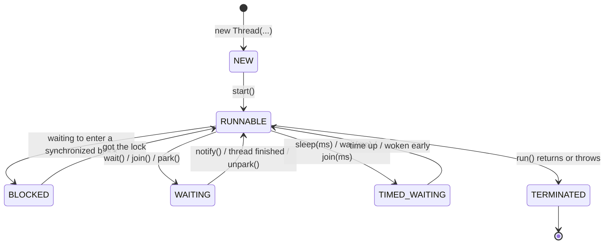

# Lesson 03: The Thread Lifecycle

## What you'll learn

- The six states a Java thread can be in, and what moves it between them
- How `sleep` and `join` work, including the timed form of `join`
- What daemon threads are and why the JVM doesn't wait for them
- Why thread priorities are a hint you should almost never use

---

## Why this matters

When a production service hangs, the thread dump (Lesson 00) lists every thread with a state: `RUNNABLE`, `BLOCKED`, `WAITING`. Those states are the first clue. Hundreds of threads `BLOCKED` on the same lock point to one kind of problem, and hundreds `WAITING` inside a connection-pool call point to a completely different one. If you can read states, you can read dumps.

---

## The concept

`Thread.getState()` returns one of six values from the `Thread.State` enum:



| State | Meaning |
|---|---|
| `NEW` | The object exists, but `start()` hasn't been called. |
| `RUNNABLE` | Running *or ready to run*. Java doesn't separate "on a CPU right now" from "waiting for a CPU". Both are `RUNNABLE`. |
| `BLOCKED` | Waiting to enter a `synchronized` block that another thread holds (Lesson 06). |
| `WAITING` | Waiting with no time limit, for another thread to do something: `wait()`, `join()`, `LockSupport.park()`. |
| `TIMED_WAITING` | The same, but with a timeout: `sleep(ms)`, `wait(ms)`, `join(ms)`. |
| `TERMINATED` | `run()` has finished, normally or with an exception. |

Two things surprise people:

- **A thread blocked on I/O, such as a socket read, usually shows as `RUNNABLE`.** The JVM can't tell it is stuck in the operating system. A dump full of `RUNNABLE` threads doesn't mean they are all busy.
- **`BLOCKED` applies only to `synchronized`.** A thread waiting for a `ReentrantLock` (Lesson 13) shows as `WAITING`, because those locks park the thread.

---

## Hands-on

### 1. Watching every state

This program puts threads into each state on purpose and prints what it sees. It uses `synchronized`, `wait` and `notifyAll` a little ahead of time. They get full lessons of their own (06 and 08), and here they are just a way to create `BLOCKED` and `WAITING`.

`ThreadStates.java`:

```java
final Object lock = new Object();

void main() throws InterruptedException {
    Thread sleeper = new Thread(() -> pause(500), "sleeper");
    IO.println("After new:         " + sleeper.getState());

    sleeper.start();
    IO.println("After start:       " + sleeper.getState());

    pause(100);
    IO.println("While sleeping:    " + sleeper.getState());

    sleeper.join();
    IO.println("After finish:      " + sleeper.getState());

    Thread waiter = new Thread(() -> {
        synchronized (lock) {
            try {
                lock.wait();
            } catch (InterruptedException e) {
                Thread.currentThread().interrupt();
            }
        }
    }, "waiter");
    waiter.start();
    pause(100);
    IO.println("Inside wait():     " + waiter.getState());

    Thread blocked;
    synchronized (lock) {
        blocked = new Thread(() -> {
            synchronized (lock) {
                IO.println("blocked thread finally got the lock");
            }
        }, "blocked");
        blocked.start();
        pause(100);
        IO.println("Lock held by main: " + blocked.getState());
        lock.notifyAll();
    }
    waiter.join();
    blocked.join();
}

void pause(long millis) {
    try {
        Thread.sleep(millis);
    } catch (InterruptedException e) {
        Thread.currentThread().interrupt();
    }
}
```

```
After new:         NEW
After start:       RUNNABLE
While sleeping:    TIMED_WAITING
After finish:      TERMINATED
Inside wait():     WAITING
Lock held by main: BLOCKED
blocked thread finally got the lock
```

`pause(100)` gives the other thread time to reach the state you want to observe. That is fine for a demo, but **never use sleeps to coordinate threads in real code**. They make things work on your laptop and fail on a busy server. Lesson 14 shows the proper tools.

### 2. `sleep`: pausing the current thread

`Thread.sleep(millis)` (or `Thread.sleep(Duration)`) pauses *the thread that calls it*. It's a static method, so `someOtherThread.sleep(1000)` still sleeps the *current* thread, and the compiler warns you about it.

A sleeping thread:

- Uses no CPU.
- **Keeps any locks it holds.** Sleeping inside a `synchronized` block blocks everyone else waiting for that lock.
- Can be woken early by an interrupt, which is why `sleep` throws the checked `InterruptedException`. Lesson 04 is all about that exception.

### 3. `join`: waiting for another thread to finish

`JoinDemo.java`:

```java
void main() throws InterruptedException {
    Thread download = new Thread(() -> {
        for (int percent = 25; percent <= 100; percent += 25) {
            pause(200);
            IO.println("download " + percent + "%");
        }
    });

    download.start();
    IO.println("main: waiting for the download");
    download.join();
    IO.println("main: download finished, opening file");

    Thread slow = new Thread(() -> pause(5_000));
    slow.start();
    boolean finished = slow.join(Duration.ofMillis(300));
    IO.println("slow thread finished in time? " + finished);
    slow.interrupt();
}

void pause(long millis) {
    try {
        Thread.sleep(millis);
    } catch (InterruptedException e) {
        Thread.currentThread().interrupt();
    }
}
```

```
main: waiting for the download
download 25%
download 50%
download 75%
download 100%
main: download finished, opening file
slow thread finished in time? false
```

- `join()` puts the caller in `WAITING` until the target thread reaches `TERMINATED`.
- `join(Duration)` (Java 19+) waits at most that long and returns `true` if the thread finished. **Prefer the timed form in real code.** A plain `join()` on a thread that never ends hangs the caller forever.
- `join` also creates a *happens-before* relationship: everything the finished thread wrote is visible to the thread that joined it. That guarantee matters a lot in Lesson 07.

### 4. Daemon threads

The JVM exits when every **non-daemon** thread has finished. **Daemon** threads are background helpers that the JVM doesn't wait for. When the last non-daemon thread ends, the JVM exits and any daemon threads stop mid-step.

`DaemonDemo.java`:

```java
void main() throws InterruptedException {
    Thread heartbeat = new Thread(() -> {
        while (true) {
            IO.println("heartbeat");
            try {
                Thread.sleep(200);
            } catch (InterruptedException e) {
                return;
            }
        }
    });
    heartbeat.setDaemon(true);
    heartbeat.start();

    Thread.sleep(700);
    IO.println("main finished, JVM exits even though heartbeat never stops");
}
```

```
heartbeat
heartbeat
heartbeat
heartbeat
main finished, JVM exits even though heartbeat never stops
```

Remove `setDaemon(true)` and the program never exits. Rules:

- `setDaemon` must be called **before** `start()`, or it throws `IllegalThreadStateException`.
- A new thread inherits the daemon flag of the thread that created it.
- Daemon threads get **no cleanup**: no `finally` blocks, no flushing. Never give a daemon thread work that must finish, such as writing a file or committing a transaction.
- Virtual threads (Lesson 21) are always daemon threads.

### 5. Names, IDs, priorities: inspecting a thread

`ThreadInfo.java`:

```java
void main() throws InterruptedException {
    Thread worker = Thread.ofPlatform()
            .name("report-generator")
            .daemon(false)
            .priority(Thread.NORM_PRIORITY)
            .unstarted(() -> IO.println("generating report..."));

    printInfo(Thread.currentThread());
    printInfo(worker);
    worker.start();
    worker.join();
}

void printInfo(Thread thread) {
    IO.println("name=" + thread.getName()
            + " id=" + thread.threadId()
            + " state=" + thread.getState()
            + " daemon=" + thread.isDaemon()
            + " priority=" + thread.getPriority()
            + " virtual=" + thread.isVirtual());
}
```

```
name=main id=3 state=RUNNABLE daemon=false priority=5 virtual=false
name=report-generator id=25 state=NEW daemon=false priority=5 virtual=false
generating report...
```

- `threadId()` replaced the deprecated `getId()` in Java 19.
- The IDs between 3 and 25 belong to threads the JVM started for itself (garbage collector helpers, the JIT compiler and so on).
- **Priority** ranges from 1 (`MIN_PRIORITY`) to 10 (`MAX_PRIORITY`), with 5 as the default. It is only a *hint* to the operating system scheduler, and on Linux it is normally ignored altogether. Never use priority to make a program correct. The demo in [`org/javaguy/Main.java`](../../src/main/java/org/javaguy/Main.java) sets `MAX_PRIORITY` on `main`. Try it, and you'll see it changes nothing you can observe.

---

## Try it yourself

1. In `ThreadStates`, try to produce `WAITING` using `join()` instead of `wait()`. (Hint: you need a third thread that joins a thread that is still running.)
2. In `DaemonDemo`, move `setDaemon(true)` to *after* `start()`. What happens?
3. Start a non-daemon thread that loops forever, then take a thread dump with `jcmd`. Find it and read its state. Kill the program with Ctrl+C.
4. Change `slow.join(Duration.ofMillis(300))` to a plain `slow.join()`, and remove `slow.interrupt()`. How long does the program run now?

---

## Common mistakes

- **Using `Thread.sleep` to wait for another thread.** It's a race you win on your laptop and lose in production. Use `join`, or the synchronizers in Lesson 14.
- **Sleeping while holding a lock.** Every other thread that needs that lock sits `BLOCKED` for the whole sleep.
- **Calling `join()` with no timeout on a thread that might never finish.** The caller hangs with it.
- **Putting important work on daemon threads.** It gets cut off at shutdown with no `finally`.
- **Relying on thread priority.** It's a hint that most schedulers ignore.
- **Reading `RUNNABLE` as "using CPU".** Threads stuck in socket reads are `RUNNABLE` too.

---

## Check your understanding

**1. A thread calls `Thread.sleep(2000)`. What state does it show during those two seconds?**

<details>
<summary>Reveal answer</summary>

`TIMED_WAITING`. Any wait with a timeout (`sleep(ms)`, `wait(ms)`, `join(ms)`) shows as `TIMED_WAITING`.

</details>

**2. What is the difference between `BLOCKED` and `WAITING`?**

<details>
<summary>Reveal answer</summary>

`BLOCKED` means the thread wants to enter a `synchronized` block whose lock another thread holds. It is waiting for a *lock*. `WAITING` means the thread has chosen to wait for another thread to *do something*, such as `notify()` it, finish (`join()`) or unpark it. A thread waiting for a `ReentrantLock` also shows `WAITING`, because that lock uses parking under the hood.

</details>

**3. `main` starts a non-daemon thread that loops forever, and then `main` returns. Does the program exit?**

<details>
<summary>Reveal answer</summary>

No. The JVM waits for all non-daemon threads, so the program runs until something kills it. Mark the thread as a daemon, or give it a way to stop (Lesson 04).

</details>

**4. Why is `worker.sleep(1000)` misleading code?**

<details>
<summary>Reveal answer</summary>

`sleep` is a static method that always pauses the *calling* thread. Calling it on `worker` reads as if the worker sleeps, but the current thread does. The correct form is `Thread.sleep(1000)`.

</details>

**5. A thread holds a `synchronized` lock and calls `Thread.sleep(5000)`. What happens to other threads that need that lock?**

<details>
<summary>Reveal answer</summary>

They sit in `BLOCKED` for the full five seconds. `sleep` does not release locks. (`wait()` does, as you'll see in Lesson 08.)

</details>

**6. `join(Duration.ofSeconds(1))` returns `false`. What does that tell you?**

<details>
<summary>Reveal answer</summary>

The target thread was still running when the timeout expired. The caller stops waiting, but the target thread is *not* stopped. If you want it to stop, you have to ask it with `interrupt()` (next lesson).

</details>

---

## Recap

- Six states: `NEW`, `RUNNABLE`, `BLOCKED`, `WAITING`, `TIMED_WAITING` and `TERMINATED`. Thread dumps speak this language.
- `sleep` pauses the current thread and keeps its locks. `join` waits for another thread, and you should prefer the timed form.
- Daemon threads don't keep the JVM alive and get no cleanup at shutdown.
- Priority is a hint and nothing more.

**Next: [Lesson 04, Interruption](04-interruption.md)**
