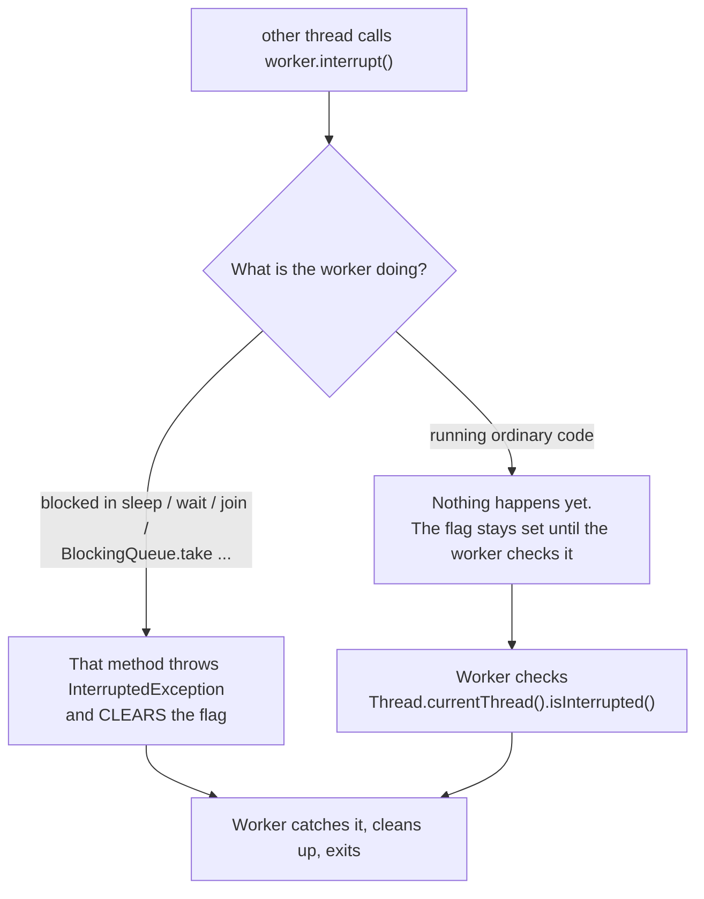

# Lesson 04: Interruption

## What you'll learn

- Why Java has no safe way to *force* a thread to stop
- How `interrupt()` works as a polite request, and the two ways a thread notices it
- The one rule for `InterruptedException`: never swallow it
- When a `volatile` stop flag is enough, and when it isn't

---

## Why this matters

Users cancel uploads. Services shut down. Requests time out. Each of these needs a thread to stop what it is doing and exit cleanly: close files, release locks, roll back.

Java once had `Thread.stop()`, which killed a thread wherever it happened to be, possibly halfway through updating an object, leaving that object half-written for every other thread to see. It was deprecated in Java 1.2 and, since Java 20, simply throws `UnsupportedOperationException`. What replaced it is **interruption**: you *ask* a thread to stop, and the thread decides when it is safe to do so.

---

## The concept

Every thread has a boolean **interrupt flag**. `thread.interrupt()` does exactly one thing: it sets that flag. It doesn't stop anything. What happens next depends on what the target thread is doing.



So a thread notices an interrupt in one of two ways:

1. **Blocking methods throw.** `Thread.sleep`, `Object.wait`, `Thread.join`, `BlockingQueue.take`, `Future.get` and most other methods that declare `throws InterruptedException` wake up immediately and throw it.
2. **Polling the flag.** Code that is busy computing must check `Thread.currentThread().isInterrupted()` itself.

The detail that causes most interruption bugs: **when a blocking method throws `InterruptedException`, it clears the flag first.** If you catch the exception and carry on, the request to stop is gone. Nobody further up the call stack can ever see it.

| Method | What it does |
|---|---|
| `thread.interrupt()` | Sets the target's flag, and wakes it if it is blocked |
| `thread.isInterrupted()` | Reads the flag without changing it |
| `Thread.interrupted()` (static) | Reads the *current* thread's flag **and clears it**. The name is confusing, so it's rarely what you want. |

---

## Hands-on

### 1. Interrupting a sleeping thread

`InterruptSleeping.java`:

```java
void main() throws InterruptedException {
    Thread worker = new Thread(() -> {
        try {
            IO.println("worker: going to sleep for 10 seconds");
            Thread.sleep(10_000);
            IO.println("worker: woke up normally");
        } catch (InterruptedException e) {
            IO.println("worker: interrupted while sleeping, cleaning up and exiting");
        }
    });

    worker.start();
    Thread.sleep(500);
    IO.println("main: asking worker to stop");
    worker.interrupt();
    worker.join();
    IO.println("main: worker has stopped");
}
```

```
worker: going to sleep for 10 seconds
main: asking worker to stop
worker: interrupted while sleeping, cleaning up and exiting
main: worker has stopped
```

The program ends after about half a second, not ten. The `catch` block is where the thread decides to exit. Here it is the last thing in `run()`, so exiting is simply returning.

### 2. Interrupting a busy thread

A thread that never blocks never gets an exception, so it has to check the flag itself.

`InterruptBusyLoop.java`:

```java
void main() throws InterruptedException {
    Thread counter = new Thread(() -> {
        long count = 0;
        while (!Thread.currentThread().isInterrupted()) {
            count++;
        }
        IO.println("counter: stopped after " + count + " increments");
    });

    counter.start();
    Thread.sleep(200);
    counter.interrupt();
    counter.join();
    IO.println("main: done");
}
```

One run (your number will differ):

```
counter: stopped after 412793316 increments
main: done
```

Remove the `isInterrupted()` check (use `while (true)`) and `interrupt()` does nothing at all. The flag gets set, nobody reads it, and the program never ends. **Interruption is cooperative.** It only works if the code being interrupted cooperates.

For long computations, check the flag at a natural boundary, such as once per loop iteration, per batch or per file.

### 3. The swallowed interrupt

This is the bug you will find in real codebases. Two workers run the same loop. One swallows the interrupt, and the other restores it.

`SwallowedInterrupt.java`:

```java
void main() throws InterruptedException {
    Thread broken = new Thread(() -> worker("broken", false));
    Thread fixed = new Thread(() -> worker("fixed", true));

    broken.start();
    fixed.start();
    Thread.sleep(300);

    broken.interrupt();
    fixed.interrupt();

    fixed.join();
    broken.join(Duration.ofSeconds(2));
    IO.println("broken thread still alive after 2s? " + broken.isAlive());
    System.exit(0);
}

void worker(String name, boolean restoreInterrupt) {
    while (!Thread.currentThread().isInterrupted()) {
        try {
            Thread.sleep(100);
        } catch (InterruptedException e) {
            if (restoreInterrupt) {
                Thread.currentThread().interrupt();
            }
        }
    }
    IO.println(name + ": stopped cleanly");
}
```

```
fixed: stopped cleanly
broken thread still alive after 2s? true
```

The workers are almost certainly inside `sleep` when the interrupt arrives. `sleep` throws and **clears the flag**. The `broken` worker catches the exception and does nothing, so the loop condition sees `false` and keeps looping forever. The `fixed` worker calls `Thread.currentThread().interrupt()` to set the flag again, so the loop condition sees it and exits. (`System.exit(0)` is there only because `broken` would otherwise keep the JVM alive.)

### The rule for `InterruptedException`

When you catch `InterruptedException`, do one of two things:

1. **Propagate it.** Declare `throws InterruptedException` and let the caller decide. This is the best option whenever your method signature allows it.
2. **Restore the flag, then stop.** If you can't throw it (for example, inside `Runnable.run()`, which can't throw checked exceptions), call `Thread.currentThread().interrupt()` and then return or break.

```java
try {
    Thread.sleep(1_000);
} catch (InterruptedException e) {
    Thread.currentThread().interrupt();
    return;
}
```

**Never** leave the catch block empty, and never only log it. And don't wrap it in a `RuntimeException` without restoring the flag first. Some of the demos in this repository do that (for example [`org/javaguy/Main.java`](../../src/main/java/org/javaguy/Main.java) and [`CustomRunnableThread.java`](../../src/main/java/org/javaguy/CustomRunnableThread.java)). Run `CustomRunnableThread` and count how many times it prints `Do sth` after being interrupted.

### 4. A `volatile` stop flag

For your own loops, a boolean flag is sometimes easier to read than interruption.

`VolatileFlagStop.java`:

```java
void main() throws InterruptedException {
    var poller = new Poller();
    Thread thread = new Thread(poller);
    thread.start();

    Thread.sleep(350);
    poller.stop();
    thread.join();
}

class Poller implements Runnable {
    private volatile boolean running = true;

    void stop() {
        running = false;
    }

    @Override
    public void run() {
        while (running) {
            IO.println("polling for new messages...");
            try {
                Thread.sleep(100);
            } catch (InterruptedException e) {
                Thread.currentThread().interrupt();
                return;
            }
        }
        IO.println("poller stopped");
    }
}
```

```
polling for new messages...
polling for new messages...
polling for new messages...
polling for new messages...
poller stopped
```

The `volatile` keyword is not optional. Without it, the poller thread may never see `running` become `false`. Lesson 07 explains exactly why.

Compare the two approaches:

| | `volatile` flag | Interruption |
|---|---|---|
| Wakes a thread blocked in `sleep` / `wait` / `take` | No. The thread notices only after the call returns. | Yes, immediately |
| Works with library code that doesn't know about your flag | No | Yes. Executors, `Future.cancel(true)` and blocking queues all use interruption. |
| Readability | Very clear | Clear once you know the rule |

Interruption is the standard mechanism. Thread pools use it to shut down (`shutdownNow()`), and `Future.cancel(true)` uses it to cancel a task. If your code swallows interrupts, those tools stop working.

---

## Try it yourself

1. In `InterruptSleeping`, move the `try/catch` *inside* a `for` loop that sleeps 10 times. What does the worker do when interrupted? Fix it so the loop ends.
2. Make `InterruptBusyLoop` use `Thread.interrupted()` (the static one) in the loop condition, and then print `isInterrupted()` after the loop. Why is it `false`?
3. Rewrite `Poller` to use interruption only, with no `running` field. Which version stops faster when the sleep is 5 seconds instead of 100 ms?

---

## Common mistakes

- **Swallowing `InterruptedException`.** An empty catch, or a catch that only logs, silently erases the request to stop.
- **Wrapping it in a `RuntimeException` without restoring the flag.** Code further up can no longer tell that the thread was interrupted.
- **Believing `interrupt()` stops the thread.** It sets a flag. A thread that never blocks and never checks the flag ignores it completely.
- **Using `Thread.interrupted()` when you meant `isInterrupted()`.** The static version clears the flag as it reads it.
- **A stop flag that isn't `volatile`.** The loop may never see the change (Lesson 07).

---

## Check your understanding

**1. What does `thread.interrupt()` actually do?**

<details>
<summary>Reveal answer</summary>

It sets the target thread's interrupt flag. If the thread is blocked in an interruptible method such as `sleep`, `wait`, `join` or `take`, that method wakes up and throws `InterruptedException`. It doesn't stop or kill the thread. The thread has to respond.

</details>

**2. What's wrong with this?**

```java
while (!Thread.currentThread().isInterrupted()) {
    try {
        doWork();
        Thread.sleep(1_000);
    } catch (InterruptedException e) {
        log.warn("interrupted");
    }
}
```

<details>
<summary>Reveal answer</summary>

`sleep` clears the interrupt flag when it throws. The catch block only logs, so the flag stays cleared, the loop condition sees "not interrupted", and the loop runs forever. Fix it with `Thread.currentThread().interrupt();` in the catch, and ideally `break` or `return` as well.

</details>

**3. You can't add `throws InterruptedException` to `Runnable.run()`. What do you do when `run()` catches one?**

<details>
<summary>Reveal answer</summary>

Restore the flag with `Thread.currentThread().interrupt()` and then end the task (return from `run()`). Restoring the flag means the owner of the thread, for example an executor, can still see that an interrupt happened.

</details>

**4. Why was `Thread.stop()` removed?**

<details>
<summary>Reveal answer</summary>

It killed a thread at an arbitrary point, possibly in the middle of updating shared objects, and released its locks, leaving those objects half-updated for every other thread. Interruption lets the thread choose a safe point to stop at.

</details>

**5. A worker is blocked in `queue.take()`, waiting for a message that may never arrive. You set its `volatile boolean running` to `false`. Does it stop?**

<details>
<summary>Reveal answer</summary>

Not until a message arrives, because the flag is only checked after `take()` returns. `interrupt()` would wake `take()` immediately with an `InterruptedException`. That is the main advantage of interruption over a custom flag.

</details>

---

## Recap

- `interrupt()` sets a flag. It's a request, not a command.
- Blocking methods respond by throwing `InterruptedException` and clearing the flag. Busy code must poll `isInterrupted()`.
- When you catch `InterruptedException`, **propagate it or restore the flag**. Never swallow it.
- Executors and `Future.cancel` depend on interruption, so code that honours it plays well with the whole JDK.

## End of Part 1

You can now create threads, read their states, wait for them and stop them politely. In every example so far, the threads barely touched each other. Part 2 is what happens when they do: two threads, one variable, and results that are wrong in ways you can't see.

**Next: [Lesson 05, Race conditions](../part-2-shared-state/05-race-conditions.md)**
