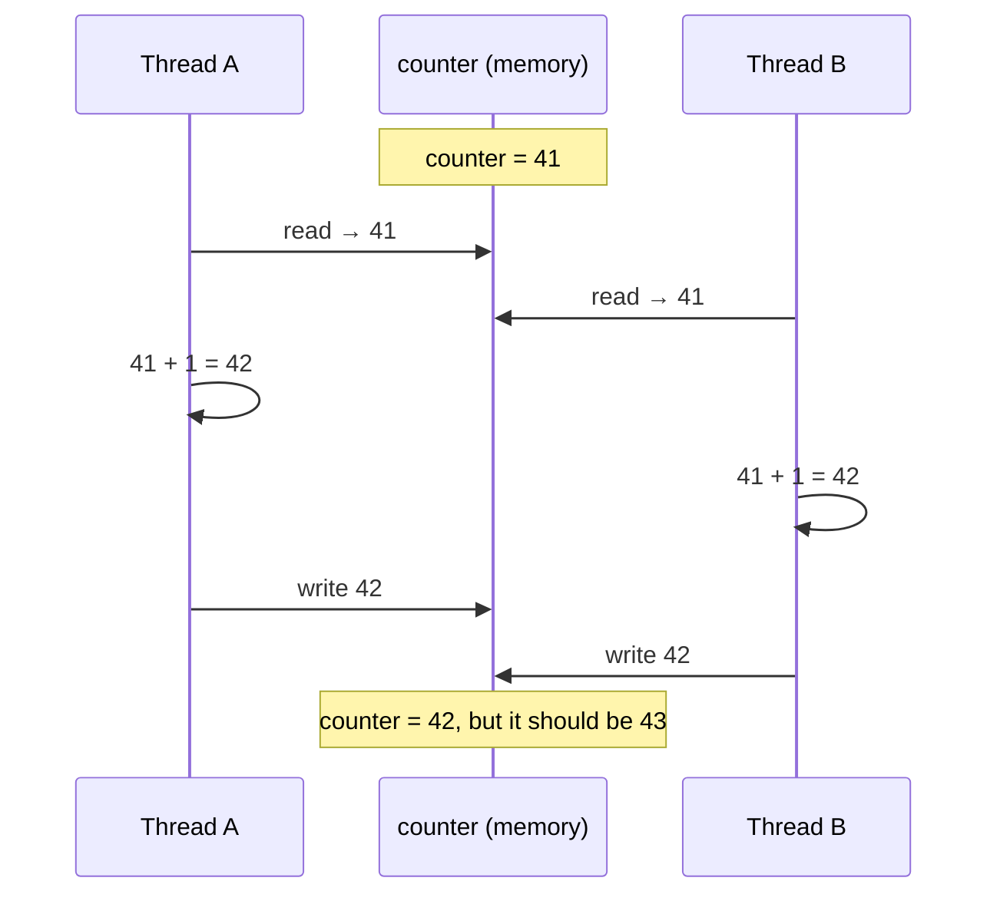

# Lesson 05: Race Conditions

## What you'll learn

- Why `counter++` is three operations, not one
- The two shapes almost every race condition takes: **read-modify-write** and **check-then-act**
- What "thread-safe" means, and why `ArrayList` and `HashMap` aren't
- Why race conditions are so hard to find by testing

---

## Why this matters

Everything so far has been about threads *running*. This lesson is about threads *sharing*. The moment two threads touch the same mutable data, you can get bugs that don't crash, don't log anything and don't show up in your tests. A bank balance is off by a few cents, a stock count goes negative, or a counter is 3% low. These are **race conditions**: the result depends on the timing of threads, and timing is something you don't control.

---

## The concept

### `counter++` is not one step

To you, `counter++` is one line. To the CPU, it is three steps:

1. **Read** the current value of `counter` from memory into a register.
2. **Add** one to the register.
3. **Write** the register back to memory.

When two threads do this at the same moment, their steps can interleave:



Two increments happened and one was lost. This is a **lost update**, the classic **read-modify-write** race.

### Check-then-act

The second shape: a thread *checks* a condition and then *acts* on it, but by the time it acts, the condition may no longer be true.

```java
if (ticketsLeft > 0) {
    ticketsLeft--;
}
```

Two threads both see `ticketsLeft == 1`, both pass the check, and both sell the ticket. Lazy initialization (`if (instance == null) instance = new ...`) and "put if absent" on a map have the same shape.

### Critical sections and atomicity

A **critical section** is a stretch of code that reads and writes shared state and must not be interleaved with another thread doing the same. The fix for every race in this lesson is to make the critical section **atomic**: it happens all at once or not at all, from the point of view of every other thread.

Java gives you several ways to do that, and the next lessons cover each one:

| Tool | Lesson |
|---|---|
| `synchronized` | 06 |
| `ReentrantLock` | 13 |
| Atomic variables (`AtomicInteger`, `LongAdder`) | 12 |
| Concurrent collections with atomic methods (`merge`, `putIfAbsent`) | 15 |
| No shared mutable state at all (immutability, confinement) | 16 |

### What "thread-safe" means

A class is **thread-safe** if it behaves correctly when used from several threads at once, with no extra coordination by the caller. `ArrayList`, `HashMap`, `HashSet` and `StringBuilder` are **not** thread-safe. Their Javadoc says so. `String`, records with immutable fields, `ConcurrentHashMap` and `AtomicInteger` are.

---

## Hands-on

### 1. The lost update

`RaceCondition.java`:

```java
int counter = 0;

void main() throws InterruptedException {
    Runnable addTenThousand = () -> {
        for (int i = 0; i < 10_000; i++) {
            counter++;
        }
    };

    List<Thread> threads = new ArrayList<>();
    for (int i = 0; i < 4; i++) {
        Thread thread = new Thread(addTenThousand);
        threads.add(thread);
        thread.start();
    }
    for (Thread thread : threads) {
        thread.join();
    }

    IO.println("Expected: 40000");
    IO.println("Actual:   " + counter);
}
```

Three runs on the same machine:

```
Expected: 40000
Actual:   39752

Expected: 40000
Actual:   29515

Expected: 40000
Actual:   33987
```

A different wrong answer each time. Occasionally you will even get `40000`, which is the most dangerous outcome of all, because that is what your unit test sees.

`counter` is a field, so it lives on the heap and all four threads share it. If it were a local variable inside the lambda, each thread would have its own copy and there would be no race (Lesson 01).

### 2. Check-then-act: selling the same ticket five times

`CheckThenAct.java`:

```java
Map<String, Integer> stock = new HashMap<>(Map.of("ticket", 1));
List<String> buyers = Collections.synchronizedList(new ArrayList<>());

void main() throws InterruptedException {
    List<Thread> threads = new ArrayList<>();
    for (int i = 1; i <= 5; i++) {
        String buyer = "buyer-" + i;
        Thread thread = new Thread(() -> buy(buyer));
        threads.add(thread);
    }
    threads.forEach(Thread::start);
    for (Thread thread : threads) {
        thread.join();
    }
    IO.println("Tickets in stock at start: 1");
    IO.println("Buyers who got one: " + buyers);
    IO.println("Tickets left: " + stock.get("ticket"));
}

void buy(String buyer) {
    if (stock.get("ticket") > 0) {
        simulateWork();
        stock.put("ticket", stock.get("ticket") - 1);
        buyers.add(buyer);
    }
}

void simulateWork() {
    try {
        Thread.sleep(10);
    } catch (InterruptedException e) {
        Thread.currentThread().interrupt();
    }
}
```

One run:

```
Tickets in stock at start: 1
Buyers who got one: [buyer-1, buyer-2, buyer-3]
Tickets left: -2
```

Three people bought the only ticket, and stock went negative. `simulateWork()` stands in for a payment call or a database write between the check and the act, and it widens the window so the race shows up every time. In production the window is smaller, so the bug appears less often, but it is the same bug.

Notice that `buyers` is a `Collections.synchronizedList`, so each individual `add` is safe. **Making each operation thread-safe does not make a sequence of operations thread-safe.** The check and the act must be atomic *together*.

### 3. Non-thread-safe collections can corrupt themselves

`UnsafeList.java`:

```java
void main() throws InterruptedException {
    List<Integer> numbers = new ArrayList<>();
    List<Thread> threads = new ArrayList<>();
    for (int t = 0; t < 4; t++) {
        Thread thread = new Thread(() -> {
            for (int i = 0; i < 10_000; i++) {
                numbers.add(i);
            }
        });
        threads.add(thread);
        thread.start();
    }
    for (Thread thread : threads) {
        thread.join();
    }
    IO.println("Expected size: 40000");
    IO.println("Actual size:   " + numbers.size());
}
```

One run:

```
Exception in thread "Thread-0" java.lang.ArrayIndexOutOfBoundsException: Index 136 out of bounds for length 49
	at java.base/java.util.ArrayList.add(ArrayList.java:485)
	at java.base/java.util.ArrayList.add(ArrayList.java:497)
	at UnsafeList.lambda$main$0(UnsafeList.java:7)
	at java.base/java.lang.Thread.run(Thread.java:1474)
Expected size: 40000
Actual size:   12839
```

Another run:

```
Expected size: 40000
Actual size:   16860
```

`ArrayList.add` reads the size, maybe grows the internal array, stores the element and increments the size. Two threads interleaving those steps overwrite each other's elements, or write past the end of an array that another thread just replaced. Sometimes you get an exception. Often you just get wrong data and no error at all. `HashMap` is worse: concurrent resizes can lose entries entirely.

---

## Why testing doesn't catch races

- The window where a race can happen may be a few nanoseconds wide.
- Your laptop has different core counts, load and timing from the production server.
- Adding a `println` to debug it changes the timing, and often makes the bug disappear.
- A test that passes 1,000 times proves nothing about run 1,001.

The only reliable defence is **reasoning**. For each piece of shared mutable state, ask *which lock or mechanism protects it*. If you can't name one, it is a bug. Lesson 24 adds some tools that help, but none replace this question.

---

## Try it yourself

1. Change `RaceCondition` to use 1 thread doing 40,000 increments. Is the result ever wrong? Why not?
2. Move `int counter` inside the lambda as a local variable, and print it at the end of each thread. What happens, and why does it no longer compile if you try to use it from `main`?
3. In `CheckThenAct`, remove `simulateWork()`. Run it 20 times. How often does the race still show up?
4. Find a race in your own code: search a project for a `static` mutable field, or a `HashMap` field on a Spring singleton `@Service`.

---

## Common mistakes

- **"It's only one line, so it's atomic."** `counter++`, `total += x` and `list.add(x)` are all several steps.
- **"I used a thread-safe collection, so my code is thread-safe."** Two safe calls in sequence (`get` then `put`, `contains` then `add`) are still a race.
- **"It passed the tests."** Races depend on timing, and tests rarely reproduce production timing.
- **Shared state in Spring singletons.** A `@Service` is one object used by every request thread. A mutable field on it is shared by all of them.

---

## Check your understanding

**1. Why can two threads each running `counter++` 1,000 times end up with a total below 2,000?**

<details>
<summary>Reveal answer</summary>

`counter++` is a read, an add and a write. If both threads read the same old value before either writes, both write the same new value, and one increment is lost. Every such overlap loses one update.

</details>

**2. Is this safe if `cache` is a `ConcurrentHashMap`?**

```java
if (!cache.containsKey(key)) {
    cache.put(key, expensiveLoad(key));
}
```

<details>
<summary>Reveal answer</summary>

No. It is check-then-act. Each call is thread-safe on its own, but two threads can both see "absent" and both load and put. Use the single atomic operation `cache.computeIfAbsent(key, this::expensiveLoad)` instead (Lesson 15).

</details>

**3. A method only reads and writes local variables and its parameters, which are primitives. Can it have a race condition?**

<details>
<summary>Reveal answer</summary>

No. Local variables live on the calling thread's stack and no other thread can see them. Races need *shared*, *mutable* state. (If a parameter were a reference to a shared mutable object, that object could still be raced on.)

</details>

**4. A race-condition test passes 500 times in a row. What have you proven?**

<details>
<summary>Reveal answer</summary>

Very little. Races depend on timing, and the timing on your machine in a test may never produce the bad interleaving. Correctness has to come from reasoning about which mechanism protects each piece of shared state.

</details>

**5. Name the two common shapes of race condition.**

<details>
<summary>Reveal answer</summary>

**Read-modify-write**, where a value is read, changed and written back (`count++`, `balance -= amount`). **Check-then-act**, where a decision is made from a check that may be stale by the time you act on it (`if (x == null) x = ...`, `if (stock > 0) sell()`).

</details>

---

## Recap

- A race condition is a result that depends on thread timing. It needs **shared, mutable** state.
- `counter++` is read, add and write. Interleaving loses updates.
- Check-then-act fails because the check goes stale before the act.
- `ArrayList`, `HashMap` and friends are not thread-safe and can corrupt themselves.
- Two thread-safe calls in sequence are not a thread-safe sequence.
- Tests rarely catch races. Reasoning about "what protects this state?" does.

**Next: [Lesson 06, `synchronized` and intrinsic locks](06-synchronized.md)**
