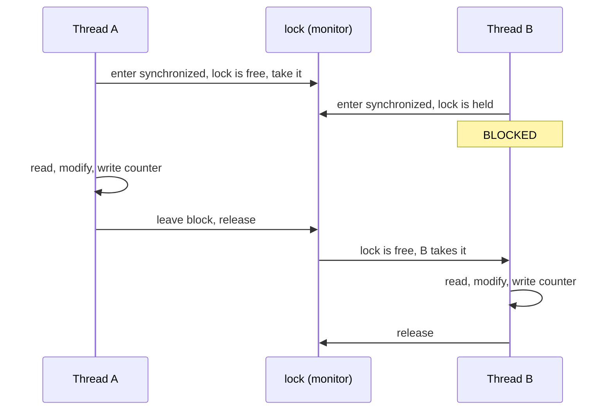

# Lesson 06: `synchronized` and Intrinsic Locks

## What you'll learn

- How `synchronized` turns a critical section into something only one thread can run at a time
- The difference between `synchronized` methods and `synchronized` blocks, and which object is the lock in each case
- Why a thread can re-enter a lock it already holds (reentrancy)
- How to keep locked sections small, and what *not* to lock on

---

## Why this matters

Lesson 05 ended with broken counters, oversold tickets and corrupted lists. `synchronized` is Java's built-in fix, and it has been in the language since version 1.0. It's also the base for understanding every other lock: `ReentrantLock` (Lesson 13) is the same idea with more features.

---

## The concept

### Every object has a lock

Every Java object has a built-in lock called its **intrinsic lock**, or **monitor**. `synchronized` uses it:

```java
synchronized (someObject) {
    // only one thread at a time can be in here, for this someObject
}
```

When a thread reaches the block:

1. If nobody holds `someObject`'s lock, the thread takes it and enters.
2. If another thread holds it, this thread goes to `BLOCKED` (the state from Lesson 03) and waits.
3. When the holder leaves the block, normally *or by an exception*, the lock is released and one waiting thread gets it.



`synchronized` gives you two guarantees:

- **Mutual exclusion (atomicity):** only one thread at a time runs any code guarded by the *same* lock.
- **Visibility:** everything a thread wrote before releasing a lock is visible to the next thread that takes the *same* lock. Lesson 07 explains why this second guarantee is needed at all.

Both guarantees only work if **every** access to the shared state uses the **same** lock. Guarding the writes and not the reads doesn't work, and neither does guarding with two different locks.

### Methods vs blocks: which object is the lock?

| You write | The lock is |
|---|---|
| `synchronized void deposit(...)` | `this` (the instance) |
| `static synchronized void log(...)` | The `Class` object, e.g. `Account.class` |
| `synchronized (this) { ... }` | `this`, the same as a synchronized method |
| `synchronized (lock) { ... }` | Whatever object `lock` refers to |

The repository demo [`synchronizedkey/BankAccount.java`](../../src/main/java/org/javaguy/synchronizedkey/BankAccount.java) shows both forms side by side. `deposit` uses `synchronized (this)` and `withdraw` uses a synchronized method, and the two lock the same object.

---

## Hands-on

### 1. Fixing the counter

`SynchronizedCounter.java`:

```java
void main() throws InterruptedException {
    var counter = new Counter();

    List<Thread> threads = new ArrayList<>();
    for (int i = 0; i < 4; i++) {
        Thread thread = new Thread(() -> {
            for (int j = 0; j < 10_000; j++) {
                counter.increment();
            }
        });
        threads.add(thread);
        thread.start();
    }
    for (Thread thread : threads) {
        thread.join();
    }

    IO.println("Expected: 40000");
    IO.println("Actual:   " + counter.value());
}

class Counter {
    private int value;

    synchronized void increment() {
        value++;
    }

    synchronized int value() {
        return value;
    }
}
```

```
Expected: 40000
Actual:   40000
```

It prints `40000` every time. Note that `value()` is synchronized too. A getter that isn't synchronized may return a stale value (Lesson 07). Here `join()` happens to make the final value visible anyway, but don't rely on that in general.

### 2. Fixing check-then-act, with a private lock

`TicketOffice.java`:

```java
void main() throws InterruptedException {
    var office = new TicketOffice(1);

    List<Thread> threads = new ArrayList<>();
    for (int i = 1; i <= 5; i++) {
        String buyer = "buyer-" + i;
        threads.add(new Thread(() -> office.buy(buyer)));
    }
    threads.forEach(Thread::start);
    for (Thread thread : threads) {
        thread.join();
    }
    IO.println("Buyers who got one: " + office.buyers());
}

class TicketOffice {
    private final Object lock = new Object();
    private final List<String> buyers = new ArrayList<>();
    private int ticketsLeft;

    TicketOffice(int tickets) {
        this.ticketsLeft = tickets;
    }

    void buy(String buyer) {
        synchronized (lock) {
            if (ticketsLeft == 0) {
                return;
            }
            ticketsLeft--;
            buyers.add(buyer);
        }
        IO.println(buyer + " sends confirmation email outside the lock");
    }

    List<String> buyers() {
        synchronized (lock) {
            return List.copyOf(buyers);
        }
    }
}
```

```
buyer-1 sends confirmation email outside the lock
Buyers who got one: [buyer-1]
```

(Which buyer wins changes from run to run. There is always exactly one.)

Three design decisions to copy:

1. **The check and the act are inside one `synchronized` block.** That makes them atomic together.
2. **A private, final lock object.** Nobody outside the class can lock on `lock`, so no outside code can interfere with it or deadlock against it. If you lock on `this`, any caller holding a reference to your object can also `synchronized (office)` and stall your class.
3. **Slow work goes outside the lock.** Sending an email doesn't touch shared state, so it doesn't belong in the critical section.

`buyers()` returns a *copy*. Returning the internal `ArrayList` itself would let callers read it without the lock while another thread is writing to it.

### 3. Reentrancy: a thread can re-take its own lock

`Reentrancy.java`:

```java
void main() {
    var account = new Account();
    account.depositTwice(50);
    IO.println("balance = " + account.balance());
}

class Account {
    private int balance;

    synchronized void deposit(int amount) {
        balance += amount;
    }

    synchronized void depositTwice(int amount) {
        deposit(amount);
        deposit(amount);
    }

    synchronized int balance() {
        return balance;
    }
}
```

```
balance = 100
```

`depositTwice` holds the lock on `this`, then calls `deposit`, which needs the same lock. If locks weren't **reentrant**, the thread would wait for itself forever. Java's intrinsic locks keep a hold count per owner thread: acquiring again increments it, leaving decrements it, and the lock is free when the count hits zero.

### 4. Keep the critical section small

Every thread that wants a lock waits while another thread holds it. A slow operation inside the lock makes *everyone* slow.

`LockTiming.java` loads five different keys through two caches. One holds the lock during the slow "database" call, and the other locks only around the map access:

```java
void main() throws InterruptedException {
    var slow = new SlowCache(true);
    var fast = new SlowCache(false);
    IO.println("lock around the slow call: " + time(slow) + " ms");
    IO.println("lock only around the map:  " + time(fast) + " ms");
}

long time(SlowCache cache) throws InterruptedException {
    long start = System.currentTimeMillis();
    List<Thread> threads = new ArrayList<>();
    for (int i = 0; i < 5; i++) {
        String key = "key-" + i;
        Thread thread = new Thread(() -> cache.get(key));
        threads.add(thread);
        thread.start();
    }
    for (Thread thread : threads) {
        thread.join();
    }
    return System.currentTimeMillis() - start;
}

class SlowCache {
    private final Map<String, String> values = new HashMap<>();
    private final boolean lockEverything;

    SlowCache(boolean lockEverything) {
        this.lockEverything = lockEverything;
    }

    String get(String key) {
        if (lockEverything) {
            synchronized (this) {
                return values.computeIfAbsent(key, this::loadFromDatabase);
            }
        }
        synchronized (this) {
            String cached = values.get(key);
            if (cached != null) {
                return cached;
            }
        }
        String loaded = loadFromDatabase(key);
        synchronized (this) {
            values.putIfAbsent(key, loaded);
            return values.get(key);
        }
    }

    private String loadFromDatabase(String key) {
        try {
            Thread.sleep(200);
        } catch (InterruptedException e) {
            Thread.currentThread().interrupt();
        }
        return "value-for-" + key;
    }
}
```

```
lock around the slow call: 1016 ms
lock only around the map:  202 ms
```

Five 200 ms loads run one after another (1000 ms) when the lock covers them, and in parallel (200 ms) when it doesn't. The trade-off: in the fast version, two threads asking for the *same* missing key may both load it. `putIfAbsent` makes sure only the first result is kept. Often that is an acceptable price, and Lesson 15's `ConcurrentHashMap.computeIfAbsent` gives you per-key locking so you don't have to choose.

### What not to lock on

| Don't lock on | Why |
|---|---|
| A `String` literal, e.g. `synchronized ("lock")` | String literals are interned and shared by the whole JVM. Unrelated code may lock the same object. |
| A boxed value, e.g. `Integer`, `Boolean` | Small values are cached and shared. `synchronized (count)` locks whatever object `count` currently refers to, and `count++` swaps it for a different one. |
| A field that gets reassigned | Threads end up locking different objects, which is the same as no lock. |
| `this`, on a class whose instances are shared publicly | Outside code can lock it too. It isn't wrong, just exposed. |

Lock on a `private final Object lock = new Object();` and all four problems go away.

---

## Try it yourself

1. In `SynchronizedCounter`, remove `synchronized` from `increment()` only. What result do you get?
2. Give `Counter` two separate lock objects, one used by `increment()` and one by `value()`. Is the counter still correct? Explain why or why not.
3. Add a `static synchronized` method to `Counter` and an instance `synchronized` method. Can two threads run them at the same time? (Hint: which object does each one lock?)
4. Write a `transfer(Account from, Account to, int amount)` using `synchronized` blocks. Keep it for Lesson 09, where you'll find out that it can deadlock.

---

## Common mistakes

- **Guarding writes but not reads.** Readers can see stale or half-updated state. Every access to shared state needs the lock.
- **Using different locks for the same data.** Two locks protect nothing. One piece of state gets one lock.
- **Doing slow work while holding a lock**, such as HTTP calls, database queries or `Thread.sleep`. Everyone queues behind you.
- **Locking on strings, boxed numbers or reassigned fields.**
- **Returning internal mutable collections from a synchronized getter.** The lock protects the call, not what the caller does with the result afterwards. Return a copy or an unmodifiable view.

---

## Check your understanding

**1. What object does a `synchronized` instance method lock? And a `static synchronized` method?**

<details>
<summary>Reveal answer</summary>

An instance method locks `this`. A static method locks the class's `Class` object (for example, `Counter.class`). They are different locks, so a static synchronized method and an instance synchronized method can run at the same time.

</details>

**2. Thread A is inside `synchronized (lockA)`. Thread B wants to enter `synchronized (lockB)`. Does B wait?**

<details>
<summary>Reveal answer</summary>

No. They are different locks, so there is no mutual exclusion between them. That is why all code touching one piece of shared state must use one and the same lock.

</details>

**3. A synchronized method calls another synchronized method on the same object. Why doesn't it deadlock?**

<details>
<summary>Reveal answer</summary>

Intrinsic locks are *reentrant*. The lock records its owning thread and a hold count, and the owner can acquire it again, which increments the count. It is released when the count returns to zero.

</details>

**4. An exception is thrown inside a `synchronized` block. Is the lock released?**

<details>
<summary>Reveal answer</summary>

Yes. The lock is released automatically whenever the block is exited, normally or by an exception. This is one advantage over `ReentrantLock`, where you must release the lock yourself in a `finally` block (Lesson 13).

</details>

**5. What is wrong with this code?**

```java
private Integer count = 0;

void increment() {
    synchronized (count) {
        count++;
    }
}
```

<details>
<summary>Reveal answer</summary>

`count++` on an `Integer` creates a *new* `Integer` object and assigns it to `count`. The next thread locks a different object, so threads no longer exclude each other. On top of that, small `Integer` values are cached and shared across the JVM. Use a separate `private final Object lock`, or an `AtomicInteger` (Lesson 12).

</details>

---

## Recap

- `synchronized` gives **mutual exclusion** and **visibility**, but only between threads that use the **same lock**.
- Instance methods lock `this`, static methods lock the `Class`, and blocks lock whatever object you name.
- Prefer a `private final Object lock` over `this`, and never lock on strings or boxed values.
- Intrinsic locks are reentrant and are released even when an exception is thrown.
- Keep critical sections small, and never do slow I/O inside one.

**Next: [Lesson 07, Visibility, `volatile` and happens-before](07-visibility-and-volatile.md)**
