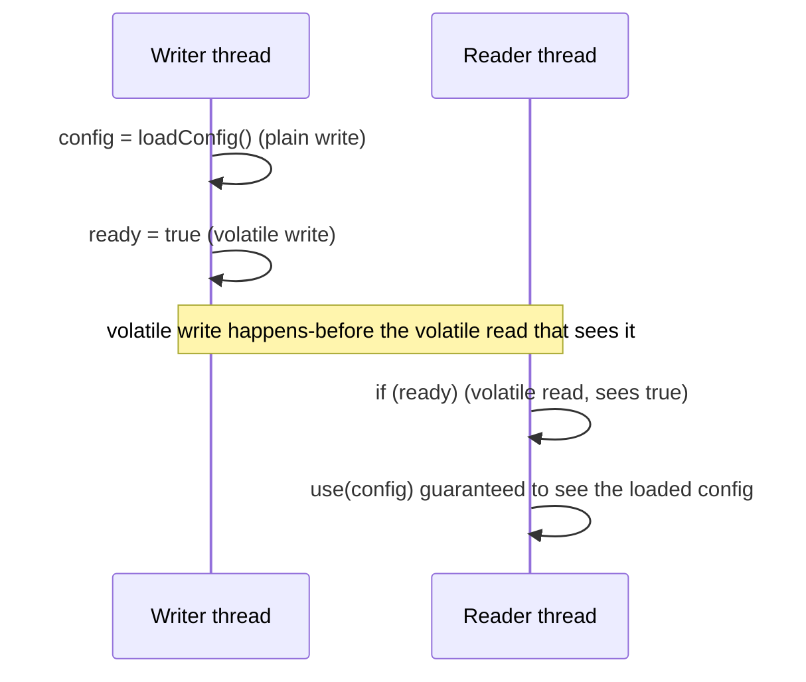

# Lesson 07: Visibility, `volatile` and Happens-Before

## What you'll learn

- Why one thread's write may *never* become visible to another thread
- What the Java Memory Model promises, expressed as **happens-before** rules
- What `volatile` fixes (visibility) and what it doesn't fix (atomicity)
- How to publish an object safely to other threads

---

## Why this matters

Lesson 05's races were about two threads writing at once. This lesson covers a stranger problem. One thread writes a value, a completely separate thread reads it later, and it sees the *old* value. Not for a moment, but possibly forever.

That sounds impossible, but it is permitted by the Java language specification, and it happens on real hardware with the real JIT compiler. You'll see it happen below.

---

## The concept

### Why writes can go missing

Your code isn't executed exactly as written:

- **CPU caches.** Each core has its own caches. A write may sit in one core's cache or store buffer before it reaches main memory, and another core may keep reading its own cached copy.
- **Compiler and JIT optimisations.** The JIT is allowed to reorder instructions and to keep a field in a register, *as long as the current thread can't tell the difference*. If a loop reads a field that the loop itself never changes, the JIT may read it once, before the loop, and never again.
- **CPU reordering.** Processors can execute memory operations out of order too.

None of these break single-threaded code. They only break when *another* thread is watching. So Java defines exactly when one thread is guaranteed to see another's writes. That definition is the **Java Memory Model (JMM)**.

### Happens-before

The JMM's central idea: if action **A happens-before** action **B**, then everything A wrote (and everything before A in the same thread) is visible to B. Without a happens-before relationship, there is **no guarantee at all** that B sees A's writes.

The rules you'll actually use:

| Rule | Meaning |
|---|---|
| **Program order** | Within one thread, each statement happens-before the next one. |
| **Monitor lock** | Releasing a lock happens-before any later acquire of the *same* lock. |
| **Volatile** | A write to a `volatile` field happens-before every later read of that field. |
| **Thread start** | `thread.start()` happens-before anything the new thread does. |
| **Thread join** | Everything a thread does happens-before another thread returns from `join()` on it. |
| **Transitivity** | If A happens-before B and B happens-before C, then A happens-before C. |
| **`java.util.concurrent`** | Putting into a concurrent collection, submitting to an executor and completing a `Future` all create happens-before edges (documented in the package Javadoc). |

The transitivity rule is where the power comes from. A thread writes ten ordinary fields and then one `volatile` field. Another thread reads the `volatile` field, sees the new value, and is then guaranteed to see all ten ordinary writes too.



---

## Hands-on

### 1. A write that is never seen

`Visibility.java`:

```java
boolean stopRequested = false;

void main() throws InterruptedException {
    Thread spinner = new Thread(() -> {
        long spins = 0;
        while (!stopRequested) {
            spins++;
        }
        IO.println("spinner saw the stop after " + spins + " spins");
    });
    spinner.setDaemon(true);
    spinner.start();

    Thread.sleep(500);
    stopRequested = true;
    IO.println("main: stopRequested = true");

    spinner.join(Duration.ofSeconds(2));
    IO.println("spinner still running 2 seconds later? " + spinner.isAlive());
}
```

```
main: stopRequested = true
spinner still running 2 seconds later? true
```

`main` set the flag, and the spinner never noticed. After a few thousand iterations, the JIT compiled the loop and, seeing that nothing inside it changes `stopRequested`, read it once and kept looping forever. (The thread is a daemon only so that the program can exit.)

Nothing here is a race in the Lesson 05 sense, because only one thread ever writes. The problem is purely **visibility**: there is no happens-before edge between `main`'s write and the spinner's reads.

### 2. The same program with `volatile`

Change one word:

```java
volatile boolean stopRequested = false;
```

`VolatileVisibility.java` is the same program with that change:

```java
volatile boolean stopRequested = false;

void main() throws InterruptedException {
    Thread spinner = new Thread(() -> {
        long spins = 0;
        while (!stopRequested) {
            spins++;
        }
        IO.println("spinner saw the stop after " + spins + " spins");
    });
    spinner.setDaemon(true);
    spinner.start();

    Thread.sleep(500);
    stopRequested = true;
    IO.println("main: stopRequested = true");

    spinner.join(Duration.ofSeconds(2));
    IO.println("spinner still running 2 seconds later? " + spinner.isAlive());
}
```

```
main: stopRequested = true
spinner saw the stop after 621429275 spins
spinner still running 2 seconds later? false
```

`volatile` tells the compiler and the CPU that this field is shared between threads. Every read must see the latest write, and it can't be cached in a register or reordered around. This is why the `Poller` in Lesson 04 needed `volatile`.

### 3. `volatile` doesn't make `++` atomic

`VolatileNotAtomic.java`:

```java
volatile int counter = 0;

void main() throws InterruptedException {
    List<Thread> threads = new ArrayList<>();
    for (int i = 0; i < 4; i++) {
        Thread thread = new Thread(() -> {
            for (int j = 0; j < 100_000; j++) {
                counter++;
            }
        });
        threads.add(thread);
        thread.start();
    }
    for (Thread thread : threads) {
        thread.join();
    }
    IO.println("Expected: 400000");
    IO.println("Actual:   " + counter);
}
```

```
Expected: 400000
Actual:   226810
```

`volatile` guarantees each read sees the latest value, but `counter++` is still read, add and write, and two threads can still read the same value before either writes. **`volatile` gives visibility, not atomicity.** For counters, use `synchronized` or an `AtomicInteger` (Lesson 12).

When is `volatile` enough? When **one thread writes and others only read**, or when every write is a plain assignment that doesn't depend on the current value (`flag = true`, `current = newConfig`).

### 4. Safe publication with an immutable object

A common, correct pattern: build an immutable object, then publish it through a `volatile` reference. Readers always see either the whole old object or the whole new one, never a half-built one.

`SafePublication.java`:

```java
record Config(String url, int timeoutSeconds) {}

volatile Config current = new Config("https://old.example.com", 5);

void main() throws InterruptedException {
    Thread reader = new Thread(() -> {
        Config seen = current;
        while (seen.url().contains("old")) {
            seen = current;
        }
        IO.println("reader sees " + seen);
    });
    reader.start();

    Thread.sleep(200);
    current = new Config("https://new.example.com", 10);
    reader.join();
}
```

```
reader sees Config[url=https://new.example.com, timeoutSeconds=10]
```

This is how you hot-reload configuration without locks. Replace the whole object, never mutate it. Records are ideal because their fields are `final`, and the JMM gives `final` fields an extra guarantee: once the constructor finishes, any thread that sees the reference sees the final fields fully initialised.

### Ways to publish an object safely

An object is **safely published** when other threads are guaranteed to see it fully built. Any one of these is enough:

- Store the reference in a `volatile` field (or an `AtomicReference`).
- Store it in a field that is guarded by a lock, with readers taking the same lock.
- Store it in a `final` field of an object that is itself safely published.
- Put it into a concurrent collection (`ConcurrentHashMap`, `BlockingQueue` and so on).
- Initialise it in a `static` initialiser. Class initialisation is thread-safe.

---

## Try it yourself

1. In `Visibility.java`, add `IO.println(spins)` *inside* the loop. Does the spinner now stop even without `volatile`? Why is this *not* a fix?
2. Replace `volatile` in `Visibility.java` with a `synchronized` getter and setter for `stopRequested`. Does it stop? Which happens-before rule makes it work?
3. Write a class with a `volatile boolean ready` and a plain `int answer`. The writer sets `answer = 42` and then `ready = true`. The reader waits for `ready` and prints `answer`. Explain why it must print 42. Then swap the order of the two writes and explain why it no longer has to.

---

## Common mistakes

- **Non-volatile stop flags.** The loop may run forever, and only after JIT compilation, so it "works in debug mode".
- **Using `volatile` for counters.** `volatile` doesn't make `++` atomic.
- **Adding `println` to "fix" a visibility bug.** `println` synchronizes internally, which accidentally creates happens-before edges and hides the bug. Remove the log line and the bug returns.
- **Publishing mutable objects through a `volatile` reference and then mutating them.** The `volatile` covers the reference, not later changes to the object's fields.
- **Assuming `long` and `double` writes are atomic.** Plain 64-bit writes may be split into two 32-bit halves on some JVMs. `volatile long` and `volatile double` are always atomic.

---

## Check your understanding

**1. Thread A sets a plain `boolean done = true`. Thread B loops `while (!done)`. Is B guaranteed to stop?**

<details>
<summary>Reveal answer</summary>

No. There is no happens-before edge between the write and B's reads, so B may never see it. The JIT can legally hoist the read out of the loop. Making `done` `volatile`, or accessing it under a common lock, fixes it.

</details>

**2. Why is a `volatile int` counter still broken?**

<details>
<summary>Reveal answer</summary>

`volatile` guarantees each read sees the most recent write, but `counter++` is still three separate steps. Two threads can read the same value and both write the same result, losing an update. `volatile` gives visibility, not atomicity.

</details>

**3. A thread writes `data = load()` (plain field) and then `ready = true` (`volatile`). Another thread reads `ready == true`. Is it guaranteed to see the loaded `data`?**

<details>
<summary>Reveal answer</summary>

Yes. By program order, the `data` write happens-before the volatile write. By the volatile rule, the volatile write happens-before the read that sees it. By transitivity, the `data` write happens-before the reader's use of `data`.

</details>

**4. A worker thread writes results into a plain `int[]`. `main` calls `worker.join()` and then reads the array. Is that safe?**

<details>
<summary>Reveal answer</summary>

Yes. The thread-join rule means everything the worker did happens-before `join()` returns in `main`. No `volatile` is needed for that hand-off.

</details>

**5. When is `volatile` alone enough to make a field thread-safe?**

<details>
<summary>Reveal answer</summary>

When the new value doesn't depend on the old one: plain assignments such as flags, or swapping in a new immutable object. It is also fine when only one thread ever writes. As soon as an update is read-modify-write, or two fields must change together, you need a lock or an atomic class.

</details>

---

## Recap

- Without a **happens-before** edge, one thread may never see another's writes, because of caches, registers and reordering.
- Edges come from locks, `volatile`, `start`, `join` and the `java.util.concurrent` classes.
- `volatile` = **visibility** and ordering, **not** atomicity.
- Publish immutable objects through a `volatile` or `final` field and replace them rather than mutating them.

**Next: [Lesson 08, `wait`, `notify` and guarded blocks](08-wait-and-notify.md)**
