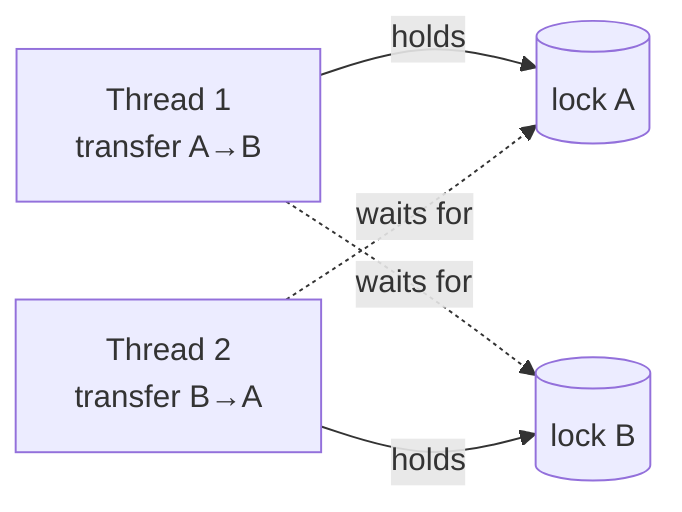

# Lesson 09: Deadlock, Livelock and Starvation

## What you'll learn

- How two threads can each wait forever for the other: **deadlock**
- The four conditions a deadlock needs, and how breaking any one prevents it
- How to detect a deadlock, both from code and from a thread dump
- What **livelock** and **starvation** are, and how they differ from deadlock

---

## Why this matters

Locks fix races (Lesson 06), but they bring a new kind of failure. A race gives you *wrong* answers. A **liveness** failure gives you *no* answers: threads that are alive, use no CPU and never make progress. A deadlocked payment service doesn't crash or log an error. It just stops responding, and it keeps holding its database connections while it does.

---

## The concept

### Deadlock

Two people must each transfer money between the same two accounts. Alice's transfer locks account A, then tries to lock account B. At the same moment, Bob's transfer locks account B, then tries to lock account A. Each holds what the other needs, and neither will let go.



A deadlock needs **all four** of these conditions (the Coffman conditions):

1. **Mutual exclusion**: a resource can be held by only one thread at a time.
2. **Hold and wait**: a thread holds one resource while waiting for another.
3. **No preemption**: a resource can't be taken away. The holder must release it.
4. **Circular wait**: a cycle of threads, each waiting for a resource held by the next.

Break any one and deadlock becomes impossible. In practice, you break **circular wait** (by always taking locks in the same order) or **hold and wait / no preemption** (by using `tryLock` with a timeout and backing off, as shown in Lesson 13).

### Livelock

Threads aren't blocked. They're busy, but only reacting to each other, so no real work gets done. Picture two people meeting in a corridor who both step aside to the same side, then both step back, over and over. In code, it's usually two threads that each detect a conflict, back off, retry at exactly the same moment and conflict again. The fix is to add randomness to the retry delay (**jitter**) so they stop moving in lockstep.

### Starvation

A thread is *able* to run but never gets the resource it needs, because others keep getting it first. Examples:

- An unfair lock under heavy contention keeps handing the lock to newly arriving threads.
- A thread pool whose threads are all busy with long tasks, so short tasks wait forever.
- A reader-writer lock where a steady stream of readers keeps a writer out (Lesson 13).

Fair locks (`new ReentrantLock(true)`) reduce starvation at the cost of throughput.

---

## Hands-on

### 1. Creating and detecting a deadlock

`Deadlock.java`:

```java
import java.lang.management.ManagementFactory;

final Object accountA = new Object();
final Object accountB = new Object();

void main() throws InterruptedException {
    Thread first = new Thread(() -> transfer(accountA, accountB, "A->B"), "transfer-A-to-B");
    Thread second = new Thread(() -> transfer(accountB, accountA, "B->A"), "transfer-B-to-A");
    first.setDaemon(true);
    second.setDaemon(true);
    first.start();
    second.start();

    Thread.sleep(500);
    var threadBean = ManagementFactory.getThreadMXBean();
    long[] deadlocked = threadBean.findDeadlockedThreads();
    if (deadlocked == null) {
        IO.println("no deadlock");
        return;
    }
    for (var info : threadBean.getThreadInfo(deadlocked)) {
        IO.println(info.getThreadName() + " is " + info.getThreadState()
                + ", waiting for a lock held by " + info.getLockOwnerName());
    }
}

void transfer(Object from, Object to, String label) {
    synchronized (from) {
        IO.println(label + ": locked the first account");
        pause(100);
        synchronized (to) {
            IO.println(label + ": locked both, transferring");
        }
    }
}

void pause(long millis) {
    try {
        Thread.sleep(millis);
    } catch (InterruptedException e) {
        Thread.currentThread().interrupt();
    }
}
```

```
A->B: locked the first account
B->A: locked the first account
transfer-A-to-B is BLOCKED, waiting for a lock held by transfer-B-to-A
transfer-B-to-A is BLOCKED, waiting for a lock held by transfer-A-to-B
```

`java.lang.management` isn't in `java.base`, so this file needs one explicit import. `ThreadMXBean.findDeadlockedThreads()` finds cycles of threads waiting on each other's locks. Monitoring tools use the same API.

The same information appears in a thread dump. Remove the `setDaemon` calls, run it, and use `jcmd <pid> Thread.print`. At the bottom of the dump the JVM prints:

```
Found one Java-level deadlock:
=============================
"transfer-A-to-B":
  waiting to lock monitor 0x000077b310005f40 (object 0x00000005b5018080, a java.lang.Object),
  which is held by "transfer-B-to-A"

"transfer-B-to-A":
  waiting to lock monitor 0x000077b314006120 (object 0x00000005b5018070, a java.lang.Object),
  which is held by "transfer-A-to-B"

Java stack information for the threads listed above:
===================================================
...
```

A deadlock is one of the few concurrency bugs that is easy to diagnose *once it has happened*. Take a thread dump and the JVM names the cycle for you.

### 2. Preventing it with lock ordering

Give every lock a global order and always acquire locks in that order. Then a cycle is impossible: no thread can hold a "higher" lock while waiting for a "lower" one.

`LockOrdering.java`:

```java
record Account(int id, String owner) {}

void main() throws InterruptedException {
    var alice = new Account(1, "alice");
    var bob = new Account(2, "bob");

    Thread first = new Thread(() -> transfer(alice, bob));
    Thread second = new Thread(() -> transfer(bob, alice));
    first.start();
    second.start();
    first.join();
    second.join();
    IO.println("both transfers finished, no deadlock");
}

void transfer(Account from, Account to) {
    Account lowerId = from.id() < to.id() ? from : to;
    Account higherId = from.id() < to.id() ? to : from;

    synchronized (lowerId) {
        pause(100);
        synchronized (higherId) {
            IO.println("transferred " + from.owner() + " -> " + to.owner());
        }
    }
}

void pause(long millis) {
    try {
        Thread.sleep(millis);
    } catch (InterruptedException e) {
        Thread.currentThread().interrupt();
    }
}
```

```
transferred alice -> bob
transferred bob -> alice
both transfers finished, no deadlock
```

Both transfers lock account 1 first, whichever direction the money moves. The second transfer simply waits for the first to finish. The order must be based on something stable and unique, such as a database ID. `System.identityHashCode` is sometimes used, but it can collide.

(Records are used as locks here only to keep the example short. In real code, lock on a dedicated lock object owned by each account.)

### Other ways to avoid deadlock

| Technique | Breaks which condition |
|---|---|
| Consistent lock ordering | Circular wait |
| `tryLock(timeout)`: give up and release everything if you can't get all the locks (Lesson 13) | Hold and wait / no preemption |
| Hold one lock at a time, and never call unknown code (callbacks, listeners) while holding a lock | Hold and wait |
| Use one coarser lock instead of two fine ones | Circular wait, since there is only one lock |
| Avoid shared locks entirely: immutability, message passing (Lessons 15–16) | Mutual exclusion |

---

## Try it yourself

1. Run `Deadlock.java` without the daemon flags and find the deadlock report in a `jcmd` thread dump.
2. Add a third account and a third thread so that the cycle is A→B, B→C, C→A. Does `findDeadlockedThreads` still find it?
3. Break `LockOrdering` on purpose. What happens if two accounts have the same `id`?
4. Livelock: write two threads that each `tryLock` two `ReentrantLock`s in opposite orders, release both on failure, and retry immediately. Then add a random sleep before retrying. (Come back to this after Lesson 13.)

---

## Common mistakes

- **Acquiring locks in an order that depends on the arguments.** `transfer(a, b)` and `transfer(b, a)` will eventually deadlock.
- **Calling alien code while holding a lock.** A listener or callback you don't control might take other locks in any order.
- **Nested `synchronized` on objects that other code may also lock**, such as `this` on a public class.
- **Treating a hang as a performance problem.** Take a thread dump first. Deadlocks are named in it explicitly.
- **Retrying in lockstep.** Two threads backing off and retrying at the same intervals can livelock. Add jitter.

---

## Check your understanding

**1. What four conditions must all hold for a deadlock?**

<details>
<summary>Reveal answer</summary>

Mutual exclusion, hold and wait, no preemption, and circular wait. Removing any one of them makes deadlock impossible.

</details>

**2. How does consistent lock ordering prevent deadlock?**

<details>
<summary>Reveal answer</summary>

It makes circular wait impossible. If every thread takes locks in the same global order, a thread holding a later lock never waits for an earlier one, so no cycle can form.

</details>

**3. What does a deadlocked thread look like in a thread dump?**

<details>
<summary>Reveal answer</summary>

It is `BLOCKED` (for `synchronized`) or `WAITING` (for `java.util.concurrent` locks), waiting for a lock held by another thread that is itself waiting. The HotSpot JVM detects the cycle and prints "Found one Java-level deadlock" with the threads and locks involved.

</details>

**4. What is the difference between deadlock and livelock?**

<details>
<summary>Reveal answer</summary>

In a deadlock, threads are blocked and use no CPU. In a livelock, threads are active and use CPU, but they keep reacting to each other, such as backing off and retrying in sync, so no useful work gets done.

</details>

**5. A single high-priority task always gets the lock, and a background task never does. What is this called?**

<details>
<summary>Reveal answer</summary>

Starvation. The background thread could run, but it never gets the resource. Fair locks, or limiting how often the busy task takes the lock, help.

</details>

## Recap

- **Deadlock**: a cycle of threads each holding what the next one needs. It needs all four Coffman conditions.
- Prevent it with **consistent lock ordering**, `tryLock` with timeouts, or by never holding two locks at once.
- Detect it with a thread dump or `ThreadMXBean.findDeadlockedThreads()`.
- **Livelock**: busy but going nowhere, fixed with jitter. **Starvation**: never getting a turn, reduced with fairness.

## End of Part 2

You now know the three core problems of shared state: races (atomicity), stale reads (visibility) and liveness failures. You also know the low-level tools: `synchronized`, `volatile`, `wait` and `notify`. Part 3 introduces `java.util.concurrent`, which is the set of higher-level tools professionals actually reach for.

**Next: [Lesson 10, Executors and thread pools](../part-3-java-util-concurrent/10-executors.md)**
