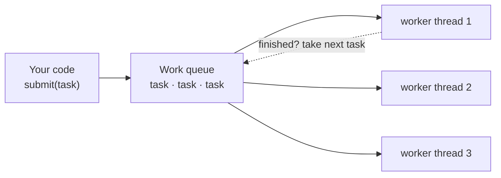

# Lesson 10: Executors and Thread Pools

## What you'll learn

- Why creating a new thread per task stops scaling, and what a thread pool does instead
- The `ExecutorService` API: `submit`, `execute`, `shutdown`, `shutdownNow` and `close`
- The factory methods in `Executors`, and the trap hidden in each one
- How to build a `ThreadPoolExecutor` with a bounded queue, named threads and a rejection policy

---

## Why this matters

In Part 1 you wrote `new Thread(...).start()` for every task. Picture doing that for every HTTP request a server receives. Platform threads are expensive to create (each reserves memory for its stack, often 1 MB of address space) and expensive to schedule. Ten thousand requests means ten thousand threads, and the server runs out of memory or spends all its time context switching.

A **thread pool** keeps a fixed set of worker threads alive and feeds them tasks from a queue. Its size limits the thread count, and the queue absorbs bursts. This is the model behind Tomcat's request threads, Spring's `@Async`, Kafka listener containers and almost every server you'll ever use.

---

## The concept



The key idea from Lesson 02 comes back here: a **task** (`Runnable` or `Callable`) is separate from the **thread** that runs it. You describe the work, and the executor decides which thread runs it and when.

### The interfaces

| Interface | What it adds |
|---|---|
| `Executor` | One method: `execute(Runnable)`. "Run this at some point." |
| `ExecutorService` | Lifecycle (`shutdown`, `awaitTermination`, `close`), `submit` returning a `Future`, and `invokeAll`/`invokeAny` |
| `ScheduledExecutorService` | Run after a delay, or periodically (Lesson 17) |

### Shutting down

A pool's threads are non-daemon, so **a pool you never shut down keeps the JVM alive forever**.

| Method | Effect |
|---|---|
| `shutdown()` | Stop accepting new tasks. Queued and running tasks still finish. Returns immediately. |
| `awaitTermination(timeout)` | Block until all tasks are done or the timeout passes. |
| `shutdownNow()` | Stop accepting tasks, **interrupt** running ones, and return the queued tasks that never started. |
| `close()` (Java 19+) | `shutdown()` then wait for termination. `ExecutorService` is `AutoCloseable`, so **try-with-resources** does it for you. |

`shutdownNow()` works by interrupting worker threads, which is why Lesson 04's rule matters: a task that swallows `InterruptedException` can't be stopped this way.

### The `Executors` factory methods

| Factory | Threads | Queue | The trap |
|---|---|---|---|
| `newFixedThreadPool(n)` | exactly `n` | **unbounded** `LinkedBlockingQueue` | Under overload the queue grows without limit, until `OutOfMemoryError`. |
| `newCachedThreadPool()` | 0 up to **unlimited**, idle threads die after 60 s | none (direct hand-off) | Under overload it creates thousands of threads. |
| `newSingleThreadExecutor()` | 1 | unbounded | Tasks run one at a time, in submission order. That's useful, but the queue is still unbounded. |
| `newVirtualThreadPerTaskExecutor()` | a new virtual thread per task | none | Nothing limits concurrency, so you may need a `Semaphore` (Lessons 14 and 21). |
| `newScheduledThreadPool(n)` | `n` | delay queue | Lesson 17 |
| `newWorkStealingPool()` | a `ForkJoinPool`, one thread per core | per-thread deques | Lesson 19 |

For quick programs and demos, the factories are fine. For production services, build a `ThreadPoolExecutor` yourself so that every limit is a decision you made on purpose.

---

## Hands-on

### 1. A fixed pool with try-with-resources

`FixedPool.java`:

```java
void main() {
    try (ExecutorService pool = Executors.newFixedThreadPool(3)) {
        for (int i = 1; i <= 6; i++) {
            int orderId = i;
            pool.submit(() -> {
                IO.println("order " + orderId + " on " + Thread.currentThread().getName());
                pause(300);
            });
        }
        IO.println("all orders submitted");
    }
    IO.println("pool closed, every order processed");
}

void pause(long millis) {
    try {
        Thread.sleep(millis);
    } catch (InterruptedException e) {
        Thread.currentThread().interrupt();
    }
}
```

```
all orders submitted
order 3 on pool-1-thread-3
order 1 on pool-1-thread-1
order 2 on pool-1-thread-2
order 4 on pool-1-thread-1
order 5 on pool-1-thread-3
order 6 on pool-1-thread-2
pool closed, every order processed
```

- `submit` returns immediately, so "all orders submitted" prints first.
- Only three threads ever exist. Orders 4–6 wait in the queue and reuse the threads that finished orders 1–3.
- The end of the `try` block calls `close()`, which waits for every task. Without it, `main` would carry on straight away (and the JVM would never exit).
- `int orderId = i;` is needed because a lambda can only capture *effectively final* variables, and `i` changes.

The demo in [`executors/ExecutorThread.java`](../../src/main/java/org/javaguy/executors/ExecutorThread.java) shows the older style with an explicit `shutdown()`.

### 2. `shutdown` vs `shutdownNow`

`PoolShutdown.java`:

```java
void main() throws InterruptedException {
    ExecutorService pool = Executors.newFixedThreadPool(2);
    for (int i = 1; i <= 6; i++) {
        int jobId = i;
        pool.submit(() -> {
            try {
                Thread.sleep(1_000);
                IO.println("job " + jobId + " finished");
            } catch (InterruptedException e) {
                IO.println("job " + jobId + " interrupted");
                Thread.currentThread().interrupt();
            }
        });
    }

    pool.shutdown();
    IO.println("after shutdown(), isShutdown = " + pool.isShutdown());

    try {
        pool.submit(() -> IO.println("never runs"));
    } catch (RejectedExecutionException e) {
        IO.println("new task rejected after shutdown");
    }

    boolean finished = pool.awaitTermination(1500, TimeUnit.MILLISECONDS);
    IO.println("finished within 1.5s? " + finished);
    if (!finished) {
        List<Runnable> neverStarted = pool.shutdownNow();
        IO.println("shutdownNow(): " + neverStarted.size() + " queued jobs never started");
    }
    pool.awaitTermination(1, TimeUnit.SECONDS);
    IO.println("terminated = " + pool.isTerminated());
}
```

```
after shutdown(), isShutdown = true
new task rejected after shutdown
job 2 finished
job 1 finished
finished within 1.5s? false
shutdownNow(): 2 queued jobs never started
job 3 interrupted
job 4 interrupted
terminated = true
```

This is the standard graceful-shutdown recipe: `shutdown()`, wait for a while, then `shutdownNow()` if the pool still isn't done. Jobs 3 and 4 were running and got interrupted. Jobs 5 and 6 were still in the queue and came back as the list of tasks that never started.

### 3. A production-shaped pool

`CustomPool.java`:

```java
void main() {
    ThreadFactory namedThreads = Thread.ofPlatform().name("email-sender-", 1).factory();

    var pool = new ThreadPoolExecutor(
            2,
            2,
            0, TimeUnit.SECONDS,
            new ArrayBlockingQueue<>(2),
            namedThreads,
            new ThreadPoolExecutor.CallerRunsPolicy());

    try (pool) {
        for (int i = 1; i <= 6; i++) {
            int emailId = i;
            pool.execute(() -> {
                IO.println("email " + emailId + " sent by " + Thread.currentThread().getName());
                pause(200);
            });
        }
    }
}

void pause(long millis) {
    try {
        Thread.sleep(millis);
    } catch (InterruptedException e) {
        Thread.currentThread().interrupt();
    }
}
```

```
email 1 sent by email-sender-1
email 2 sent by email-sender-2
email 5 sent by main
email 3 sent by email-sender-1
email 4 sent by email-sender-2
email 6 sent by email-sender-1
```

The constructor arguments, in order:

| Argument | Value here | Meaning |
|---|---|---|
| `corePoolSize` | 2 | Threads kept alive even when idle |
| `maximumPoolSize` | 2 | Upper limit. Extra threads beyond the core size are created **only when the queue is full**. |
| `keepAliveTime` | 0 s | How long an idle thread above the core size lives |
| `workQueue` | `ArrayBlockingQueue(2)` | **Bounded**, so overload can't eat all the memory |
| `threadFactory` | named `email-sender-1`, `-2`... | Readable thread dumps |
| `handler` | `CallerRunsPolicy` | What to do when threads *and* queue are full |

Walk through it: emails 1 and 2 go to the two threads, and 3 and 4 fill the queue. Email 5 finds both full, so `CallerRunsPolicy` runs it **on the submitting thread**, `main`. While `main` is busy sending email 5, it can't submit email 6. This is natural backpressure: the producer slows down to the pool's pace.

The four built-in rejection policies:

| Policy | On overload |
|---|---|
| `AbortPolicy` (default) | Throws `RejectedExecutionException` |
| `CallerRunsPolicy` | Runs the task on the submitting thread, which gives backpressure |
| `DiscardPolicy` | Silently drops the new task. This is rarely what you want. |
| `DiscardOldestPolicy` | Drops the oldest queued task and retries |

### Sizing a pool

- **CPU-bound tasks:** about the number of cores (`Runtime.getRuntime().availableProcessors()`).
- **I/O-bound tasks:** more. A common rule is `cores × (1 + wait time / compute time)`. A task that waits 90 ms for every 10 ms of CPU work suggests `cores × 10`.
- For large numbers of I/O-bound tasks, **virtual threads** (Lesson 21) remove the sizing question entirely.

### 4. Exceptions inside a pool

`LostException.java`:

```java
void main() throws InterruptedException {
    try (ExecutorService pool = Executors.newSingleThreadExecutor()) {
        pool.submit(() -> {
            throw new IllegalStateException("payment failed");
        });
        pool.execute(() -> {
            throw new IllegalStateException("email failed");
        });
    }
    IO.println("main finished");
}
```

```
main finished
Exception in thread "pool-1-thread-1" java.lang.IllegalStateException: email failed
	at LostException.lambda$main$1(LostException.java:7)
	at java.base/java.util.concurrent.ThreadPoolExecutor.runWorker(ThreadPoolExecutor.java:1090)
	...
```

(The two lines can appear in either order, because they go to different output streams.)

"email failed" (submitted with `execute`) is printed by the default uncaught-exception handler. **"payment failed" (submitted with `submit`) vanishes without a trace.** `submit` catches the exception and stores it in the returned `Future`, and since nobody called `get()` on that `Future`, nobody ever sees it. That is the subject of the next lesson.

---

## Try it yourself

1. In `FixedPool`, remove the try-with-resources and don't call `shutdown()`. Does the program exit?
2. In `CustomPool`, switch to `AbortPolicy` and catch the `RejectedExecutionException`. Which emails are rejected?
3. Change `CustomPool` to `corePoolSize = 1` and `maximumPoolSize = 3`. Predict when the second and third threads get created, then check.
4. Submit 10,000 tasks to `newCachedThreadPool()` that each sleep for 1 second, and print `Thread.activeCount()` after submitting. Try the same with `newFixedThreadPool(10)`.

---

## Common mistakes

- **Never shutting down a pool.** Its non-daemon threads keep the JVM alive. Use try-with-resources.
- **Unbounded queues in production** (`newFixedThreadPool`). Overload turns into an `OutOfMemoryError` instead of a clear rejection.
- **`newCachedThreadPool` for untrusted load.** Nothing limits the thread count.
- **Creating a new pool per request.** A pool is meant to be long-lived and shared. Create it once.
- **Using `submit` and ignoring the `Future`.** Exceptions disappear silently.
- **Running blocking I/O on a small CPU-sized pool.** Every thread waits and throughput collapses.

---

## Check your understanding

**1. Why use a thread pool instead of `new Thread()` per task?**

<details>
<summary>Reveal answer</summary>

Threads are expensive to create and each one costs memory. A pool reuses a bounded number of threads, which limits resource use, avoids the creation cost for every task, and turns overload into queueing or rejection instead of a crash.

</details>

**2. What is the difference between `shutdown()` and `shutdownNow()`?**

<details>
<summary>Reveal answer</summary>

`shutdown()` stops accepting new tasks but lets queued and running tasks finish. `shutdownNow()` also interrupts running tasks and returns the queued tasks that never started.

</details>

**3. A `ThreadPoolExecutor` has core size 2, max size 10, and an unbounded queue. How many threads will it ever create?**

<details>
<summary>Reveal answer</summary>

Two. Extra threads beyond the core size are only created when the queue is *full*, and an unbounded queue is never full. Tasks queue forever and `maximumPoolSize` has no effect. This surprises almost everyone.

</details>

**4. What does `CallerRunsPolicy` do, and why is it useful?**

<details>
<summary>Reveal answer</summary>

When the pool and its queue are full, it runs the rejected task on the thread that submitted it. The submitter is busy for a while and can't submit more, which automatically slows the producer down to the pool's speed (backpressure) without dropping work.

</details>

**5. A task submitted with `submit()` throws an exception. Where does it show up?**

<details>
<summary>Reveal answer</summary>

Only when someone calls `get()` on the returned `Future`, which throws an `ExecutionException` wrapping it. If nobody calls `get()`, the exception is lost silently. With `execute()`, it goes to the thread's uncaught-exception handler instead.

</details>

---

## Recap

- A pool reuses a few threads to run many tasks from a queue.
- Shut pools down. Try-with-resources (`close()`) is the easiest way.
- The `Executors` factories hide unbounded queues or unbounded threads. In production, build a `ThreadPoolExecutor` with a bounded queue, named threads and a rejection policy.
- `submit` stores exceptions in the `Future`, and `execute` sends them to the uncaught handler.

**Next: [Lesson 11, `Callable` and `Future`](11-callable-and-future.md)**
