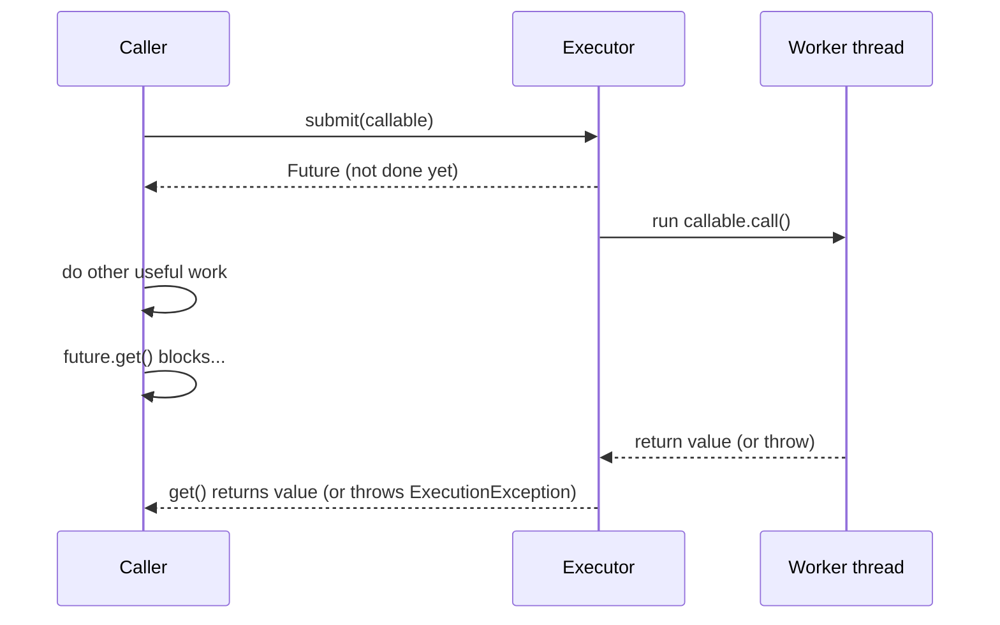

# Lesson 11: `Callable` and `Future`

## What you'll learn

- How `Callable` differs from `Runnable`: it returns a value and can throw checked exceptions
- How to get a result back from another thread with a `Future`, and what to do while you wait
- How exceptions, timeouts and cancellation flow through a `Future`
- `invokeAll`, `invokeAny` and `CompletionService` for working with many tasks at once

---

## Why this matters

`Runnable.run()` returns `void` and can't throw checked exceptions. That's fine for "send this email", but most real work has a result: a price, a user profile, a report. And when it fails, the caller needs to know.

In Lesson 02 you saw that an exception on a worker thread never reaches the caller. `Future` is how a result, *or a failure*, travels back from a worker thread to the thread that asked for it.

---

## The concept

```java
@FunctionalInterface
public interface Callable<V> {
    V call() throws Exception;
}
```

Submit a `Callable` to an executor and you get a `Future<V>` straight away. The `Future` is a receipt, a placeholder for a result that doesn't exist yet.



| `Future` method | What it does |
|---|---|
| `get()` | Blocks until the result is ready. Returns it, or throws `ExecutionException` wrapping the task's exception. |
| `get(timeout, unit)` | The same, but throws `TimeoutException` if the result isn't ready in time. **Prefer this.** |
| `isDone()` | `true` once the task finished: normally, with an exception, or by cancellation |
| `cancel(mayInterrupt)` | Cancels the task if it hasn't started. If it is running and `mayInterrupt` is `true`, the worker is interrupted. |
| `state()` (Java 19+) | `RUNNING`, `SUCCESS`, `FAILED` or `CANCELLED` |
| `resultNow()` / `exceptionNow()` (Java 19+) | Read the outcome of a task that is already done, without checked exceptions |

`get()` can throw three different exceptions, and each means something different:

| Exception | Meaning |
|---|---|
| `ExecutionException` | The *task* threw. The real cause is in `e.getCause()`. |
| `InterruptedException` | *Your* thread was interrupted while waiting. Restore the flag (Lesson 04). |
| `TimeoutException` | Timed `get` only. The result wasn't ready in time, but the task may still be running. |

---

## Hands-on

### 1. Results, failures and timeouts

`FutureBasics.java`:

```java
void main() throws InterruptedException {
    try (ExecutorService pool = Executors.newFixedThreadPool(2)) {
        Callable<Integer> fetchPrice = () -> {
            Thread.sleep(300);
            return 42;
        };

        Future<Integer> price = pool.submit(fetchPrice);
        IO.println("submitted, doing other work while the price loads...");
        IO.println("isDone right away? " + price.isDone());

        try {
            IO.println("price = " + price.get(1, TimeUnit.SECONDS));
        } catch (ExecutionException e) {
            IO.println("task failed: " + e.getCause());
        } catch (TimeoutException e) {
            IO.println("took too long");
            price.cancel(true);
        }

        Future<Integer> broken = pool.submit(() -> {
            if (true) {
                throw new IllegalStateException("inventory service down");
            }
            return 0;
        });
        try {
            broken.get();
        } catch (ExecutionException e) {
            IO.println("failure surfaced at get(): " + e.getCause());
        }

        Future<String> slow = pool.submit(() -> {
            Thread.sleep(5_000);
            return "too late";
        });
        try {
            slow.get(200, TimeUnit.MILLISECONDS);
        } catch (TimeoutException | ExecutionException e) {
            boolean cancelled = slow.cancel(true);
            IO.println("timed out, cancelled = " + cancelled + ", state = " + slow.state());
        }
    }
}
```

```
submitted, doing other work while the price loads...
isDone right away? false
price = 42
failure surfaced at get(): java.lang.IllegalStateException: inventory service down
timed out, cancelled = true, state = CANCELLED
```

Three details:

- The `Callable` throws `InterruptedException` from `Thread.sleep` without any `try/catch`. `call()` is allowed to throw checked exceptions, which a `Runnable` can't.
- `if (true) throw ...` followed by `return 0` is only a trick to keep the example short. It gives the lambda a return value, so it is unmistakably a `Callable<Integer>` and not a `Runnable`.
- A `TimeoutException` stops *you* waiting, but the task keeps running. `cancel(true)` interrupts it, and the whole program finishes quickly because `Thread.sleep` responds to the interrupt. Without the cancel, `close()` at the end of the `try` would wait the full 5 seconds.

### 2. Many tasks: `invokeAll` and `invokeAny`

`InvokeAllAny.java` asks three airlines for a quote:

```java
void main() throws InterruptedException, ExecutionException {
    try (ExecutorService pool = Executors.newFixedThreadPool(3)) {
        List<Callable<String>> quotes = List.of(
                () -> quote("fast-airline", 100),
                () -> quote("slow-airline", 400),
                () -> quote("medium-airline", 250));

        long start = System.currentTimeMillis();
        List<Future<String>> all = pool.invokeAll(quotes);
        for (Future<String> future : all) {
            IO.println("invokeAll: " + future.get());
        }
        IO.println("invokeAll took " + (System.currentTimeMillis() - start) + " ms");

        start = System.currentTimeMillis();
        String first = pool.invokeAny(quotes);
        IO.println("invokeAny: " + first + " after " + (System.currentTimeMillis() - start) + " ms");
    }
}

String quote(String airline, long millis) throws InterruptedException {
    Thread.sleep(millis);
    return airline + " quote";
}
```

```
invokeAll: fast-airline quote
invokeAll: slow-airline quote
invokeAll: medium-airline quote
invokeAll took 404 ms
invokeAny: fast-airline quote after 101 ms
```

- **`invokeAll`** runs every task and waits until *all* have finished (404 ms, the slowest one). The futures come back in the **same order as the tasks**, and they are all done, so `get()` never blocks.
- **`invokeAny`** returns the result of the *first task to succeed* and cancels the rest (101 ms). This is useful for hedged requests: ask several replicas and use whichever answers first.

### 3. Results in completion order: `CompletionService`

`invokeAll` makes you wait for the slowest task before you can see any result. A `CompletionService` hands you each result *as soon as it's ready*.

`CompletionOrder.java`:

```java
void main() throws InterruptedException, ExecutionException {
    try (ExecutorService pool = Executors.newFixedThreadPool(3)) {
        CompletionService<String> completion = new ExecutorCompletionService<>(pool);
        completion.submit(() -> download("big.zip", 600));
        completion.submit(() -> download("small.txt", 100));
        completion.submit(() -> download("medium.pdf", 300));

        for (int i = 0; i < 3; i++) {
            Future<String> done = completion.take();
            IO.println("finished: " + done.get());
        }
    }
}

String download(String file, long millis) throws InterruptedException {
    Thread.sleep(millis);
    return file;
}
```

```
finished: small.txt
finished: medium.pdf
finished: big.zip
```

Submitted in the order big, small, medium. Received in the order small, medium, big. Internally, finished futures go into a `BlockingQueue`, and `take()` waits for the next one. The repository demo [`callable/CallableDemo.java`](../../src/main/java/org/javaguy/callable/CallableDemo.java) uses the same pattern, along with `invokeAll` and `FutureTask`.

### The limits of `Future`

`Future` works, but it is a *pull* model: you must block on `get()` to find out what happened. You can't say "when this finishes, then do that" or "combine these two results" without tying up a thread to wait. `CompletableFuture` (Lesson 18) fixes exactly that.

---

## Try it yourself

1. In `FutureBasics`, call `slow.get()` with no timeout and remove the cancel. How long does the program take now?
2. Make one of the airline quotes throw an exception. What does `invokeAll` return for it? What does `invokeAny` do if only *one* task fails, and what if *all* of them fail?
3. Rewrite `CompletionOrder` to print the results as soon as they arrive *without* `CompletionService`, just a `List<Future>`. Why is it harder?
4. Use `Executors.callable(runnable, "done")` to turn a `Runnable` into a `Callable<String>`.

---

## Common mistakes

- **Calling `get()` right after `submit()`.** You've made the work synchronous and gained nothing. Do other work between `submit` and `get`.
- **`get()` with no timeout.** One stuck task hangs the caller forever.
- **Logging `ExecutionException` itself instead of `getCause()`.** The wrapper hides the real error.
- **Swallowing the `InterruptedException` from `get()`.** Restore the flag.
- **Ignoring the `Future` returned by `submit`.** Any exception disappears with it.
- **Assuming a `TimeoutException` stopped the task.** Call `cancel(true)` if you really want it to stop.

---

## Check your understanding

**1. Name two differences between `Runnable` and `Callable`.**

<details>
<summary>Reveal answer</summary>

`Callable.call()` returns a value, while `Runnable.run()` returns `void`. `call()` can also throw checked exceptions, while `run()` can't. Both can be submitted to an `ExecutorService`.

</details>

**2. A task throws `IllegalArgumentException`. What does `future.get()` throw, and how do you get the original exception?**

<details>
<summary>Reveal answer</summary>

It throws `ExecutionException`. The original `IllegalArgumentException` is `e.getCause()`.

</details>

**3. `future.get(1, SECONDS)` throws `TimeoutException`. Is the task still running?**

<details>
<summary>Reveal answer</summary>

Possibly, yes. The timeout only stops the caller from waiting. Call `future.cancel(true)` to interrupt the task, and it will only stop if the task responds to interruption.

</details>

**4. When would you use `invokeAny`?**

<details>
<summary>Reveal answer</summary>

When any one successful result is enough and you want the fastest. Examples are querying several mirrors or replicas, or trying several strategies at once. It returns the first successful result and cancels the rest.

</details>

**5. You submit 50 downloads and want to process each one the moment it finishes. What do you use?**

<details>
<summary>Reveal answer</summary>

A `CompletionService` (for example, `ExecutorCompletionService`). `take()` returns futures in *completion* order, while `invokeAll` returns them in *submission* order only after all are done. `CompletableFuture` (Lesson 18) is the other option.

</details>

---

## Recap

- `Callable` = a task with a result and checked exceptions. `Future` = a receipt for that result.
- `get()` blocks. Always prefer the timed version, and unwrap `ExecutionException.getCause()`.
- `cancel(true)` interrupts a running task. A timeout alone doesn't stop anything.
- `invokeAll` waits for all tasks, `invokeAny` returns the first success, and `CompletionService` delivers results in completion order.

**Next: [Lesson 12, Atomic variables and CAS](12-atomics.md)**
