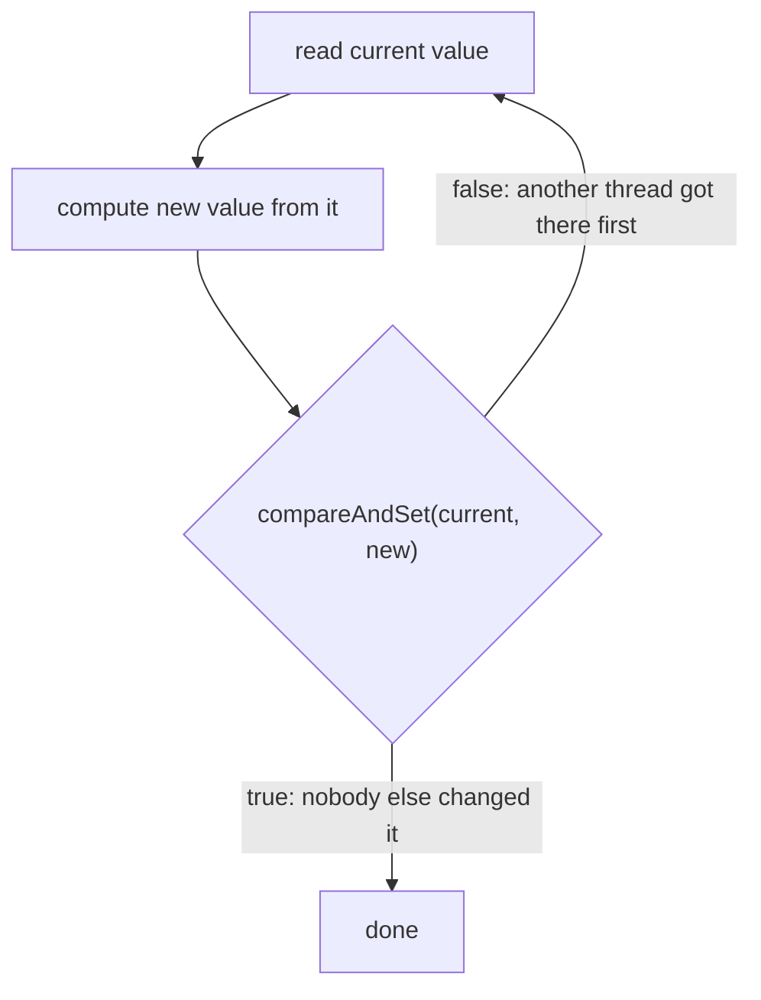

# Lesson 12: Atomic Variables and CAS

## What you'll learn

- How `AtomicInteger` fixes the lost-update counter without any lock
- **Compare-and-set (CAS)**, the single CPU instruction behind every atomic class
- How to write a CAS retry loop, and the built-in helpers (`updateAndGet`, `accumulateAndGet`) that write it for you
- When `LongAdder` beats `AtomicLong`, and how `AtomicReference` makes updates to whole objects atomic

---

## Why this matters

`synchronized` works, but it's heavy-handed for a single number. A thread that can't get the lock is parked by the operating system and woken up later, which takes microseconds. For "add one to a counter", that's a lot of ceremony.

Modern CPUs have an instruction that does "update this value, but only if nobody changed it since I read it" in one indivisible step. The `java.util.concurrent.atomic` package exposes it. These classes are **lock-free**: threads never block, they just retry.

---

## The concept

### Compare-and-set

`compareAndSet(expected, newValue)` says: *if the current value is still `expected`, set it to `newValue` and return `true`; otherwise change nothing and return `false`.* The CPU does the comparison and the write as one atomic instruction (`CMPXCHG` on x86, `CAS` or `LDXR`/`STXR` on ARM).

Every lock-free update is a loop around it:



Compare that with Lesson 05's lost update. There, a thread wrote its result *even though* the value had changed underneath it. With CAS, the write fails, and the thread re-reads and tries again. No update is ever lost.

### The classes

| Class | Use it for |
|---|---|
| `AtomicInteger`, `AtomicLong` | Counters, sequence numbers, a single numeric value |
| `AtomicBoolean` | A flag that must flip exactly once ("run this only once") |
| `AtomicReference<V>` | Swapping a whole object atomically, usually an immutable one |
| `LongAdder`, `LongAccumulator` | Counters written by many threads and read rarely (metrics) |
| `AtomicIntegerArray` and friends | Arrays whose elements are updated atomically |

The methods you'll use most:

| Method | Returns |
|---|---|
| `get()` / `set(v)` | Read and write, with `volatile` semantics |
| `incrementAndGet()` / `getAndIncrement()` | The new value / the old value |
| `addAndGet(delta)` | The new value |
| `compareAndSet(expected, new)` | `true` if it was swapped |
| `updateAndGet(fn)` / `accumulateAndGet(x, fn)` | The new value, with the CAS loop written for you |

---

## Hands-on

### 1. The counter, fixed without a lock

`AtomicCounter.java`:

```java
void main() throws InterruptedException {
    var atomic = new AtomicInteger();
    var adder = new LongAdder();

    try (ExecutorService pool = Executors.newFixedThreadPool(4)) {
        for (int i = 0; i < 4; i++) {
            pool.submit(() -> {
                for (int j = 0; j < 100_000; j++) {
                    atomic.incrementAndGet();
                    adder.increment();
                }
            });
        }
    }

    IO.println("AtomicInteger: " + atomic.get());
    IO.println("LongAdder:     " + adder.sum());
}
```

```
AtomicInteger: 400000
LongAdder:     400000
```

Both counters are correct every time. Compare this with the `volatile int` counter from Lesson 07, which lost almost half its updates.

### 2. A CAS loop by hand: highest bid wins

"Keep the maximum" is a read-modify-write, so it needs the CAS loop.

`CasLoop.java`:

```java
void main() throws InterruptedException {
    var highestBid = new AtomicInteger(0);
    var retries = new AtomicInteger(0);

    try (ExecutorService pool = Executors.newFixedThreadPool(8)) {
        for (int bidder = 1; bidder <= 8; bidder++) {
            pool.submit(() -> {
                for (int round = 0; round < 10_000; round++) {
                    int bid = ThreadLocalRandom.current().nextInt(1_000_000);
                    placeBid(highestBid, bid, retries);
                }
            });
        }
    }
    IO.println("highest bid: " + highestBid.get());
    IO.println("CAS retries: " + retries.get());

    var maxWithHelper = new AtomicInteger(0);
    maxWithHelper.accumulateAndGet(500, Math::max);
    maxWithHelper.accumulateAndGet(300, Math::max);
    IO.println("accumulateAndGet(max): " + maxWithHelper.get());
}

void placeBid(AtomicInteger highestBid, int bid, AtomicInteger retries) {
    while (true) {
        int current = highestBid.get();
        if (bid <= current) {
            return;
        }
        if (highestBid.compareAndSet(current, bid)) {
            return;
        }
        retries.incrementAndGet();
    }
}
```

One run:

```
highest bid: 999966
CAS retries: 1
accumulateAndGet(max): 500
```

`placeBid` is exactly the loop from the diagram: read, decide, try to swap, and go round again if another thread won. Retries are rare here because most bids lose to the current maximum without ever attempting a swap. The retry count varies from run to run.

In real code, write `highestBid.accumulateAndGet(bid, Math::max)`. It is the same loop, already written and tested. One rule for the functions you pass to `updateAndGet`/`accumulateAndGet`: **they must have no side effects**, because under contention they may run more than once.

(`ThreadLocalRandom.current()` gives each thread its own random generator. A single shared `Random` would make threads contend on its internal seed, which is itself an `AtomicLong`.)

### 3. `AtomicReference`: updating several fields as one

What if you need to update two numbers together, such as requests and errors? Two `AtomicLong`s can't be updated atomically *together*. Put both in an immutable record and swap the whole record.

`AtomicReferenceDemo.java`:

```java
record Stats(long requests, long errors) {
    Stats record(boolean failed) {
        return new Stats(requests + 1, failed ? errors + 1 : errors);
    }
}

void main() throws InterruptedException {
    var stats = new AtomicReference<>(new Stats(0, 0));

    try (ExecutorService pool = Executors.newFixedThreadPool(4)) {
        for (int i = 0; i < 4; i++) {
            pool.submit(() -> {
                for (int j = 0; j < 10_000; j++) {
                    boolean failed = j % 10 == 0;
                    stats.updateAndGet(current -> current.record(failed));
                }
            });
        }
    }
    IO.println(stats.get());
}
```

```
Stats[requests=40000, errors=4000]
```

Readers always see a consistent pair, because `requests` and `errors` change in the same swap. This "immutable snapshot plus atomic reference" pattern shows up again in Lesson 16.

### 4. `LongAdder` vs `AtomicLong` under contention

When many threads hammer the *same* `AtomicLong`, most of their CAS attempts fail and retry, and the CPU cores fight over the cache line that holds the value. `LongAdder` avoids this by giving threads separate cells to add into, and only adds them together when you call `sum()`.

`AdderBenchmark.java`:

```java
void main() throws InterruptedException {
    int threads = Runtime.getRuntime().availableProcessors();
    var atomic = new AtomicLong();
    var adder = new LongAdder();

    IO.println("AtomicLong: " + time(threads, atomic::incrementAndGet) + " ms");
    IO.println("LongAdder:  " + time(threads, adder::increment) + " ms");
}

long time(int threads, Runnable increment) throws InterruptedException {
    long start = System.currentTimeMillis();
    try (ExecutorService pool = Executors.newFixedThreadPool(threads)) {
        for (int i = 0; i < threads; i++) {
            pool.submit(() -> {
                for (int j = 0; j < 5_000_000; j++) {
                    increment.run();
                }
            });
        }
    }
    return System.currentTimeMillis() - start;
}
```

On a 12-core machine:

```
AtomicLong: 5603 ms
LongAdder:  351 ms
```

About 16 times faster in this run. (This is a rough timing, not a proper benchmark. Use JMH for real measurements. The difference is still real.) The trade-off: `sum()` isn't an atomic snapshot while writes are in progress, and there's no `compareAndSet`. `LongAdder` is for counters you **write often and read rarely**, such as request counts and metrics. Micrometer uses it for exactly that. For sequence numbers or IDs, where every reader needs the exact current value, use `AtomicLong`.

### Atomics vs locks

| | Atomics | Locks |
|---|---|---|
| Scope | One variable, or one reference to an immutable object | Any number of variables, any code |
| Blocking | Never. Threads retry. | Waiting threads are parked. |
| Under low or medium contention | Faster | Slower |
| Under very heavy contention | Many wasted retries (`LongAdder` fixes this for counters) | Threads queue in an orderly way |
| Composing two updates | Not possible. Two atomics are not atomic together. | Easy: put both inside one lock |

---

## Try it yourself

1. Replace `highestBid.compareAndSet(current, bid)` with `highestBid.set(bid)`. Is the final answer still always the maximum? Explain the interleaving that breaks it.
2. Use `AtomicBoolean.compareAndSet(false, true)` to make an `init()` method that runs exactly once, no matter how many threads call it.
3. Put a `IO.println` inside the lambda passed to `updateAndGet` in `AtomicReferenceDemo`. Count how many times it prints compared with 40,000. Why is it more?
4. Keep `requests` and `errors` in two separate `AtomicLong`s. Write a reader thread that checks `errors <= requests`. Can you catch a moment when the check fails?

---

## Common mistakes

- **`get()` then `set()` instead of one atomic method.** That is check-then-act again. Use `incrementAndGet`, `updateAndGet` or `compareAndSet`.
- **Side effects in `updateAndGet` lambdas.** The lambda can run several times under contention.
- **Several atomics that must stay consistent with each other.** Each is atomic on its own, but the group isn't. Use one `AtomicReference` to an immutable object, or a lock.
- **Using `LongAdder` for IDs or anything that needs an exact read.** `sum()` isn't a snapshot while writes are happening.
- **Mutating the object inside an `AtomicReference`.** The reference is atomic, not the object's fields. Keep those objects immutable.

---

## Check your understanding

**1. What does `compareAndSet(5, 6)` do if the current value is 7?**

<details>
<summary>Reveal answer</summary>

Nothing. It returns `false` and leaves the value at 7. It only writes when the current value equals the expected one. The caller then typically re-reads and retries.

</details>

**2. Why don't CAS-based updates lose writes the way `counter++` does?**

<details>
<summary>Reveal answer</summary>

The write only succeeds if the value is unchanged since it was read. If another thread updated it in between, CAS fails and the thread recomputes from the fresh value. With `counter++`, the stale write goes through anyway.

</details>

**3. When is `LongAdder` a better choice than `AtomicLong`?**

<details>
<summary>Reveal answer</summary>

For counters that many threads update often and that are read rarely, such as metrics and statistics. It spreads updates across several cells to avoid contention. It is a poor fit when you need `compareAndSet` or an exact, consistent read while updates are in progress.

</details>

**4. You need `balance` and `transactionCount` to always change together. Two `AtomicLong` fields: safe or not?**

<details>
<summary>Reveal answer</summary>

Not safe. Each update is atomic on its own, but a reader can see one changed and not the other. Put both in an immutable record inside an `AtomicReference` and swap the record with `updateAndGet`, or protect both with a lock.

</details>

**5. Why must the function passed to `updateAndGet` be free of side effects?**

<details>
<summary>Reveal answer</summary>

`updateAndGet` is a CAS retry loop. If another thread changes the value between the read and the swap, the function runs again with the new value. Any side effect, such as logging, sending a message or incrementing something else, may happen more than once.

</details>

---

## Recap

- **CAS** does "write only if unchanged" in one CPU instruction, and it's the basis of lock-free code.
- `AtomicInteger`/`AtomicLong` for counters, `AtomicBoolean` for run-once flags, `AtomicReference` plus an immutable record for multi-field state.
- Prefer `updateAndGet`/`accumulateAndGet` to hand-written loops, and keep their lambdas pure.
- `LongAdder` for hot counters that are written often and read rarely.
- One variable: atomics. Several variables that must change together: a lock, or one atomic reference.

**Next: [Lesson 13, Explicit locks](13-explicit-locks.md)**
