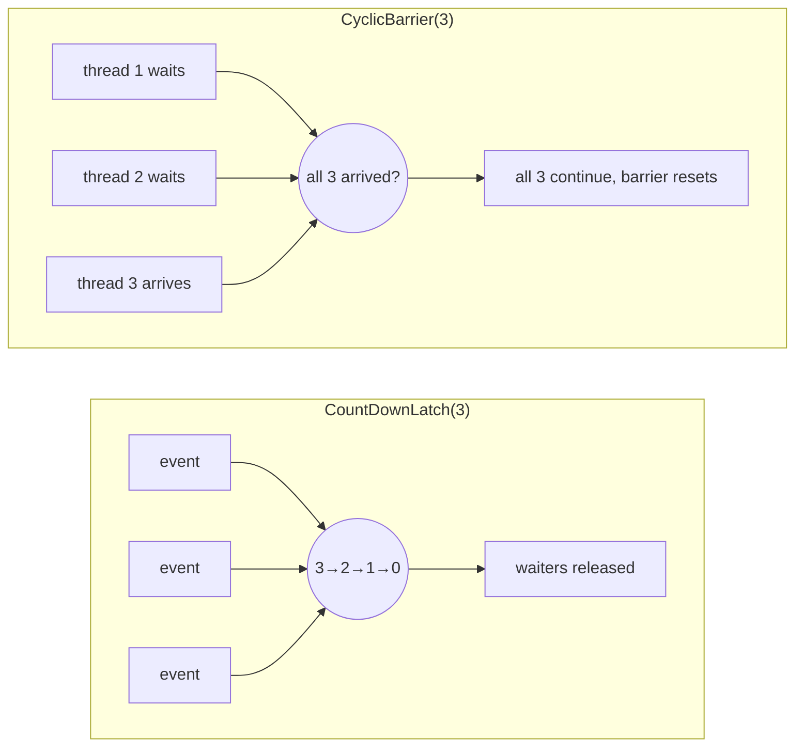

# Lesson 14: Synchronizers

## What you'll learn

- `CountDownLatch`: wait until N things have happened
- `CyclicBarrier`: make N threads wait for each other, round after round
- `Semaphore`: allow at most N threads into a section at once
- `Phaser`: a flexible barrier whose members can join and leave

---

## Why this matters

In Lesson 03 you used `Thread.sleep` to "give another thread time", and you were warned never to do that in real code. In Lesson 08 you built coordination by hand with `wait`/`notify`, and saw how easy it is to get wrong.

**Synchronizers** are ready-made coordination objects for the patterns that come up again and again: "start when everything is ready", "everyone meet here", and "no more than five at a time". They are correct, fast, and they say clearly what you mean.

---

## The concept

| Synchronizer | Question it answers | Reusable? |
|---|---|---|
| `CountDownLatch(n)` | "Wait until `n` events have happened." | No, it's one-shot |
| `CyclicBarrier(n)` | "Wait until all `n` threads reach this point, then all continue." | Yes, it resets each round |
| `Semaphore(n)` | "At most `n` threads may hold a permit at once." | Yes |
| `Phaser` | "A barrier with phases, where parties can register and deregister." | Yes |



The key difference between a latch and a barrier: with a **latch**, *some* threads wait for *events* (anyone can count down, and the counting threads don't wait). With a **barrier**, the *participating threads wait for each other*.

---

## Hands-on

### 1. `CountDownLatch`: wait for startup

A service shouldn't accept traffic until its database, cache and message broker connections are all up.

`LatchDemo.java`:

```java
void main() throws InterruptedException {
    List<String> services = List.of("database", "cache", "message-broker");
    var ready = new CountDownLatch(services.size());

    try (ExecutorService pool = Executors.newFixedThreadPool(services.size())) {
        for (String service : services) {
            pool.submit(() -> {
                pause(ThreadLocalRandom.current().nextInt(100, 500));
                IO.println(service + " is up");
                ready.countDown();
            });
        }

        IO.println("waiting for " + ready.getCount() + " services...");
        boolean allUp = ready.await(2, TimeUnit.SECONDS);
        IO.println(allUp ? "all services up, accepting traffic" : "startup timed out");
    }
}

void pause(long millis) {
    try {
        Thread.sleep(millis);
    } catch (InterruptedException e) {
        Thread.currentThread().interrupt();
    }
}
```

One run:

```
waiting for 3 services...
message-broker is up
database is up
cache is up
all services up, accepting traffic
```

- `countDown()` decrements the count. It never blocks.
- `await()` blocks until the count reaches zero. Use the timed version so a service that never starts can't hang you forever.
- Once at zero, the latch stays open. Later `await()` calls return immediately, and it can't be reset.
- In real code, call `countDown()` in a `finally`, so a failing task still counts down and doesn't leave the waiters hanging.

### 2. A latch as a starting gun

A latch of 1 releases many threads at the same instant, which is handy for load tests and for making race conditions show up in tests (Lesson 24).

`StartingGun.java`:

```java
void main() throws InterruptedException {
    var startingGun = new CountDownLatch(1);
    var finishLine = new CountDownLatch(3);

    for (int runner = 1; runner <= 3; runner++) {
        int runnerId = runner;
        Thread.ofPlatform().start(() -> {
            try {
                startingGun.await();
                IO.println("runner " + runnerId + " off at " + System.nanoTime() / 1_000_000 % 10_000);
            } catch (InterruptedException e) {
                Thread.currentThread().interrupt();
            } finally {
                finishLine.countDown();
            }
        });
    }

    Thread.sleep(200);
    IO.println("bang!");
    startingGun.countDown();
    finishLine.await();
    IO.println("race over");
}
```

One run:

```
bang!
runner 2 off at 4142
runner 3 off at 4143
runner 1 off at 4142
race over
```

All three start within a millisecond of each other. (The printed number is just the last digits of the current time in milliseconds.) The `Thread.sleep(200)` here isn't coordination: it only makes sure the runners are waiting before the gun fires, so the demo is visible. Correctness doesn't depend on it.

### 3. `CyclicBarrier`: phases of parallel work

Simulations, and multi-stage batch jobs, often need every worker to finish step N before anyone starts step N+1.

`BarrierDemo.java`:

```java
void main() {
    int workers = 3;
    var barrier = new CyclicBarrier(workers, () -> IO.println("--- all workers finished this phase ---"));

    try (ExecutorService pool = Executors.newFixedThreadPool(workers)) {
        for (int w = 1; w <= workers; w++) {
            int workerId = w;
            pool.submit(() -> {
                for (int phase = 1; phase <= 3; phase++) {
                    pause(ThreadLocalRandom.current().nextInt(50, 300));
                    IO.println("worker " + workerId + " done with phase " + phase);
                    try {
                        barrier.await();
                    } catch (InterruptedException e) {
                        Thread.currentThread().interrupt();
                        return;
                    } catch (BrokenBarrierException e) {
                        return;
                    }
                }
            });
        }
    }
}

void pause(long millis) {
    try {
        Thread.sleep(millis);
    } catch (InterruptedException e) {
        Thread.currentThread().interrupt();
    }
}
```

One run:

```
worker 3 done with phase 1
worker 2 done with phase 1
worker 1 done with phase 1
--- all workers finished this phase ---
worker 2 done with phase 2
worker 3 done with phase 2
worker 1 done with phase 2
--- all workers finished this phase ---
worker 1 done with phase 3
worker 3 done with phase 3
worker 2 done with phase 3
--- all workers finished this phase ---
```

- The optional **barrier action** (the second constructor argument) runs once per round, after the last thread arrives and before anyone is released. It's a good place to merge partial results.
- The barrier **resets automatically**, which is what "cyclic" means.
- If one waiting thread is interrupted or times out, the barrier is **broken** and every other waiter gets `BrokenBarrierException`. That way nobody waits forever for a thread that isn't coming.
- **The pool needs at least as many threads as parties.** With a 2-thread pool and a 3-party barrier, the third party never gets a thread and the program hangs.

### 4. `Semaphore`: limit concurrency

A semaphore holds a number of **permits**. `acquire()` takes one, waiting if none are left, and `release()` gives one back. Use it to limit how many threads can use a scarce resource at once: database connections, calls to a rate-limited API, or file handles.

`SemaphoreDemo.java`:

```java
void main() {
    var connections = new Semaphore(2);
    var inUse = new AtomicInteger();

    try (ExecutorService pool = Executors.newFixedThreadPool(6)) {
        for (int i = 1; i <= 6; i++) {
            int requestId = i;
            pool.submit(() -> {
                try {
                    connections.acquire();
                } catch (InterruptedException e) {
                    Thread.currentThread().interrupt();
                    return;
                }
                try {
                    IO.println("request " + requestId + " got a connection, in use: " + inUse.incrementAndGet());
                    pause(300);
                    inUse.decrementAndGet();
                } finally {
                    connections.release();
                }
            });
        }
    }
}

void pause(long millis) {
    try {
        Thread.sleep(millis);
    } catch (InterruptedException e) {
        Thread.currentThread().interrupt();
    }
}
```

One run:

```
request 2 got a connection, in use: 2
request 1 got a connection, in use: 1
request 3 got a connection, in use: 1
request 6 got a connection, in use: 2
request 5 got a connection, in use: 1
request 4 got a connection, in use: 2
```

Six threads, but never more than two inside at once. The same `acquire`, then `try`, then `finally release` shape as a lock, and for the same reason.

Differences from a lock:

- Permits have **no owner**. Any thread can `release()`, even one that never acquired. That's flexible, and it's also a bug waiting to happen if you release twice.
- `tryAcquire(timeout)` lets a caller give up instead of queueing forever. That is the basis of the **bulkhead** pattern in Lesson 23.
- A `Semaphore(1)` works like a lock that isn't reentrant.

### 5. `Phaser`: a barrier with changing membership

`CyclicBarrier` has a fixed number of parties. A `Phaser` lets parties `register()` and `arriveAndDeregister()` as the work goes on.

`PhaserDemo.java`:

```java
void main() throws InterruptedException {
    var phaser = new Phaser(1);

    for (int i = 1; i <= 3; i++) {
        int workerId = i;
        phaser.register();
        Thread.ofPlatform().start(() -> {
            IO.println("worker " + workerId + " loading data");
            phaser.arriveAndAwaitAdvance();
            if (workerId == 3) {
                IO.println("worker 3 leaves after loading");
                phaser.arriveAndDeregister();
                return;
            }
            IO.println("worker " + workerId + " processing");
            phaser.arriveAndAwaitAdvance();
            IO.println("worker " + workerId + " saving");
            phaser.arriveAndDeregister();
        });
    }

    phaser.arriveAndAwaitAdvance();
    IO.println("== phase 0 (load) complete ==");
    phaser.arriveAndAwaitAdvance();
    IO.println("== phase 1 (process) complete, parties now " + phaser.getRegisteredParties() + " ==");
    phaser.arriveAndDeregister();
}
```

One run:

```
worker 1 loading data
worker 2 loading data
worker 3 loading data
worker 3 leaves after loading
worker 2 processing
== phase 0 (load) complete ==
worker 1 processing
worker 2 saving
== phase 1 (process) complete, parties now 3 ==
worker 1 saving
```

`main` registers itself as a party (`new Phaser(1)`) so it can wait on the phases too. Worker 3 leaves after phase 0, and the phaser simply expects one fewer party from then on. After each phase is released, threads race to print, which is why the order of lines within a phase varies.

`Phaser` is the most flexible synchronizer and the hardest to read. Use a latch or a barrier when they fit.

---

## Try it yourself

1. In `LatchDemo`, make the cache "fail" by throwing an exception before `countDown()`. What happens to `await`? Fix it with `finally`.
2. In `BarrierDemo`, change the pool size to 2. Take a thread dump and explain what you see.
3. Use a `Semaphore(3)` to make sure no more than three virtual threads call a fake API at once, out of 100 tasks.
4. Replace the `CyclicBarrier` in `BarrierDemo` with a `Phaser`.

---

## Common mistakes

- **Using `sleep` for coordination.** Use a latch, barrier or `join`.
- **`countDown()` / `release()` not in `finally`.** One exception, and a waiter hangs forever or a permit leaks.
- **Trying to reuse a `CountDownLatch`.** It can't be reset. Create a new one, or use `CyclicBarrier`/`Phaser`.
- **Running a barrier on a pool with fewer threads than parties.** It deadlocks.
- **Releasing a semaphore you never acquired.** The permit count goes above its limit, and the limit silently stops working.
- **Waiting with no timeout.** Prefer `await(timeout)` and `tryAcquire(timeout)`.

---

## Check your understanding

**1. What is the key difference between `CountDownLatch` and `CyclicBarrier`?**

<details>
<summary>Reveal answer</summary>

A latch waits for *events*: counting threads don't block, and it can only be used once. A barrier makes the *participating threads wait for each other*, and it resets automatically for the next round.

</details>

**2. You need at most 10 concurrent calls to a partner API. Which synchronizer do you use?**

<details>
<summary>Reveal answer</summary>

A `Semaphore(10)`. Each call does `acquire()` before and `release()` in a `finally` after. `tryAcquire(timeout)` lets callers fail fast instead of queueing forever.

</details>

**3. A `CountDownLatch(3)` has reached zero. A new thread calls `await()`. What happens?**

<details>
<summary>Reveal answer</summary>

It returns immediately. Once a latch reaches zero it stays open forever.

</details>

**4. One thread waiting at a `CyclicBarrier` is interrupted. What happens to the others?**

<details>
<summary>Reveal answer</summary>

The barrier becomes broken, and every thread waiting on it, or arriving later, gets `BrokenBarrierException`. This stops them from waiting forever for a party that won't arrive.

</details>

**5. When would you use a `Phaser` over a `CyclicBarrier`?**

<details>
<summary>Reveal answer</summary>

When the number of participants changes over time, with parties registering or leaving between phases, or when you need to track phase numbers. For a fixed group, `CyclicBarrier` is simpler.

</details>

---

## Recap

- `CountDownLatch`: one-shot, wait for N events.
- `CyclicBarrier`: N threads meet at a point, round after round, with an optional merge action.
- `Semaphore`: at most N at a time. Always `release()` in `finally`.
- `Phaser`: a barrier whose membership changes.
- Every one of them replaces fragile `sleep` or hand-written `wait`/`notify` code.

**Next: [Lesson 15, Concurrent collections](15-concurrent-collections.md)**
