# Lesson 17: Scheduled Executors

## What you'll learn

- How to run a task after a delay, or repeatedly, with `ScheduledExecutorService`
- The difference between **fixed rate** and **fixed delay**, and which one to pick
- Why one uncaught exception silently stops a periodic task forever
- Why `ScheduledExecutorService` replaced `java.util.Timer`

---

## Why this matters

Backend services are full of timed work: send heartbeats, refresh a cache every minute, retry a failed call in five seconds, expire sessions, flush metrics. A `while (true) { work(); Thread.sleep(...); }` loop in its own thread works, but you have to manage the thread, the shutdown, the error handling and the timing drift yourself.

`ScheduledExecutorService` is a thread pool with a clock. Spring's `@Scheduled` runs on one.

---

## The concept

| Method | Runs |
|---|---|
| `schedule(task, delay, unit)` | Once, after `delay` |
| `scheduleAtFixedRate(task, initialDelay, period, unit)` | Repeatedly. Each run *starts* `period` after the previous one *started*. |
| `scheduleWithFixedDelay(task, initialDelay, delay, unit)` | Repeatedly. Each run *starts* `delay` after the previous one *finished*. |

Every method returns a `ScheduledFuture`, which you can `cancel()`.

```mermaid
gantt
    title A 150 ms job scheduled every 200 ms
    dateFormat x
    axisFormat %L ms
    section Fixed rate
    run 1 :0, 150
    run 2 :200, 350
    run 3 :400, 550
    section Fixed delay
    run 1 :0, 150
    run 2 :350, 500
    run 3 :700, 850
```



- **Fixed rate** keeps to the clock: 0, 200, 400... It's the right choice for "sample every second" or "heartbeat every 5 seconds". If a run takes *longer* than the period, the next run starts late but runs **never overlap**. They queue up and then run back to back.
- **Fixed delay** guarantees a gap between runs. It's the right choice for "poll the queue, then rest", where you never want to hammer a downstream system.

---

## Hands-on

### 1. One-off and periodic tasks

`ScheduledDemo.java`:

```java
long start = System.currentTimeMillis();

void main() throws InterruptedException {
    try (ScheduledExecutorService scheduler = Executors.newScheduledThreadPool(2)) {
        scheduler.schedule(() -> log("one-off reminder after 300 ms"), 300, TimeUnit.MILLISECONDS);

        ScheduledFuture<?> heartbeat = scheduler.scheduleAtFixedRate(
                () -> log("heartbeat"), 0, 200, TimeUnit.MILLISECONDS);

        Thread.sleep(700);
        heartbeat.cancel(false);
        log("heartbeat cancelled");
    }
}

void log(String message) {
    IO.println(String.format("%4d ms  %s", System.currentTimeMillis() - start, message));
}
```

```
  18 ms  heartbeat
 217 ms  heartbeat
 315 ms  one-off reminder after 300 ms
 417 ms  heartbeat
 617 ms  heartbeat
 719 ms  heartbeat cancelled
```

A periodic task runs until it's cancelled or the scheduler shuts down. By default, `shutdown()` (and so `close()`) cancels pending periodic runs and lets a run that is already in progress finish. Cancelling explicitly, as above, still makes the intent clear, and it lets you stop one task while the scheduler keeps running the others.

### 2. Fixed rate vs fixed delay, measured

`RateVsDelay.java` runs a 150 ms job every 200 ms, both ways:

```java
long start = System.currentTimeMillis();

void main() throws InterruptedException {
    try (ScheduledExecutorService scheduler = Executors.newScheduledThreadPool(2)) {
        ScheduledFuture<?> rate = scheduler.scheduleAtFixedRate(
                () -> slowJob("fixed RATE "), 0, 200, TimeUnit.MILLISECONDS);
        Thread.sleep(1_000);
        rate.cancel(false);

        Thread.sleep(200);
        IO.println("");

        ScheduledFuture<?> delay = scheduler.scheduleWithFixedDelay(
                () -> slowJob("fixed DELAY"), 0, 200, TimeUnit.MILLISECONDS);
        Thread.sleep(1_000);
        delay.cancel(false);
    }
}

void slowJob(String label) {
    IO.println(String.format("%s started at %4d ms", label, (System.currentTimeMillis() - start) % 1200));
    try {
        Thread.sleep(150);
    } catch (InterruptedException e) {
        Thread.currentThread().interrupt();
    }
}
```

```
fixed RATE  started at   17 ms
fixed RATE  started at  216 ms
fixed RATE  started at  416 ms
fixed RATE  started at  616 ms
fixed RATE  started at  816 ms
fixed RATE  started at 1015 ms

fixed DELAY started at   22 ms
fixed DELAY started at  373 ms
fixed DELAY started at  724 ms
```

Fixed rate starts every 200 ms. Fixed delay starts every 350 ms: 150 ms of work plus a 200 ms gap. (`% 1200` just restarts the clock for the second half of the demo.)

### 3. The silent death of a periodic task

`SilentDeath.java`:

```java
void main() throws InterruptedException {
    var runs = new AtomicInteger();
    try (ScheduledExecutorService scheduler = Executors.newSingleThreadScheduledExecutor()) {
        ScheduledFuture<?> broken = scheduler.scheduleAtFixedRate(() -> {
            int run = runs.incrementAndGet();
            IO.println("broken job run " + run);
            if (run == 3) {
                throw new IllegalStateException("database hiccup");
            }
        }, 0, 100, TimeUnit.MILLISECONDS);

        var safeRuns = new AtomicInteger();
        ScheduledFuture<?> safe = scheduler.scheduleAtFixedRate(() -> {
            try {
                int run = safeRuns.incrementAndGet();
                if (run == 3) {
                    throw new IllegalStateException("database hiccup");
                }
            } catch (RuntimeException e) {
                IO.println("safe job logged and survived: " + e.getMessage());
            }
        }, 0, 100, TimeUnit.MILLISECONDS);

        Thread.sleep(700);
        IO.println("broken job done? " + broken.isDone() + ", runs = " + runs.get());
        IO.println("safe job done?   " + safe.isDone() + ", runs = " + safeRuns.get());
        try {
            broken.get();
        } catch (ExecutionException e) {
            IO.println("the reason it stopped: " + e.getCause());
        }
        safe.cancel(false);
    }
}
```

```
broken job run 1
broken job run 2
broken job run 3
safe job logged and survived: database hiccup
broken job done? true, runs = 3
safe job done?   false, runs = 8
the reason it stopped: java.lang.IllegalStateException: database hiccup
```

This is one of the nastiest production bugs in this course. **If a periodic task throws, it never runs again**, and *nothing is logged*. The exception is stored in the `ScheduledFuture`, like `submit` in Lesson 10. Your cache simply stops refreshing, and nobody notices for days.

**Always wrap the body of a periodic task in `try/catch` and log the error.**

### Why not `java.util.Timer`?

| `Timer` | `ScheduledExecutorService` |
|---|---|
| One thread for all tasks: a slow task delays all the others | A pool of as many threads as you choose |
| An uncaught exception **kills the timer thread and cancels every task** | Only the failing task stops |
| Based on the system clock, so a clock change shifts it | Based on relative time (`System.nanoTime`) |

There is no reason to use `Timer` in new code.

---

## Try it yourself

1. Make the job in `RateVsDelay` take 300 ms with a 200 ms period at a fixed rate. Print the start times. Do runs ever overlap?
2. Schedule a retry with exponential backoff: 100 ms, then 200, then 400, stopping after the first success. (Hint: each run schedules the next with `schedule`.)
3. Remove `heartbeat.cancel(false)` from `ScheduledDemo`. Does the program still exit? Look up `setContinueExistingPeriodicTasksAfterShutdownPolicy` on `ScheduledThreadPoolExecutor` to explain why.
4. Write a `TimeoutGuard` that uses `schedule` to call `future.cancel(true)` on another task if it hasn't finished within 1 second.

---

## Common mistakes

- **No `try/catch` in periodic tasks.** One exception, and the task silently stops forever.
- **Fixed rate for work that can take longer than the period.** Runs pile up back to back. Use fixed delay.
- **A single-threaded scheduler with long-running tasks.** Every other task waits. Size the pool, or hand the heavy work to another executor.
- **Assuming a periodic task keeps running after `shutdown()`.** By default it doesn't.
- **Using `Timer`.**

---

## Check your understanding

**1. A job takes 3 seconds and is scheduled with `scheduleAtFixedRate(..., 5, SECONDS)`. When do runs start? What about `scheduleWithFixedDelay(..., 5, SECONDS)`?**

<details>
<summary>Reveal answer</summary>

Fixed rate: at 0, 5, 10, 15 s, one every period, measured start to start. Fixed delay: at 0, 8, 16 s, because each run starts 5 seconds after the previous one *finished* (3 s of work plus 5 s of delay).

</details>

**2. A fixed-rate task sometimes takes longer than its period. Do two runs of it ever execute at the same time?**

<details>
<summary>Reveal answer</summary>

No. Runs of the same periodic task never overlap. The late runs start as soon as the previous one ends, one after another.

</details>

**3. A periodic task throws a `RuntimeException` on its 10th run. What happens next?**

<details>
<summary>Reveal answer</summary>

It is never scheduled again. The exception is stored in its `ScheduledFuture` and isn't logged anywhere unless someone calls `get()`. Wrap the body in `try/catch` to keep the task alive.

</details>

**4. Why prefer `ScheduledExecutorService` over `Timer`?**

<details>
<summary>Reveal answer</summary>

`Timer` runs every task on a single thread, so one slow task delays the rest, and an uncaught exception kills that thread and cancels *all* tasks. A scheduled executor can have several threads, isolates failures per task, and uses relative time.

</details>

---

## Recap

- `schedule` runs a task once after a delay. `scheduleAtFixedRate` keeps to the clock. `scheduleWithFixedDelay` guarantees rest between runs.
- Runs of one periodic task never overlap.
- An uncaught exception silently ends a periodic task, so always `try/catch` inside it.
- Cancel periodic tasks with their `ScheduledFuture`, and never use `Timer`.

**Next: [Lesson 18, `CompletableFuture`](18-completablefuture.md)**
