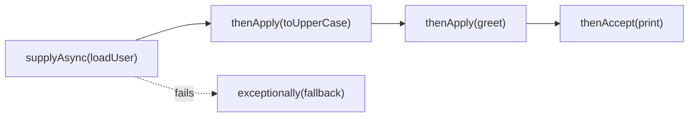

# Lesson 18: `CompletableFuture`

## What you'll learn

- How `CompletableFuture` lets you describe "when this finishes, do that" without blocking a thread
- The core methods: `supplyAsync`, `thenApply`, `thenAccept`, `thenCompose` and `thenCombine`
- How to run many calls at once and gather the results with `allOf` and `anyOf`
- Error handling (`exceptionally`, `handle`) and timeouts (`orTimeout`, `completeOnTimeout`)

---

## Why this matters

A `Future` from Lesson 11 has one way to get its result: block on `get()`. To load a user, *then* their orders, and combine that with an exchange rate you're fetching at the same time, you end up with a thread sitting in `get()` at every step.

`CompletableFuture` (Java 8) lets you build a **pipeline** instead: a description of what happens to a result once it arrives. The threads that finish each stage trigger the next one, so nobody waits in `get()` along the way. It's the same idea as JavaScript promises, and it's what Spring's `@Async` methods and many HTTP clients return.

---

## The concept

A `CompletableFuture<T>` is a `Future<T>` that can be completed by anyone, and that lets you attach callbacks to run when it completes.



The method names follow a pattern. Once you see it, you can guess the whole API:

| Method | Takes | Returns | Use it to |
|---|---|---|---|
| `supplyAsync(supplier, executor)` | `() -> T` | `CF<T>` | Start async work that returns a value |
| `runAsync(runnable, executor)` | `() -> void` | `CF<Void>` | Start async work with no result |
| `thenApply(fn)` | `T -> U` | `CF<U>` | Transform the result (like `Stream.map`) |
| `thenAccept(consumer)` | `T -> void` | `CF<Void>` | Consume the result |
| `thenRun(runnable)` | nothing | `CF<Void>` | Do something afterwards |
| `thenCompose(fn)` | `T -> CF<U>` | `CF<U>` | Chain *another async call* (like `Stream.flatMap`) |
| `thenCombine(other, fn)` | `(T, U) -> V` | `CF<V>` | Merge two independent futures |
| `allOf(cfs...)` / `anyOf(cfs...)` | many CFs | `CF<Void>` / `CF<Object>` | Wait for all of them / the first one |
| `exceptionally(fn)` | `Throwable -> T` | `CF<T>` | Recover from failure |
| `handle(fn)` | `(T, Throwable) -> U` | `CF<U>` | Handle success *or* failure |
| `whenComplete(fn)` | `(T, Throwable) -> void` | `CF<T>` | Side effects such as logging, without changing the result |

**Which thread runs the callbacks?**

- `thenApply(fn)`: whichever thread completes the previous stage, or *the calling thread* if that stage has already finished.
- `thenApplyAsync(fn)` / `thenApplyAsync(fn, executor)`: always submitted to an executor.

**Always pass your own executor to `supplyAsync`/`runAsync`.** Without one, they use `ForkJoinPool.commonPool()`, which is shared across the whole JVM and sized for CPU work. Blocking I/O on it starves everything else that uses it, including parallel streams (Lesson 20).

**`join()` vs `get()`:** both block for the result. `join()` throws the unchecked `CompletionException`, and `get()` throws the checked `ExecutionException`. Use `join()` at the edges of your program, such as tests, `main`, or the one place you must turn async code back into a plain value.

---

## Hands-on

### 1. A simple pipeline

`CompletableBasics.java`:

```java
void main() {
    try (ExecutorService pool = Executors.newFixedThreadPool(4)) {
        CompletableFuture<String> greeting = CompletableFuture
                .supplyAsync(() -> fetchUserName(42), pool)
                .thenApply(String::toUpperCase)
                .thenApply(name -> "Hello, " + name);

        greeting.thenAccept(message -> IO.println(message + "  (on " + Thread.currentThread().getName() + ")"));

        IO.println("main is free while that runs");
        IO.println("join() result: " + greeting.join());
    }
}

String fetchUserName(int userId) {
    sleep(200);
    return "grace";
}

void sleep(long millis) {
    try {
        Thread.sleep(millis);
    } catch (InterruptedException e) {
        Thread.currentThread().interrupt();
    }
}
```

```
main is free while that runs
Hello, GRACE  (on pool-1-thread-1)
join() result: Hello, GRACE
```

`main` printed its line first, because nothing in the chain blocked it. The callback ran on the pool thread that completed the fetch.

### 2. `thenCompose` and `thenCombine`: dependent and independent calls

A realistic request: load a user, then load *their* orders (this depends on the user), and at the same time load an exchange rate (this doesn't).

`ComposeCombine.java`:

```java
record User(int id, String name) {}
record Order(String item, int priceCents) {}

void main() {
    try (ExecutorService pool = Executors.newFixedThreadPool(4)) {
        long start = System.currentTimeMillis();

        CompletableFuture<User> user = CompletableFuture.supplyAsync(() -> loadUser(7), pool);

        CompletableFuture<List<Order>> orders = user.thenCompose(u -> loadOrders(u, pool));

        CompletableFuture<Double> exchangeRate = CompletableFuture.supplyAsync(() -> loadRate("EUR"), pool);

        CompletableFuture<String> summary = orders.thenCombine(exchangeRate, (list, rate) -> {
            int totalCents = list.stream().mapToInt(Order::priceCents).sum();
            return list.size() + " orders, total " + String.format("%.2f", totalCents / 100.0 * rate) + " EUR";
        });

        IO.println(summary.join());
        IO.println("took " + (System.currentTimeMillis() - start) + " ms");
    }
}

User loadUser(int id) {
    sleep(200);
    return new User(id, "ada");
}

CompletableFuture<List<Order>> loadOrders(User user, Executor pool) {
    return CompletableFuture.supplyAsync(() -> {
        sleep(200);
        return List.of(new Order("keyboard", 8_000), new Order("mouse", 2_500));
    }, pool);
}

double loadRate(String currency) {
    sleep(300);
    return 0.9;
}

void sleep(long millis) {
    try {
        Thread.sleep(millis);
    } catch (InterruptedException e) {
        Thread.currentThread().interrupt();
    }
}
```

```
2 orders, total 94.50 EUR
took 460 ms
```

Done one after another, it would take 200 + 200 + 300 = 700 ms. Here, user and then orders (400 ms) ran *alongside* the exchange rate (300 ms), so the total is roughly the longer of the two branches.

- **`thenCompose`** is for when the next step itself returns a `CompletableFuture`. With `thenApply` you'd get a `CompletableFuture<CompletableFuture<List<Order>>>`. It's the same `map` vs `flatMap` distinction as with streams and `Optional`.
- **`thenCombine`** waits for two independent futures and merges their results.

### 3. Fan-out: `allOf` and `anyOf`

`AllOfAnyOf.java`:

```java
void main() {
    try (ExecutorService pool = Executors.newFixedThreadPool(4)) {
        List<String> cities = List.of("Nairobi", "Lisbon", "Tokyo");

        List<CompletableFuture<String>> forecasts = cities.stream()
                .map(city -> CompletableFuture.supplyAsync(() -> forecast(city), pool))
                .toList();

        CompletableFuture<Void> all = CompletableFuture.allOf(forecasts.toArray(CompletableFuture[]::new));
        List<String> results = all.thenApply(ignored -> forecasts.stream().map(CompletableFuture::join).toList()).join();
        IO.println("allOf: " + results);

        CompletableFuture<Object> fastest = CompletableFuture.anyOf(
                CompletableFuture.supplyAsync(() -> mirror("mirror-eu", 300), pool),
                CompletableFuture.supplyAsync(() -> mirror("mirror-us", 100), pool));
        IO.println("anyOf: " + fastest.join());
    }
}

String forecast(String city) {
    sleep(ThreadLocalRandom.current().nextInt(100, 300));
    return city + "=sunny";
}

String mirror(String name, long millis) {
    sleep(millis);
    return name;
}

void sleep(long millis) {
    try {
        Thread.sleep(millis);
    } catch (InterruptedException e) {
        Thread.currentThread().interrupt();
    }
}
```

```
allOf: [Nairobi=sunny, Lisbon=sunny, Tokyo=sunny]
anyOf: mirror-us
```

`allOf` returns `CompletableFuture<Void>`, so it tells you *when* everything is done but not *what* the results are. The standard idiom is the one used above: once `allOf` completes, `join()` each future. None of those joins block, because every future is already complete. `anyOf` returns `Object` because its inputs may have different types. Unlike `invokeAny`, it **doesn't cancel** the slower futures.

### 4. Errors and timeouts

`ErrorsAndTimeouts.java`:

```java
void main() {
    try (ExecutorService pool = Executors.newFixedThreadPool(4)) {
        String price = CompletableFuture
                .supplyAsync(() -> callPricingService(true), pool)
                .exceptionally(error -> {
                    IO.println("exceptionally saw: " + error);
                    return "cached price 9.99";
                })
                .join();
        IO.println("price: " + price);

        String handled = CompletableFuture
                .supplyAsync(() -> callPricingService(false), pool)
                .handle((result, error) -> error == null ? "fresh " + result : "fallback")
                .join();
        IO.println("handle: " + handled);

        String withTimeout = CompletableFuture
                .supplyAsync(() -> slowCall(2_000), pool)
                .completeOnTimeout("default after timeout", 300, TimeUnit.MILLISECONDS)
                .join();
        IO.println("completeOnTimeout: " + withTimeout);

        try {
            CompletableFuture.supplyAsync(() -> slowCall(2_000), pool)
                    .orTimeout(300, TimeUnit.MILLISECONDS)
                    .join();
        } catch (CompletionException e) {
            IO.println("orTimeout: " + e.getCause());
        }

        try {
            CompletableFuture.supplyAsync(() -> callPricingService(true), pool)
                    .thenApply(value -> value + " with tax")
                    .join();
        } catch (CompletionException e) {
            IO.println("join() wraps it: " + e.getCause().getMessage());
        }
        pool.shutdownNow();
    }
}

String callPricingService(boolean fail) {
    if (fail) {
        throw new IllegalStateException("pricing service unavailable");
    }
    return "12.50";
}

String slowCall(long millis) {
    try {
        Thread.sleep(millis);
    } catch (InterruptedException e) {
        Thread.currentThread().interrupt();
    }
    return "slow result";
}
```

```
exceptionally saw: java.util.concurrent.CompletionException: java.lang.IllegalStateException: pricing service unavailable
price: cached price 9.99
handle: fresh 12.50
completeOnTimeout: default after timeout
orTimeout: java.util.concurrent.TimeoutException
join() wraps it: pricing service unavailable
```

What each part shows:

- **A failure skips stages.** In the last example, `thenApply` never ran. The exception travels down the chain until something handles it, much like an exception moving up a call stack.
- **The exception you receive is often wrapped** in `CompletionException`. Unwrap it with `getCause()` before checking its type.
- **`exceptionally`** recovers with a fallback value. **`handle`** receives both the result and the error (one of them is `null`), and it always runs.
- **`completeOnTimeout(value, ...)`** completes with a default value, and **`orTimeout(...)`** completes with a `TimeoutException`. Both are Java 9+.
- **Timeouts and `cancel()` don't interrupt the running task.** The slow call above keeps its pool thread for the full two seconds. That's why the example ends with `shutdownNow()`, which interrupts the pool's threads. Unlike `Future` from an executor, `CompletableFuture.cancel(true)` never interrupts the worker.

---

## Try it yourself

1. Remove the `pool` argument from `supplyAsync` in `CompletableBasics` and print the thread name. Which pool runs it now?
2. In `ComposeCombine`, replace `thenCompose` with `thenApply`. What type do you get, and why won't `thenCombine` work with it as it is?
3. Make one city's forecast throw an exception. What does `allOf(...).join()` do? Use `handle` on each future so that one failure produces `"Tokyo=unknown"` instead of failing everything.
4. Add `whenComplete((result, error) -> log(...))` to a chain, and check that it doesn't change the result.

---

## Common mistakes

- **Using the common pool for blocking I/O.** Pass your own executor, or use virtual threads (Lesson 21).
- **Calling `join()`/`get()` in the middle of a chain.** It blocks, which defeats the point. Compose instead.
- **`thenApply` where `thenCompose` is needed.** You get nested futures.
- **Forgetting that failures skip stages.** Add `exceptionally`/`handle` where you can recover, and don't let a failing future end up with no one ever looking at it.
- **Expecting `orTimeout` or `cancel` to stop the work.** They complete the *future*. The task keeps running.
- **Mutating shared state inside callbacks.** Callbacks run on pool threads. All of Part 2 still applies.

---

## Check your understanding

**1. What's the difference between `thenApply` and `thenCompose`?**

<details>
<summary>Reveal answer</summary>

`thenApply` takes a function `T -> U` and gives `CompletableFuture<U>`. `thenCompose` takes a function `T -> CompletableFuture<U>` and flattens the result to `CompletableFuture<U>`. Use `thenCompose` when the next step is itself asynchronous, just as you use `flatMap` over `map`.

</details>

**2. You need a user profile and a user's recommendations, and neither call depends on the other. How do you combine them?**

<details>
<summary>Reveal answer</summary>

Start both with `supplyAsync` so they run at the same time, then use `profile.thenCombine(recommendations, (p, r) -> ...)`. The total time is the slower of the two calls, not their sum.

</details>

**3. Why pass an executor to `supplyAsync`?**

<details>
<summary>Reveal answer</summary>

Without one, it uses `ForkJoinPool.commonPool()`, which is shared by the whole JVM (including parallel streams) and sized for CPU work, at about the number of cores. Blocking I/O there can starve every other user of the pool.

</details>

**4. Stage 1 of a chain throws. Stage 2 is `thenApply`, and stage 3 is `exceptionally`. Which run?**

<details>
<summary>Reveal answer</summary>

Stage 2 is skipped, because it only runs on success. Stage 3 runs with the exception (usually wrapped in `CompletionException`) and can recover with a fallback value.

</details>

**5. `orTimeout(1, SECONDS)` fires. Is the underlying task stopped?**

<details>
<summary>Reveal answer</summary>

No. The future completes with `TimeoutException`, but the task keeps running on its thread. `CompletableFuture.cancel` doesn't interrupt it either. To actually stop the work, the task must check for cancellation itself, or you have to interrupt the thread it runs on (for example, with `shutdownNow`).

</details>

---

## Recap

- `CompletableFuture` builds pipelines: `supplyAsync`, then `thenApply` / `thenCompose` / `thenCombine`, then `thenAccept`.
- `thenCompose` = flatMap for async calls, and `thenCombine` merges independent results.
- `allOf` waits for everything, and `anyOf` takes the first result.
- Failures skip stages until `exceptionally`/`handle`. Timeouts complete the future but don't stop the work.
- Always supply your own executor.

**Next: [Lesson 19, Fork/Join and work stealing](19-fork-join.md)**
