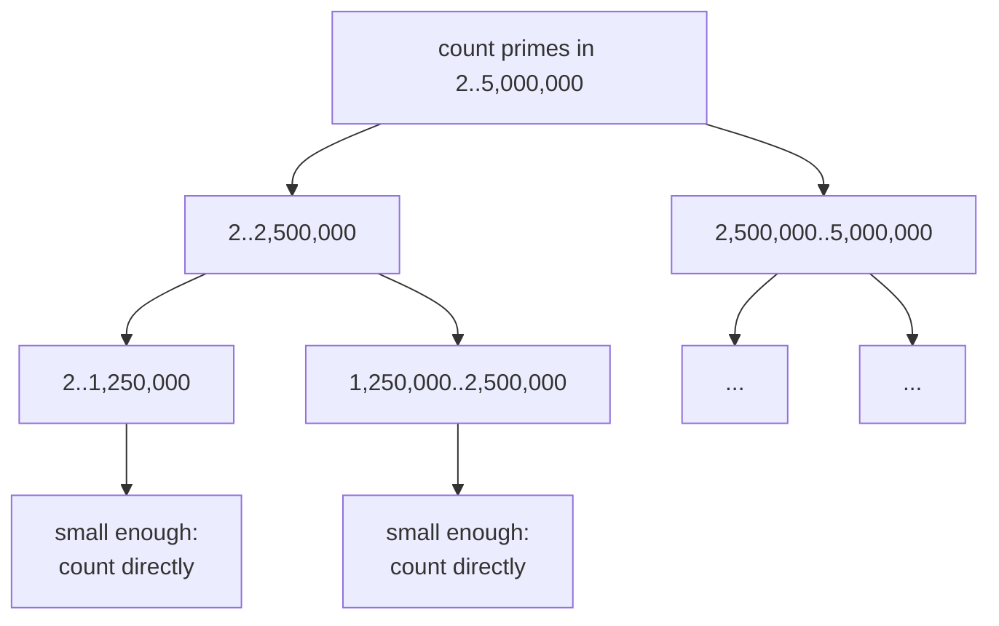
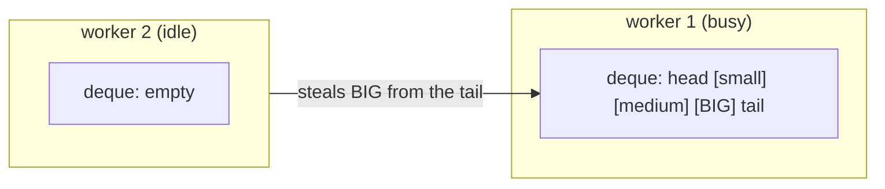

# Lesson 19: Fork/Join and Work Stealing

## What you'll learn

- **Divide and conquer**: splitting a big CPU-bound job into pieces that all the cores can work on
- How to write a `RecursiveTask` with `fork()`, `compute()` and `join()`
- **Work stealing**: how `ForkJoinPool` keeps every core busy
- **Granularity control**: why the size at which you stop splitting matters so much

---

## Why this matters

So far, concurrency has mostly been about *waiting* well: overlapping I/O and coordinating threads. Fork/Join is about *computing* faster. It's for CPU-bound work on big data, such as summing, searching, sorting, image processing and simulations, where the goal is to use every core at once.

It's also the engine under parallel streams (Lesson 20) and the default pool for `CompletableFuture` (Lesson 18). Knowing how it works explains when those tools help and when they hurt.

---

## The concept

### Divide and conquer



Each task asks itself one question: *am I small enough to just do the work?*

- **Yes:** compute the answer directly, one step after another.
- **No:** split into two halves, run them in parallel, and combine their answers.

```java
if (problem is small) {
    return solveDirectly();
}
split into left and right;
left.fork();                     // hand the left half to the pool
rightResult = right.compute();   // do the right half on this thread
leftResult = left.join();        // wait for (or help with) the left half
return combine(leftResult, rightResult);
```

`RecursiveTask<V>` returns a value, and `RecursiveAction` returns nothing, for example when it modifies an array in place.

### Work stealing

A `ForkJoinPool` gives **every worker thread its own double-ended queue (deque)**:

- A worker pushes the subtasks it forks onto the *head* of its own deque, and takes its next task from the head as well (last in, first out). Recently forked tasks are still warm in the CPU cache.
- A worker with nothing to do **steals** from the *tail* of another worker's deque. The tail holds the oldest, biggest tasks, so one steal gives the thief a large chunk of work, and thieves rarely collide with the owner working at the other end.



Uneven work balances itself: threads that finish early steal from threads that are behind. And `join()` inside a fork/join task doesn't just block. The waiting worker runs other queued tasks while it waits.

### The common pool

`ForkJoinPool.commonPool()` is a JVM-wide pool with **cores − 1** threads (the thread that calls `invoke` joins in as well). Parallel streams and `CompletableFuture`'s default async methods share it. You can create your own pool with `new ForkJoinPool(parallelism)`.

---

## Hands-on

### 1. Counting primes with Fork/Join

`ForkJoinPrimes.java`:

```java
void main() {
    int limit = 5_000_000;

    long start = System.currentTimeMillis();
    long sequential = PrimeCountTask.countDirectly(2, limit);
    IO.println("sequential: " + sequential + " primes in " + (System.currentTimeMillis() - start) + " ms");

    start = System.currentTimeMillis();
    long parallel = ForkJoinPool.commonPool().invoke(new PrimeCountTask(2, limit));
    IO.println("fork/join:  " + parallel + " primes in " + (System.currentTimeMillis() - start) + " ms");
    IO.println("common pool parallelism: " + ForkJoinPool.commonPool().getParallelism());
}

class PrimeCountTask extends RecursiveTask<Long> {
    private static final int THRESHOLD = 50_000;
    private final int from;
    private final int to;

    PrimeCountTask(int from, int to) {
        this.from = from;
        this.to = to;
    }

    @Override
    protected Long compute() {
        if (to - from <= THRESHOLD) {
            return countDirectly(from, to);
        }
        int middle = (from + to) >>> 1;
        PrimeCountTask left = new PrimeCountTask(from, middle);
        PrimeCountTask right = new PrimeCountTask(middle, to);
        left.fork();
        long rightCount = right.compute();
        long leftCount = left.join();
        return leftCount + rightCount;
    }

    static long countDirectly(int from, int to) {
        long count = 0;
        for (int n = from; n < to; n++) {
            if (isPrime(n)) {
                count++;
            }
        }
        return count;
    }

    static boolean isPrime(int n) {
        for (int divisor = 2; (long) divisor * divisor <= n; divisor++) {
            if (n % divisor == 0) {
                return false;
            }
        }
        return true;
    }
}
```

On a 12-core machine:

```
sequential: 348513 primes in 3906 ms
fork/join:  348513 primes in 707 ms
common pool parallelism: 11
```

About 5.5 times faster. Things to notice in the code:

- **`left.fork(); right.compute(); left.join();`** is the idiomatic order. The current thread does half the work itself instead of forking both halves and sitting idle. Calling `join()` *before* `compute()` would make the halves run one after the other.
- **`(from + to) >>> 1`** finds the midpoint without the integer overflow that `(from + to) / 2` can cause for very large indexes.
- Numbers near 5,000,000 take longer to test than small ones, so the halves aren't equal work. Work stealing evens this out on its own.
- `invoke` runs the task and waits for its result.

### 2. Granularity: where do you stop splitting?

This is the most important tuning decision in Fork/Join, and a central idea in chapter 3 of Jay Wang's book. Split too finely, and you spend more time creating and scheduling tasks than doing work. Split too coarsely, and some cores sit idle.

`ThresholdMatters.java` sums 20 million numbers with four different thresholds, and keeps the best of five runs for each:

```java
void main() {
    long[] numbers = LongStream.rangeClosed(1, 20_000_000).toArray();
    for (int threshold : new int[] {10, 1_000, 100_000, 20_000_000}) {
        long best = Long.MAX_VALUE;
        for (int attempt = 0; attempt < 5; attempt++) {
            long start = System.nanoTime();
            ForkJoinPool.commonPool().invoke(new SumTask(numbers, 0, numbers.length, threshold));
            best = Math.min(best, (System.nanoTime() - start) / 1_000_000);
        }
        IO.println(String.format("threshold %,11d -> %4d ms", threshold, best));
    }
}

class SumTask extends RecursiveTask<Long> {
    private final long[] numbers;
    private final int from;
    private final int to;
    private final int threshold;

    SumTask(long[] numbers, int from, int to, int threshold) {
        this.numbers = numbers;
        this.from = from;
        this.to = to;
        this.threshold = threshold;
    }

    @Override
    protected Long compute() {
        if (to - from <= threshold) {
            long sum = 0;
            for (int i = from; i < to; i++) {
                sum += numbers[i];
            }
            return sum;
        }
        int middle = (from + to) >>> 1;
        SumTask left = new SumTask(numbers, from, middle, threshold);
        left.fork();
        long rightResult = new SumTask(numbers, middle, to, threshold).compute();
        return left.join() + rightResult;
    }
}
```

```
threshold          10 ->   52 ms
threshold       1,000 ->   12 ms
threshold     100,000 ->   17 ms
threshold  20,000,000 ->   34 ms
```

- **10**: about two million tiny tasks. The overhead of creating them is larger than the work.
- **20,000,000**: never splits, so it runs on a single thread.
- **1,000 to 100,000**: the sweet spot.

A common starting point is to aim for somewhere between 10,000 and 100,000 basic operations per leaf task, or `size / (parallelism × 4)` so each core gets several chunks to balance. Then **measure**. Adding numbers is so cheap that memory bandwidth quickly becomes the limit, which is why the best result here is only about 3 times faster than one thread.

---

## Try it yourself

1. In `PrimeCountTask`, swap the order to `left.fork(); long leftCount = left.join(); long rightCount = right.compute();`. Time it. What went wrong?
2. Run `ForkJoinPrimes` with `new ForkJoinPool(2).invoke(...)` and then `new ForkJoinPool(4)`. How does the time scale?
3. Write a `RecursiveAction` that multiplies every element of a `double[]` by 2 in place.
4. Put a blocking `Thread.sleep(100)` inside each leaf task. Why is this a bad idea in a `ForkJoinPool`, and in the common pool especially?

---

## Common mistakes

- **Calling `join()` before doing your own half of the work.** Everything runs one step at a time.
- **A threshold that's too small or too large.** Measure. There's no universal number.
- **Blocking I/O in fork/join tasks.** The pool is sized for CPU work. Blocked workers leave cores idle, and in the common pool they slow down every parallel stream in the JVM.
- **Shared mutable state between subtasks.** Each subtask should work on its own slice and *return* its result.
- **Using Fork/Join for small inputs.** Below some size, a plain loop wins.

---

## Check your understanding

**1. In `compute()`, why call `right.compute()` directly instead of forking both halves?**

<details>
<summary>Reveal answer</summary>

The current thread would otherwise fork both halves and sit idle waiting for them. Computing one half itself keeps it busy and halves the number of tasks created.

</details>

**2. What is work stealing?**

<details>
<summary>Reveal answer</summary>

Each worker has its own deque of tasks. An idle worker takes a task from the *tail* of a busy worker's deque, where the oldest and largest tasks are. This balances uneven work automatically and keeps all the cores busy.

</details>

**3. What happens if the splitting threshold is far too small?**

<details>
<summary>Reveal answer</summary>

Millions of tiny tasks are created. The cost of creating, queueing and joining them outweighs the useful work, and it can end up slower than a plain sequential loop.

</details>

**4. Is Fork/Join a good fit for making 1,000 HTTP calls?**

<details>
<summary>Reveal answer</summary>

No. Fork/Join is designed for CPU-bound divide-and-conquer work, and its threads are sized to the number of cores. Blocking calls would leave most of those threads waiting. Use virtual threads (Lesson 21), or an executor sized for I/O.

</details>

---

## Recap

- Fork/Join is divide and conquer: split until the pieces are small, compute each directly, then combine.
- The idiom is `left.fork()`, then `right.compute()`, then `left.join()`.
- Work stealing balances uneven workloads automatically.
- **Granularity** decides performance, so measure your threshold.
- It's for CPU-bound work only. Never block in it.

**Next: [Lesson 20, Parallel streams](20-parallel-streams.md)**
