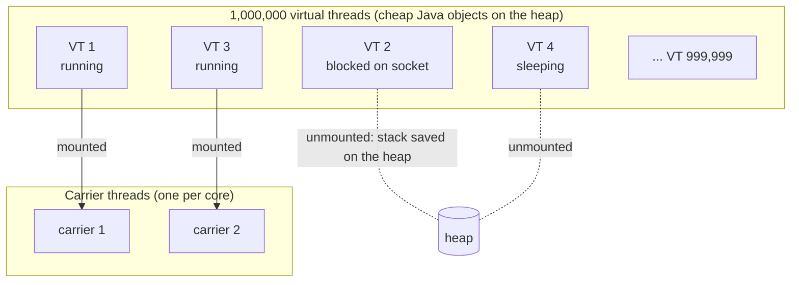

# Lesson 21: Virtual Threads

## What you'll learn

- What a virtual thread is, and how it differs from the platform threads you've used so far
- How the JVM **mounts** and **unmounts** virtual threads on a few **carrier** threads
- How to create them, and why you never pool them
- What **pinning** is, what Java 24 fixed, and when virtual threads *don't* help

---

## Why this matters

Every thread so far has been a **platform thread**: a thin wrapper around an operating-system thread. OS threads are heavy. Each one reserves memory for its stack (commonly 1 MB of address space), and the OS scheduler starts to struggle past a few thousand of them.

That limit shaped a decade of Java design. Servers used bounded thread pools (Lesson 10). When 200 request threads were all waiting on a database, request 201 queued, even though the CPU sat idle. To escape this, people moved to reactive frameworks (WebFlux, RxJava) and `CompletableFuture` chains (Lesson 18). Those scale, but they're harder to read, debug and test, because a request no longer runs top to bottom on one thread.

**Virtual threads** (final in Java 21) remove the limit. They're cheap enough that you can have a million of them, so you can go back to plain, blocking, one-thread-per-request code and still scale.

---

## The concept

### Mounting and unmounting

A virtual thread is a Java object managed by the JVM, not by the operating system. The JVM runs virtual threads on a small `ForkJoinPool` of platform threads called **carriers**, by default one per core.



1. A virtual thread that's ready to run is **mounted** on a free carrier and runs there.
2. When it makes a **blocking call**, such as `Thread.sleep`, a socket read, a JDBC query, `BlockingQueue.take` or a lock wait, the JDK **unmounts** it. Its stack frames are copied to the heap and the carrier is immediately free for another virtual thread.
3. When the blocking operation completes, the virtual thread is scheduled again, **possibly on a different carrier**.

Blocking a virtual thread is cheap. Blocking a carrier would be expensive, but the JDK's blocking operations are written so that doesn't happen.

### What changes and what doesn't

| | Platform thread | Virtual thread |
|---|---|---|
| Backed by | One OS thread for its whole life | Nothing permanent. Borrows a carrier while running. |
| Creation cost | Around a millisecond, plus stack memory | Microseconds, and a stack that grows only as needed |
| How many | Thousands | Millions |
| Blocking | Ties up an OS thread | Unmounts, and the carrier moves on |
| Daemon | Your choice | Always a daemon |
| Priority | Configurable (a hint) | Always `NORM_PRIORITY` |
| Pool it? | Yes | **Never.** Create one per task. |
| API | `Thread`, `Runnable`, locks, `ThreadLocal`... | **The same APIs** |

Virtual threads make blocking cheap. They don't make code run faster. They help when you have **many tasks that spend most of their time waiting**. For CPU-bound work, you're still limited by the number of cores.

---

## Hands-on

### 1. A hundred thousand sleeping threads

`MillionThreads.java`:

```java
void main() {
    int tasks = 100_000;

    long start = System.currentTimeMillis();
    try (ExecutorService executor = Executors.newVirtualThreadPerTaskExecutor()) {
        for (int i = 0; i < tasks; i++) {
            executor.submit(() -> {
                Thread.sleep(Duration.ofSeconds(1));
                return null;
            });
        }
    }
    IO.println(tasks + " virtual threads, each sleeping 1 s: " + (System.currentTimeMillis() - start) + " ms");

    start = System.currentTimeMillis();
    try (ExecutorService executor = Executors.newFixedThreadPool(200)) {
        for (int i = 0; i < 2_000; i++) {
            executor.submit(() -> {
                Thread.sleep(Duration.ofSeconds(1));
                return null;
            });
        }
    }
    IO.println("2000 tasks on 200 platform threads: " + (System.currentTimeMillis() - start) + " ms");
}
```

```
100000 virtual threads, each sleeping 1 s: 1866 ms
2000 tasks on 200 platform threads: 10080 ms
```

A hundred thousand concurrent one-second waits finish in under two seconds. The platform pool handles only 200 at a time, so 2,000 tasks take ten rounds. Change the first number to 1,000,000: it still works on a laptop, and finishes in a few seconds.

(The lambdas `return null` so they are `Callable`s, which lets `Thread.sleep`'s checked exception propagate without a `try/catch`.)

### 2. Creating virtual threads

`VirtualBasics.java`:

```java
void main() throws InterruptedException {
    Thread first = Thread.ofVirtual().name("virtual-1").start(() -> describe("started with ofVirtual()"));
    Thread second = Thread.startVirtualThread(() -> describe("started with startVirtualThread()"));
    first.join();
    second.join();

    ThreadFactory factory = Thread.ofVirtual().name("worker-", 0).factory();
    try (ExecutorService executor = Executors.newThreadPerTaskExecutor(factory)) {
        for (int i = 0; i < 3; i++) {
            executor.submit(() -> describe("from a named factory"));
        }
    }
}

void describe(String how) {
    Thread current = Thread.currentThread();
    IO.println(how + ": name='" + current.getName() + "' virtual=" + current.isVirtual()
            + " daemon=" + current.isDaemon() + " -> " + current);
}
```

One run:

```
started with ofVirtual(): name='virtual-1' virtual=true daemon=true -> VirtualThread[#26,virtual-1]/runnable@ForkJoinPool-1-worker-1
started with startVirtualThread(): name='' virtual=true daemon=true -> VirtualThread[#28]/runnable@ForkJoinPool-1-worker-2
from a named factory: name='worker-2' virtual=true daemon=true -> VirtualThread[#32,worker-2]/runnable@ForkJoinPool-1-worker-3
from a named factory: name='worker-0' virtual=true daemon=true -> VirtualThread[#30,worker-0]/runnable@ForkJoinPool-1-worker-2
from a named factory: name='worker-1' virtual=true daemon=true -> VirtualThread[#31,worker-1]/runnable@ForkJoinPool-1-worker-1
```

- `Thread.ofVirtual()` is the same builder style as `Thread.ofPlatform()` from Lesson 02.
- Virtual threads have **no name by default**. Name them when thread dumps matter.
- `toString()` shows the carrier: `@ForkJoinPool-1-worker-1`.
- They are always daemon threads, so the JVM won't wait for them. That's why the examples call `join()` or close the executor.
- `newVirtualThreadPerTaskExecutor()` is `newThreadPerTaskExecutor` with an unnamed virtual-thread factory.

### 3. Hopping between carriers

`CarrierHopping.java`:

```java
void main() {
    try (ExecutorService executor = Executors.newVirtualThreadPerTaskExecutor()) {
        for (int i = 0; i < 3; i++) {
            int taskId = i;
            executor.submit(() -> {
                IO.println("task " + taskId + " before sleep: " + Thread.currentThread());
                Thread.sleep(100);
                IO.println("task " + taskId + " after sleep:  " + Thread.currentThread());
                return null;
            });
        }
    }
}
```

One run:

```
task 2 before sleep: VirtualThread[#31]/runnable@ForkJoinPool-1-worker-3
task 1 before sleep: VirtualThread[#28]/runnable@ForkJoinPool-1-worker-2
task 0 before sleep: VirtualThread[#26]/runnable@ForkJoinPool-1-worker-1
task 0 after sleep:  VirtualThread[#26]/runnable@ForkJoinPool-1-worker-3
task 1 after sleep:  VirtualThread[#28]/runnable@ForkJoinPool-1-worker-2
task 2 after sleep:  VirtualThread[#31]/runnable@ForkJoinPool-1-worker-1
```

Task 0 went to sleep on `worker-1` and woke up on `worker-3`. That's the unmount and remount, visible. Your code never notices. Thread identity, `ThreadLocal`s and the stack are all carried along.

### 4. CPU-bound work gains nothing

`CpuBoundVirtual.java`:

```java
void main() {
    int tasks = 24;
    IO.println("platform pool (cores): " + time(Executors.newFixedThreadPool(Runtime.getRuntime().availableProcessors()), tasks) + " ms");
    IO.println("virtual per task:      " + time(Executors.newVirtualThreadPerTaskExecutor(), tasks) + " ms");
}

long time(ExecutorService executor, int tasks) {
    long start = System.currentTimeMillis();
    try (executor) {
        for (int i = 0; i < tasks; i++) {
            executor.submit(() -> countPrimes(1_500_000));
        }
    }
    return System.currentTimeMillis() - start;
}

long countPrimes(int limit) {
    long count = 0;
    for (int n = 2; n < limit; n++) {
        boolean prime = true;
        for (int divisor = 2; (long) divisor * divisor <= n; divisor++) {
            if (n % divisor == 0) {
                prime = false;
                break;
            }
        }
        if (prime) {
            count++;
        }
    }
    return count;
}
```

```
platform pool (cores): 3206 ms
virtual per task:      3331 ms
```

About the same. Twelve carriers can compute no faster than twelve platform threads. Virtual threads are about **waiting**, not **computing**.

### 5. Limiting concurrency without a pool

With a thread pool, the pool size limited how many calls ran at once, often by accident. With virtual threads, nothing limits it. If a partner API allows only 10 concurrent calls, 10,000 virtual threads will happily send 10,000. **Limit the resource, not the threads**: use a `Semaphore` (Lesson 14).

`LimitWithSemaphore.java`:

```java
Semaphore partnerApiPermits = new Semaphore(10);
AtomicInteger inFlight = new AtomicInteger();
AtomicInteger maxInFlight = new AtomicInteger();

void main() {
    long start = System.currentTimeMillis();
    try (ExecutorService executor = Executors.newVirtualThreadPerTaskExecutor()) {
        for (int i = 0; i < 100; i++) {
            executor.submit(this::callPartnerApi);
        }
    }
    IO.println("100 calls, max concurrent = " + maxInFlight.get()
            + ", took " + (System.currentTimeMillis() - start) + " ms");
}

Void callPartnerApi() throws InterruptedException {
    partnerApiPermits.acquire();
    try {
        maxInFlight.accumulateAndGet(inFlight.incrementAndGet(), Math::max);
        Thread.sleep(100);
        inFlight.decrementAndGet();
        return null;
    } finally {
        partnerApiPermits.release();
    }
}
```

```
100 calls, max concurrent = 10, took 1057 ms
```

A hundred threads, never more than ten inside. The threads waiting for a permit are unmounted, so they cost almost nothing.

---

## Pinning

A virtual thread is **pinned** when it can't unmount during a blocking operation, so it holds its carrier the whole time. Enough pinned threads use up all the carriers, and everything stalls.

- **Java 21–23:** blocking inside a `synchronized` block or method pinned the thread. This was the famous gotcha, and it's why the advice was "replace `synchronized` with `ReentrantLock`".
- **Java 24+ (JEP 491):** `synchronized` no longer pins. Virtual threads unmount while blocked inside `synchronized`, while waiting to *enter* a `synchronized` block, and inside `Object.wait()`. On Java 25, you don't need to rewrite `synchronized` code for virtual threads.
- **Still pins today:** blocking while a native method or a foreign (FFM) function is on the stack. That's rare in normal application code.

To find pinning, use the JFR event `jdk.VirtualThreadPinned`, which is recorded when a pinned thread blocks for longer than 20 ms by default. Lesson 24 shows how to record it. (The old `-Djdk.tracePinnedThreads` flag was removed in Java 24.)

---

## When to use virtual threads

**Use them for:**

- Servers handling many concurrent requests that block on databases, HTTP calls or message brokers. In Spring Boot, `spring.threads.virtual.enabled=true` runs request handling, `@Async` and scheduled tasks on virtual threads.
- Fan-out: calling many services at once (Lessons 22 and 23).
- Any code with a thread pool whose size you picked to cover I/O waiting.

**Don't bother for:**

- CPU-bound work. Use a pool sized to the number of cores, or Fork/Join.
- Code that already runs well with a few threads.

**Watch out for:**

- **Pooling them.** It defeats the purpose. Create one per task and let it end.
- **Unbounded concurrency against scarce resources** such as DB connection pools, rate-limited APIs and file handles. Guard them with `Semaphore`s, or the resource's own pool.
- **Large `ThreadLocal`s.** A million threads means a million copies. Prefer `ScopedValue` (Lesson 16).
- **Long CPU loops in a virtual thread.** The scheduler doesn't preempt. A virtual thread only gives up its carrier when it blocks, so a long computation keeps that carrier busy.

---

## Try it yourself

1. Run `MillionThreads` with 1,000,000 virtual threads. Then try 100,000 *platform* threads (`Executors.newThreadPerTaskExecutor(Thread.ofPlatform().factory())`) and watch what happens. (Save your work first.)
2. In `CarrierHopping`, print the carrier name only, and count how often a task wakes on a different carrier over 100 tasks.
3. Replace the `Semaphore` in `LimitWithSemaphore` with a fixed pool of 10 platform threads. Compare the code and the timing.
4. Put a `synchronized` block with a `Thread.sleep` inside it in 1,000 virtual threads that each lock a *different* object. On Java 25, does it take about 1 s or about 1,000/cores seconds? (On Java 21, it would take much longer. That was the pinning problem.)

---

## Common mistakes

- **Pooling virtual threads.** Use `newVirtualThreadPerTaskExecutor()`.
- **Expecting CPU-bound speed-ups.** They help with waiting, not computing.
- **Losing the accidental limit a pool gave you.** Add a `Semaphore` in front of scarce resources.
- **Rewriting all `synchronized` blocks to `ReentrantLock` "for virtual threads" on Java 24+.** That's no longer needed.
- **Heavy `ThreadLocal` caches.** Each virtual thread gets its own copy.

---

## Check your understanding

**1. What happens to a virtual thread's carrier when the virtual thread calls `Thread.sleep` or blocks on a socket?**

<details>
<summary>Reveal answer</summary>

The virtual thread is unmounted: its stack is saved to the heap, and the carrier becomes free to run another virtual thread. When the sleep or I/O completes, the virtual thread is mounted again, possibly on a different carrier.

</details>

**2. Why shouldn't you put virtual threads in a pool?**

<details>
<summary>Reveal answer</summary>

Pools exist because platform threads are expensive to create. Virtual threads are cheap, so pooling brings no benefit, and it re-introduces the fixed limit that virtual threads were meant to remove. Create one per task. To limit concurrency, use a `Semaphore`.

</details>

**3. Will switching a CPU-bound batch job to virtual threads make it faster?**

<details>
<summary>Reveal answer</summary>

No. Virtual threads run on carriers, by default one per core, so the same number of cores does the computing. They only help when tasks spend their time blocked.

</details>

**4. What is pinning, and did Java 24 fix it?**

<details>
<summary>Reveal answer</summary>

Pinning is when a virtual thread can't unmount while blocked, so it holds its carrier the whole time. Java 24 (JEP 491) fixed the main cause, blocking in or entering `synchronized` code. Blocking with a native or foreign function frame on the stack can still pin.

</details>

**5. Your service moves from a 200-thread pool to virtual threads, and the database starts refusing connections. Why?**

<details>
<summary>Reveal answer</summary>

The 200-thread pool was quietly limiting concurrency to 200. With virtual threads, thousands of requests now reach the database at once. Limit the resource directly with a properly sized connection pool (which blocks callers cheaply) or a `Semaphore`.

</details>

---

## Recap

- Virtual threads are cheap, JVM-managed threads, mounted on a few carrier threads and unmounted whenever they block.
- Write simple blocking code, one virtual thread per task, and it scales to millions of concurrent waits.
- Never pool them. Limit scarce resources with semaphores.
- They help I/O-bound work, not CPU-bound work.
- On Java 24+, `synchronized` no longer pins.

**Next: [Lesson 22, Structured concurrency](22-structured-concurrency.md)**
