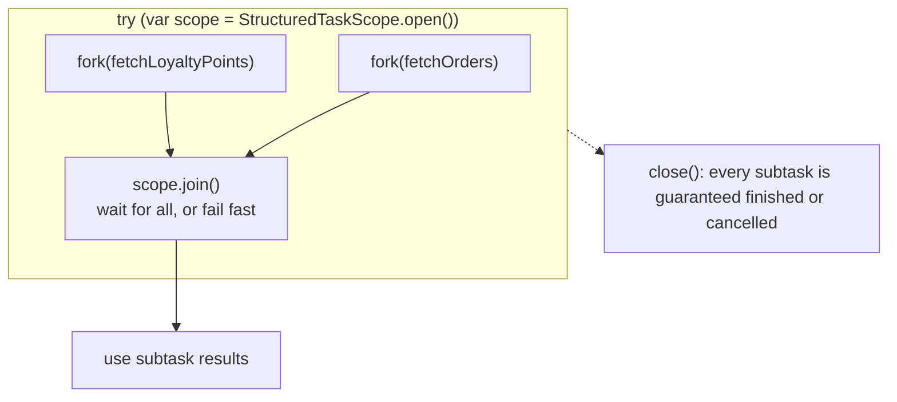

# Lesson 22: Structured Concurrency

> **Preview feature.** `StructuredTaskScope` is a *preview* API in Java 25 (JEP 505, its fifth preview). You must run these samples with `--enable-preview`:
>
> ```bash
> java --enable-preview Structured.java
> ```
>
> Preview APIs can change between releases, and this one has changed shape more than once. The concepts in this lesson are stable, but check the Javadoc for your JDK version before copying the code into production.

## What you'll learn

- The problem with "fire off some futures and hope": leaked tasks, lost failures and no cancellation
- How `StructuredTaskScope` ties subtasks to a block of code, so they can't outlive it
- Fail-fast: when one subtask fails, the others are cancelled automatically
- **Joiners**: choosing between "all must succeed" and "first success wins"
- How `ScopedValue` bindings flow into subtasks automatically

---

## Why this matters

Here is typical code with an executor:

```java
Future<User> user = executor.submit(() -> fetchUser(id));
Future<List<Order>> orders = executor.submit(() -> fetchOrders(id));
return new Profile(user.get(), orders.get());
```

It looks fine, but think about the failure cases:

- `fetchUser` fails after 10 ms. `user.get()` throws, and the method exits. **`fetchOrders` keeps running** for however long it takes, using a thread and a database connection for a result nobody will read.
- The thread calling this method is interrupted. Neither subtask finds out.
- In a thread dump, the two subtasks sit in a pool with no visible link to the request that created them.

With structured programming, when a method returns, everything it started has finished. `if` blocks and loops work that way. `ExecutorService` doesn't. **Structured concurrency** brings that rule to threads: **subtasks start and end inside a block of code, like local variables**.

---

## The concept



The shape is always the same:

1. **Open** a scope in try-with-resources.
2. **Fork** subtasks. Each one runs in its own new **virtual thread**.
3. **Join**: wait according to the scope's policy.
4. **Use** the results.
5. **Close**, which happens automatically. No subtask can outlive the block.

The policy is decided by a **Joiner**:

| Joiner | Behaviour | `join()` returns |
|---|---|---|
| `open()` with no argument (same as `Joiner.awaitAllSuccessfulOrThrow()`) | Wait for all. If one fails, cancel the rest and throw. | `null` (read each `Subtask`) |
| `Joiner.allSuccessfulOrThrow()` | Same, but collects results | A stream of subtasks |
| `Joiner.anySuccessfulResultOrThrow()` | First success wins, the rest are cancelled | The winning result |
| `Joiner.awaitAll()` | Wait for all, never cancels, you inspect each one | `null` |

If a subtask fails, `join()` throws `StructuredTaskScope.FailedException` with the original exception as its cause.

---

## Hands-on

### 1. Fork, join and fail fast

`Structured.java`:

```java
import java.util.concurrent.StructuredTaskScope.Subtask;

record Profile(String user, List<String> orders, int loyaltyPoints) {}

void main() throws InterruptedException {
    long start = System.currentTimeMillis();
    IO.println(loadProfile("ada", false) + " in " + (System.currentTimeMillis() - start) + " ms");

    start = System.currentTimeMillis();
    try {
        loadProfile("ada", true);
    } catch (StructuredTaskScope.FailedException e) {
        IO.println("failed fast after " + (System.currentTimeMillis() - start) + " ms: " + e.getCause());
    }
}

Profile loadProfile(String user, boolean loyaltyServiceDown) throws InterruptedException {
    try (var scope = StructuredTaskScope.open()) {
        Subtask<List<String>> orders = scope.fork(() -> fetchOrders(user));
        Subtask<Integer> points = scope.fork(() -> fetchLoyaltyPoints(user, loyaltyServiceDown));

        scope.join();

        return new Profile(user, orders.get(), points.get());
    }
}

List<String> fetchOrders(String user) throws InterruptedException {
    try {
        Thread.sleep(1_000);
        return List.of("keyboard", "mouse");
    } catch (InterruptedException e) {
        IO.println("  fetchOrders was cancelled");
        throw e;
    }
}

int fetchLoyaltyPoints(String user, boolean fail) throws InterruptedException {
    Thread.sleep(200);
    if (fail) {
        throw new IllegalStateException("loyalty service down");
    }
    return 1_250;
}
```

```
Profile[user=ada, orders=[keyboard, mouse], loyaltyPoints=1250] in 1053 ms
  fetchOrders was cancelled
failed fast after 205 ms: java.lang.IllegalStateException: loyalty service down
```

The first call is the happy path: both subtasks ran at the same time and took about 1 s, the slower of the two.

The second call is the one to study. The loyalty service failed at 200 ms, and **the scope immediately interrupted `fetchOrders`**, which was still sleeping. The whole call failed in 205 ms instead of waiting the full second. Nothing leaked, and no code was needed to make that happen.

Rules for `Subtask.get()`: call it **only after `join()`**, and only for a subtask that succeeded. Calling it earlier throws `IllegalStateException`.

### 2. First success wins

`StructuredAnySuccess.java` asks three replicas and uses the fastest answer:

```java
import java.util.concurrent.StructuredTaskScope.Joiner;

void main() throws InterruptedException {
    long start = System.currentTimeMillis();
    try (var scope = StructuredTaskScope.open(Joiner.<String>anySuccessfulResultOrThrow())) {
        scope.fork(() -> query("replica-eu", 400));
        scope.fork(() -> query("replica-us", 150));
        scope.fork(() -> query("replica-asia", 300));

        String fastest = scope.join();
        IO.println("first answer: " + fastest + " after " + (System.currentTimeMillis() - start) + " ms");
    }
}

String query(String replica, long millis) throws InterruptedException {
    try {
        Thread.sleep(millis);
        return replica;
    } catch (InterruptedException e) {
        IO.println("  " + replica + " cancelled");
        throw e;
    }
}
```

```
  replica-eu cancelled
  replica-asia cancelled
first answer: replica-us after 196 ms
```

Compare this with `CompletableFuture.anyOf` (Lesson 18), which leaves the losers running. Here the losers are cancelled as soon as there's a winner.

### 3. `ScopedValue` flows into subtasks

`StructuredScopedValue.java`:

```java
static final ScopedValue<String> REQUEST_ID = ScopedValue.newInstance();

void main() throws Exception {
    ScopedValue.where(REQUEST_ID, "req-77").call(() -> {
        try (var scope = StructuredTaskScope.open()) {
            scope.fork(() -> log("fetching orders"));
            scope.fork(() -> log("fetching loyalty points"));
            scope.join();
        }
        return null;
    });
}

String log(String message) {
    String line = "[" + REQUEST_ID.get() + "] " + message + " on " + Thread.currentThread();
    IO.println(line);
    return line;
}
```

One run:

```
[req-77] fetching loyalty points on VirtualThread[#28]/runnable@ForkJoinPool-1-worker-2
[req-77] fetching orders on VirtualThread[#26]/runnable@ForkJoinPool-1-worker-1
```

Each subtask runs in a different virtual thread, but both see `req-77`. Subtasks forked in a scope **inherit the parent's scoped-value bindings**. That is the missing piece from Lesson 16, where a `ThreadLocal` did *not* follow a task into an executor.

### Timeouts

A whole scope can have a deadline:

```java
try (var scope = StructuredTaskScope.open(
        Joiner.awaitAllSuccessfulOrThrow(),
        config -> config.withTimeout(Duration.ofSeconds(2)))) {
    ...
}
```

If the deadline passes, every unfinished subtask is cancelled and `join()` throws `StructuredTaskScope.TimeoutException`.

### Structured concurrency vs the alternatives

| | `ExecutorService` + `Future` | `CompletableFuture` | `StructuredTaskScope` |
|---|---|---|---|
| Subtasks can outlive the caller | Yes | Yes | **No** |
| One failure cancels the siblings | Only if you write it | Only if you write it | **Automatically** |
| Style | Blocking | Callback chains | Plain blocking code |
| Thread dumps show the parent-child link | No | No | **Yes** (JSON thread dump, Lesson 24) |
| Status | Final | Final | Preview in Java 25 |

---

## Try it yourself

1. In `Structured.java`, make *both* subtasks fail. Which exception do you get?
2. Add a scope timeout of 500 ms to the happy-path `loadProfile`. What happens?
3. Use `Joiner.awaitAll()` and handle each subtask's `state()` yourself, so that a failed loyalty lookup returns 0 points instead of failing the whole profile.
4. Nest a scope inside a subtask of another scope, and cancel the outer one. Does the inner work stop too?

---

## Common mistakes

- **Forgetting `--enable-preview`.** It won't compile or run on Java 25 without it.
- **Calling `subtask.get()` before `scope.join()`.** It throws `IllegalStateException`.
- **Using a scope outside try-with-resources, or forking from a different thread.** A scope belongs to the thread that opened it.
- **Swallowing `InterruptedException` inside subtasks.** Cancellation *is* interruption. A subtask that ignores it can't be cancelled.
- **Treating the preview API as stable.** Pin your JDK version and re-check the API when you upgrade.

---

## Check your understanding

**1. What guarantee does a `StructuredTaskScope` give when its `try` block exits?**

<details>
<summary>Reveal answer</summary>

Every subtask forked in the scope has finished, either completed or cancelled. None can outlive the block, so there are no leaked tasks and no forgotten threads.

</details>

**2. With the default joiner, subtask B fails while subtask A is still running. What happens to A?**

<details>
<summary>Reveal answer</summary>

A is cancelled by interrupting its thread, and `join()` throws `FailedException` with B's exception as the cause. The caller fails fast instead of waiting for A.

</details>

**3. What does each forked subtask run on?**

<details>
<summary>Reveal answer</summary>

Its own new virtual thread, by default. That's why forking many subtasks is cheap.

</details>

**4. How is `anySuccessfulResultOrThrow()` better than `CompletableFuture.anyOf`?**

<details>
<summary>Reveal answer</summary>

It returns the first successful result *and cancels the remaining subtasks*. `anyOf` leaves the slower futures running. `anyOf` also completes with the first *completion*, even if that's a failure, while the joiner waits for the first *success*.

</details>

**5. Why does a `ScopedValue` work inside subtasks when a `ThreadLocal` doesn't reach tasks submitted to an executor?**

<details>
<summary>Reveal answer</summary>

Structured scopes pass the parent's scoped-value bindings to every subtask they fork. An executor's pool threads are unrelated to the submitting thread, so they have their own, unrelated `ThreadLocal` values.

</details>

---

## Recap

- Structured concurrency: subtasks live and die inside a block, like local variables.
- `open()`, then `fork()`, then `join()`, then `Subtask.get()`, with try-with-resources closing the scope.
- The default policy is fail-fast: one failure cancels the siblings. `anySuccessfulResultOrThrow` returns the first success.
- Subtasks run on virtual threads and inherit `ScopedValue` bindings.
- It's still a **preview** in Java 25, so run with `--enable-preview`.

**Next: [Lesson 23, Concurrency patterns](23-concurrency-patterns.md)**
