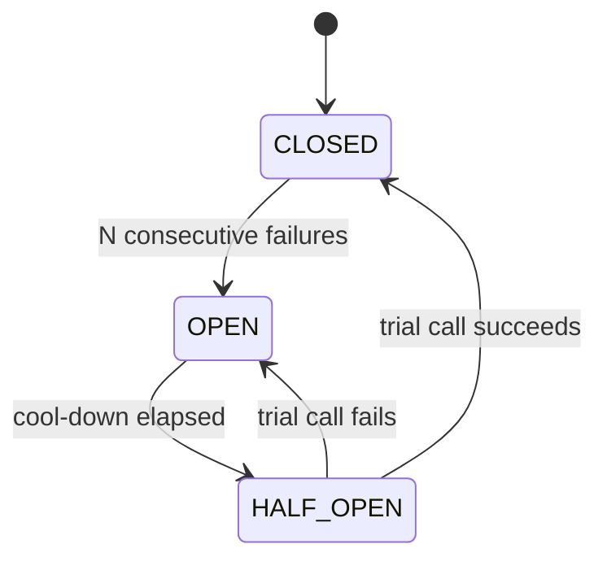

# Lesson 23: Concurrency Patterns

## What you'll learn

- **Producer-consumer** with virtual threads and a `BlockingQueue`
- **Bulkhead**: stop one slow dependency from taking every thread down with it
- **Scatter-gather**: ask many sources at once, collect whatever comes back in time
- **Circuit breaker**: stop calling a dependency that's clearly down

---

## Why this matters

The tools in Parts 2–5 are the parts. Patterns are the assemblies that experienced engineers reach for again and again. Each of these solves a problem you *will* meet in a backend service, and each is built from things you already know: queues, semaphores, futures and atomics. Chapter 5 of Jay Wang's book covers these patterns and how they combine in cloud systems.

In production you'll often use a library (Resilience4j, or Spring Framework 7's built-in `@ConcurrencyLimit` and `@Retryable`) instead of hand-written versions. Building them once yourself shows you what those libraries do and which settings matter.

---

## Pattern 1: Producer-consumer

**Problem:** work arrives at a different speed from how fast it can be processed.
**Solution:** put a bounded queue between producers and consumers. The queue absorbs bursts, and when it's full, producers block. That blocking is backpressure.

You built it by hand in Lesson 08 and with `BlockingQueue` in Lesson 15. With virtual threads, blocked producers and consumers cost almost nothing.

`PipelineWithVirtualThreads.java`:

```java
record Order(int id, int amountCents) {}

void main() throws InterruptedException {
    BlockingQueue<Order> incoming = new ArrayBlockingQueue<>(10);
    Order poisonPill = new Order(-1, 0);
    var revenueCents = new LongAdder();
    int consumers = 3;

    try (ExecutorService executor = Executors.newVirtualThreadPerTaskExecutor()) {
        executor.submit(() -> {
            for (int id = 1; id <= 30; id++) {
                incoming.put(new Order(id, 1_000 + id));
            }
            for (int i = 0; i < consumers; i++) {
                incoming.put(poisonPill);
            }
            return null;
        });

        for (int c = 0; c < consumers; c++) {
            executor.submit(() -> {
                while (true) {
                    Order order = incoming.take();
                    if (order == poisonPill) {
                        return null;
                    }
                    Thread.sleep(20);
                    revenueCents.add(order.amountCents());
                }
            });
        }
    }
    IO.println("processed revenue: " + revenueCents.sum() + " cents");
}
```

```
processed revenue: 30465 cents
```

(30 orders of 1,001 to 1,030 cents add up to 30,465.) With **N consumers, send N poison pills**, one to stop each consumer. The pill is compared with `==` because it's one specific object instance, and no real order can be that same object.

---

## Pattern 2: Bulkhead

**Problem:** a ship's hull is divided into watertight compartments, so one leak doesn't sink the whole ship. In a service, one slow dependency (say, a recommendations API) can tie up every request thread waiting for it, and then *all* endpoints stop responding, even ones that never call it.
**Solution:** give each dependency its own limited number of concurrent calls. When that limit is reached, **fail fast and fall back** instead of queueing.

`Bulkhead.java`:

```java
class Bulkhead {
    private final String name;
    private final Semaphore permits;
    private final Duration maxWait;

    Bulkhead(String name, int maxConcurrentCalls, Duration maxWait) {
        this.name = name;
        this.permits = new Semaphore(maxConcurrentCalls);
        this.maxWait = maxWait;
    }

    <T> T call(Callable<T> action) throws Exception {
        if (!permits.tryAcquire(maxWait.toMillis(), TimeUnit.MILLISECONDS)) {
            throw new RejectedExecutionException(name + " bulkhead full");
        }
        try {
            return action.call();
        } finally {
            permits.release();
        }
    }
}

Bulkhead recommendations = new Bulkhead("recommendations", 3, Duration.ofMillis(50));
AtomicInteger served = new AtomicInteger();
AtomicInteger rejected = new AtomicInteger();

void main() {
    try (ExecutorService executor = Executors.newVirtualThreadPerTaskExecutor()) {
        for (int i = 0; i < 10; i++) {
            executor.submit(this::handleRequest);
        }
    }
    IO.println("served: " + served.get() + ", fell back: " + rejected.get());
}

void handleRequest() {
    try {
        recommendations.call(() -> {
            Thread.sleep(500);
            return List.of("book", "pen");
        });
        served.incrementAndGet();
    } catch (RejectedExecutionException e) {
        rejected.incrementAndGet();
    } catch (Exception e) {
        IO.println("call failed: " + e);
    }
}
```

```
served: 3, fell back: 7
```

Ten requests arrive while the dependency is slow (500 ms). Three get through, and seven wait at most 50 ms before falling back, perhaps to "no recommendations" on the page. The rest of the service stays responsive.

The key choice is **`tryAcquire` with a short timeout, not `acquire()`**. A bulkhead that queues forever just moves the pile-up somewhere else.

---

## Pattern 3: Scatter-gather

**Problem:** you need answers from several independent sources (supplier quotes, search shards, price feeds), and some will be slow or down.
**Solution:** send all requests at once (*scatter*), give each one a deadline, and combine whatever arrives in time (*gather*).

`ScatterGather.java`:

```java
record Quote(String supplier, int priceCents) {}

void main() {
    List<String> suppliers = List.of("acme", "globex", "initech", "umbrella");

    long start = System.currentTimeMillis();
    try (ExecutorService executor = Executors.newVirtualThreadPerTaskExecutor()) {
        List<CompletableFuture<Optional<Quote>>> requests = suppliers.stream()
                .map(supplier -> CompletableFuture
                        .supplyAsync(() -> requestQuote(supplier), executor)
                        .completeOnTimeout(Optional.empty(), 300, TimeUnit.MILLISECONDS)
                        .exceptionally(error -> Optional.empty()))
                .toList();

        List<Quote> quotes = requests.stream()
                .map(CompletableFuture::join)
                .flatMap(Optional::stream)
                .toList();

        Quote best = quotes.stream().min(Comparator.comparingInt(Quote::priceCents)).orElseThrow();
        IO.println("received " + quotes.size() + " of " + suppliers.size() + " quotes");
        IO.println("best: " + best + " after " + (System.currentTimeMillis() - start) + " ms");
        executor.shutdownNow();
    }
}

Optional<Quote> requestQuote(String supplier) {
    try {
        switch (supplier) {
            case "globex" -> Thread.sleep(2_000);
            case "initech" -> throw new IllegalStateException("initech is down");
            default -> Thread.sleep(ThreadLocalRandom.current().nextInt(50, 200));
        }
    } catch (InterruptedException e) {
        Thread.currentThread().interrupt();
        return Optional.empty();
    }
    return Optional.of(new Quote(supplier, ThreadLocalRandom.current().nextInt(900, 1_100)));
}
```

One run (prices are random):

```
received 2 of 4 quotes
best: Quote[supplier=umbrella, priceCents=961] after 405 ms
```

`globex` was too slow and `initech` was down, but the caller still got an answer in well under a second instead of waiting two. Each request has its own timeout and its own error handler, so **one bad source can't fail the whole gather**. `shutdownNow()` interrupts the straggler so it doesn't keep running. With structured concurrency (Lesson 22), a scope with a timeout and `Joiner.awaitAll()` does the same with automatic cancellation.

---

## Pattern 4: Circuit breaker

**Problem:** a dependency is down. Every call waits for a timeout before failing, which wastes threads, adds latency to every request, and keeps hammering a service that is trying to recover.
**Solution:** after N failures in a row, **open** the circuit and fail immediately with a fallback. After a cool-down, let one trial call through (**half-open**). If it succeeds, **close** the circuit again.



`CircuitBreaker.java`:

```java
enum State { CLOSED, OPEN, HALF_OPEN }

class CircuitBreaker {
    private final int failureThreshold;
    private final Duration openDuration;
    private final AtomicReference<State> state = new AtomicReference<>(State.CLOSED);
    private final AtomicInteger consecutiveFailures = new AtomicInteger();
    private volatile long openedAtNanos;

    CircuitBreaker(int failureThreshold, Duration openDuration) {
        this.failureThreshold = failureThreshold;
        this.openDuration = openDuration;
    }

    <T> T call(Callable<T> action, Supplier<T> fallback) {
        if (state.get() == State.OPEN) {
            if (System.nanoTime() - openedAtNanos < openDuration.toNanos()) {
                return fallback.get();
            }
            if (!state.compareAndSet(State.OPEN, State.HALF_OPEN)) {
                return fallback.get();
            }
        }
        try {
            T result = action.call();
            consecutiveFailures.set(0);
            state.set(State.CLOSED);
            return result;
        } catch (Exception e) {
            if (consecutiveFailures.incrementAndGet() >= failureThreshold || state.get() == State.HALF_OPEN) {
                openedAtNanos = System.nanoTime();
                state.set(State.OPEN);
            }
            return fallback.get();
        }
    }

    State state() {
        return state.get();
    }
}

boolean serviceHealthy = false;

void main() throws InterruptedException {
    var breaker = new CircuitBreaker(3, Duration.ofMillis(300));

    for (int i = 1; i <= 5; i++) {
        String result = breaker.call(this::callInventory, () -> "fallback");
        IO.println("call " + i + ": " + result + ", breaker " + breaker.state());
    }

    Thread.sleep(350);
    serviceHealthy = true;
    String result = breaker.call(this::callInventory, () -> "fallback");
    IO.println("after cool-down: " + result + ", breaker " + breaker.state());
}

String callInventory() {
    if (!serviceHealthy) {
        throw new IllegalStateException("inventory timeout");
    }
    return "42 in stock";
}
```

```
call 1: fallback, breaker CLOSED
call 2: fallback, breaker CLOSED
call 3: fallback, breaker OPEN
call 4: fallback, breaker OPEN
call 5: fallback, breaker OPEN
after cool-down: 42 in stock, breaker CLOSED
```

Calls 4 and 5 never touched the inventory service. They got the fallback instantly. After the cool-down, one trial call succeeded and the circuit closed.

Concurrency details worth noticing:

- **`compareAndSet(OPEN, HALF_OPEN)`** lets exactly one thread make the trial call. Every other thread that arrives at the same moment loses the CAS and gets the fallback. That's Lesson 12's CAS doing real work.
- `openedAtNanos` is `volatile` so that every thread sees when the circuit opened (Lesson 07).
- `System.nanoTime()` is used for measuring elapsed time. Unlike `currentTimeMillis()`, it doesn't jump when the system clock changes.
- The fields aren't all updated as one atomic unit, so under heavy contention the counts can be off by one. That's usually acceptable for a breaker. Production libraries use sliding windows of recent calls instead of a simple counter.

---

## Combining patterns

Real services layer these patterns, and Jay Wang's book discusses combinations such as *circuit breaker plus bulkhead* and *scatter-gather plus bulkhead*. A typical call to a remote dependency looks like this from the outside in:

```
timeout → circuit breaker → bulkhead → retry (with jitter) → the actual call
```

Each layer protects against a different failure: slow responses, a dependency that's down, too many calls at once, and brief glitches.

---

## Try it yourself

1. Give the `Bulkhead` demo a `maxWait` of 1 second. How many requests are served now, and how long does the program take?
2. In `ScatterGather`, use a `StructuredTaskScope` with `Joiner.awaitAll()` and a scope timeout instead of `CompletableFuture` (run with `--enable-preview`).
3. Make the circuit breaker's trial call fail. Does it go back to `OPEN`? Add a second cool-down and a successful trial.
4. Wrap the `ScatterGather` supplier call in both a bulkhead (at most 2 concurrent quote requests) and a circuit breaker per supplier.

---

## Common mistakes

- **Unbounded queues in producer-consumer.** You lose backpressure, and memory grows.
- **One poison pill for N consumers.** N − 1 consumers wait forever.
- **A bulkhead that waits forever (`acquire()`).** Use `tryAcquire` with a short timeout and a fallback.
- **Scatter-gather without per-request timeouts and error handling.** The slowest or broken source decides your latency.
- **Retrying without a circuit breaker or jitter.** Retries multiply the load on a service that's already failing.

---

## Check your understanding

**1. What problem does a bulkhead solve, and why use `tryAcquire` instead of `acquire`?**

<details>
<summary>Reveal answer</summary>

It limits how many concurrent calls one dependency can use, so a slow dependency can't use up every thread and take down unrelated features. `tryAcquire` with a timeout makes excess calls fail fast to a fallback. `acquire()` would just move the pile-up into the semaphore's queue.

</details>

**2. In scatter-gather, why give each request its own timeout and error handler?**

<details>
<summary>Reveal answer</summary>

So that one slow or failing source can't delay or fail the whole result. Each request completes on its own, with a value or with "nothing", and the gather step works with whatever arrived.

</details>

**3. What are the three states of a circuit breaker?**

<details>
<summary>Reveal answer</summary>

**Closed**: calls go through and failures are counted. **Open**: calls fail immediately with a fallback. **Half-open**: after a cool-down, one trial call is allowed. Success closes the circuit and failure opens it again.

</details>

**4. In the circuit breaker, why use `compareAndSet(OPEN, HALF_OPEN)` instead of `set(HALF_OPEN)`?**

<details>
<summary>Reveal answer</summary>

When the cool-down ends, many threads may arrive at the same moment. The CAS guarantees that exactly one wins and makes the trial call, while the others get the fallback. With `set`, all of them would call the service that's still recovering.

</details>

**5. Three consumers read from one queue. How many poison pills do you send, and why?**

<details>
<summary>Reveal answer</summary>

Three. Each consumer stops after taking one pill, so each one needs its own.

</details>

---

## Recap

- **Producer-consumer**: a bounded queue decouples speeds and provides backpressure.
- **Bulkhead**: a semaphore with `tryAcquire` limits each dependency.
- **Scatter-gather**: fan out with per-request timeouts, then gather what arrived.
- **Circuit breaker**: stop calling a failing dependency, and probe carefully with CAS-guarded half-open trials.
- Layer them together, and in production, prefer well-tested libraries.

**Next: [Lesson 24, Debugging and testing concurrent code](24-debugging-and-testing.md)**
