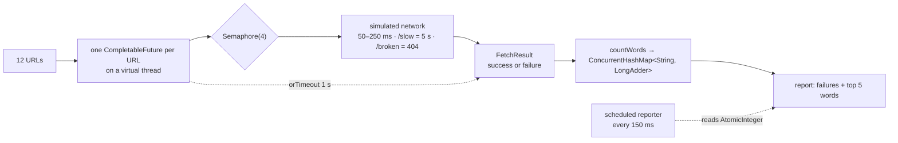

# Lesson 25: Capstone, a Concurrent Word Counter

## What you'll learn

- How to combine virtual threads, `CompletableFuture`, a `Semaphore`, `ConcurrentHashMap` with `LongAdder`, and a scheduled executor into one program
- How to design so that failures and timeouts are ordinary results, not crashes
- How to review a concurrent program by asking "what protects this state?" for every field

---

## What you're building

A program that "fetches" twelve web pages at the same time, counts the words across all of them, and prints a report. The web is simulated with a map and random delays so it runs anywhere, but the concurrency is real:

- Each page is fetched on its **own virtual thread** (Lesson 21).
- **At most 4 fetches run at once**, enforced by a `Semaphore`, the way you'd be polite to a real server (Lessons 14 and 23).
- Each fetch has a **1-second timeout** (Lesson 18).
- One page returns **404**, and one is **too slow**. Both must end up in the report, and neither may crash the run.
- Word counts go into a **`ConcurrentHashMap<String, LongAdder>`** (Lessons 12 and 15).
- A **scheduled task** prints progress while the work runs (Lesson 17).



---

## The code

`WordCounter.java`:

```java
record Page(String url, String text) {}

record FetchResult(String url, Optional<Page> page, String error) {
    static FetchResult success(Page page) {
        return new FetchResult(page.url(), Optional.of(page), null);
    }

    static FetchResult failure(String url, Throwable error) {
        Throwable cause = error instanceof CompletionException ? error.getCause() : error;
        String reason = cause.getMessage() == null ? cause.getClass().getSimpleName() : cause.getMessage();
        return new FetchResult(url, Optional.empty(), reason);
    }
}

static final Map<String, String> FAKE_WEB = Map.ofEntries(
        Map.entry("/threads", "a thread is a path of execution and every thread shares the heap"),
        Map.entry("/races", "a race happens when threads share mutable state without a lock"),
        Map.entry("/locks", "a lock gives mutual exclusion and a lock gives visibility"),
        Map.entry("/volatile", "volatile gives visibility but volatile does not give atomicity"),
        Map.entry("/executors", "an executor reuses a thread for many tasks and a pool bounds the threads"),
        Map.entry("/futures", "a future holds a result that a thread will produce later"),
        Map.entry("/atomics", "atomic classes use compare and set instead of a lock"),
        Map.entry("/collections", "a concurrent map lets every thread read without a lock"),
        Map.entry("/virtual", "a virtual thread is cheap so a thread per task is fine again"),
        Map.entry("/structured", "structured concurrency ties every subtask to a scope"));

static final int MAX_CONCURRENT_FETCHES = 4;
static final Duration FETCH_TIMEOUT = Duration.ofMillis(1_000);

final Semaphore fetchPermits = new Semaphore(MAX_CONCURRENT_FETCHES);
final ConcurrentHashMap<String, LongAdder> wordCounts = new ConcurrentHashMap<>();
final AtomicInteger completed = new AtomicInteger();

void main() {
    List<String> urls = new ArrayList<>(FAKE_WEB.keySet());
    urls.add("/broken");
    urls.add("/slow");
    Collections.sort(urls);

    long start = System.currentTimeMillis();
    List<FetchResult> results;

    try (ExecutorService fetchers = Executors.newVirtualThreadPerTaskExecutor();
         ScheduledExecutorService reporter = Executors.newSingleThreadScheduledExecutor()) {

        reporter.scheduleAtFixedRate(
                () -> IO.println("  progress: " + completed.get() + "/" + urls.size() + " pages done"),
                100, 150, TimeUnit.MILLISECONDS);

        List<CompletableFuture<FetchResult>> pending = urls.stream()
                .map(url -> CompletableFuture
                        .supplyAsync(() -> fetch(url), fetchers)
                        .orTimeout(FETCH_TIMEOUT.toMillis(), TimeUnit.MILLISECONDS)
                        .thenApply(FetchResult::success)
                        .exceptionally(error -> FetchResult.failure(url, error))
                        .whenComplete((result, error) -> completed.incrementAndGet()))
                .toList();

        results = pending.stream().map(CompletableFuture::join).toList();

        results.stream()
                .flatMap(result -> result.page().stream())
                .forEach(this::countWords);

        fetchers.shutdownNow();
    }

    printReport(results, System.currentTimeMillis() - start);
}

Page fetch(String url) {
    try {
        fetchPermits.acquire();
    } catch (InterruptedException e) {
        Thread.currentThread().interrupt();
        throw new CancellationException("interrupted while waiting for a permit");
    }
    try {
        simulateNetwork(url);
        String text = FAKE_WEB.get(url);
        if (text == null) {
            throw new IllegalStateException("404 for " + url);
        }
        return new Page(url, text);
    } finally {
        fetchPermits.release();
    }
}

void simulateNetwork(String url) {
    long latency = url.equals("/slow") ? 5_000 : ThreadLocalRandom.current().nextInt(50, 250);
    try {
        Thread.sleep(latency);
    } catch (InterruptedException e) {
        Thread.currentThread().interrupt();
        throw new CancellationException("fetch of " + url + " cancelled");
    }
}

void countWords(Page page) {
    for (String word : page.text().split("\\s+")) {
        if (word.length() > 3) {
            wordCounts.computeIfAbsent(word, key -> new LongAdder()).increment();
        }
    }
}

void printReport(List<FetchResult> results, long elapsedMillis) {
    long succeeded = results.stream().filter(result -> result.page().isPresent()).count();
    IO.println("");
    IO.println("fetched " + succeeded + "/" + results.size() + " pages in " + elapsedMillis + " ms");
    results.stream()
            .filter(result -> result.error() != null)
            .forEach(result -> IO.println("  failed " + result.url() + " -> " + result.error()));

    IO.println("top words:");
    wordCounts.entrySet().stream()
            .sorted(Comparator.comparingLong((Map.Entry<String, LongAdder> entry) -> entry.getValue().sum()).reversed()
                    .thenComparing(Map.Entry::getKey))
            .limit(5)
            .forEach(entry -> IO.println(String.format("  %-12s %d", entry.getKey(), entry.getValue().sum())));
}
```

One run (the progress lines vary, and the report doesn't):

```
  progress: 0/12 pages done
  progress: 3/12 pages done
  progress: 8/12 pages done
  progress: 10/12 pages done
  progress: 11/12 pages done
  progress: 11/12 pages done
  progress: 11/12 pages done

fetched 10/12 pages in 1043 ms
  failed /broken -> 404 for /broken
  failed /slow -> TimeoutException
top words:
  thread       7
  lock         5
  every        3
  gives        3
  threads      2
```

Twelve fetches with a limit of four at a time finished in about a second, which is the timeout on `/slow`. Every other page was done long before then. Fetched one after another, the healthy pages alone would take about 1.5 seconds, and waiting for `/slow` would add another 5.

---

## How it works

### 1. Failures are values

`FetchResult` is a record that holds either a `Page` or an error message. The `exceptionally` stage turns *any* failure (a 404, a timeout or a cancellation) into a `FetchResult.failure`. As a result:

- `pending.stream().map(CompletableFuture::join)` never throws, because every future completes normally.
- The report can list failures next to successes.
- One bad page can't hide the eleven good ones.

`FetchResult.failure` unwraps `CompletionException`, because `CompletableFuture` usually wraps the real cause (Lesson 18).

### 2. The semaphore limits the fetching, not the threads

There are twelve virtual threads, but never more than four inside `simulateNetwork`. The eight waiting in `acquire()` are unmounted and cost almost nothing (Lesson 21). The `release()` is in a `finally`, so a 404 still frees its permit. Without the `finally`, you'd get `HangingService` from Lesson 24.

The timeout clock starts when `supplyAsync` is called, **not** when the permit is acquired. Time spent waiting for a permit counts against the one-second budget. Try lowering the timeout to 300 ms and watch pages that were only *queued* start to fail. That's a real design decision in production: do you time out the whole operation, or only the network call?

### 3. Counting words without locks

```java
wordCounts.computeIfAbsent(word, key -> new LongAdder()).increment();
```

`computeIfAbsent` creates each counter exactly once, even if several threads meet the same new word at the same time (Lesson 15). `increment()` on a `LongAdder` handles contention without CAS retry storms (Lesson 12). In this version the counting happens on `main` after the fetches, but the map is ready for counting from many threads. Moving `countWords` into a `thenAccept` stage would count on the fetcher threads with no other changes.

### 4. Cleaning up

- `orTimeout` completes the `/slow` future, but its virtual thread is still sleeping (Lesson 18). `fetchers.shutdownNow()` interrupts it. `simulateNetwork` handles the interrupt properly, restoring the flag and exiting (Lesson 04), so `close()` doesn't wait for five seconds.
- The scheduled reporter is closed by try-with-resources. Resources close in reverse order, so `reporter` closes first and then `fetchers`, and the default policy drops the periodic task on shutdown (Lesson 17).

### What protects each piece of shared state?

Ask this question of every field in a concurrent program (Lesson 05). Here is the answer for this one:

| State | Shared by | Protected by |
|---|---|---|
| `FAKE_WEB` | all fetchers | Immutable (`Map.ofEntries`) |
| `fetchPermits` | all fetchers | It is itself a thread-safe synchronizer |
| `wordCounts` | counters | `ConcurrentHashMap` plus `LongAdder` |
| `completed` | callbacks and the reporter | `AtomicInteger` |
| `results` | written once by `main` | Confined to `main` |
| `Page`, `FetchResult` | passed between threads | Immutable records, safely published through `CompletableFuture` |

There are no `synchronized` blocks, no `volatile` fields and no explicit locks. Everything is either immutable, confined to one thread, or handled by a thread-safe `java.util.concurrent` class.

---

## Extensions

Try these in order. Each one practises a different lesson.

1. **Retry with backoff.** Retry a failed fetch up to twice, waiting 100 ms and then 200 ms with random jitter. Don't retry 404s. (Lessons 17 and 23)
2. **A circuit breaker per host.** Pretend URLs starting with `/s` are on a flaky host and wrap them in Lesson 23's `CircuitBreaker`.
3. **Structured version.** Rewrite `main` with `StructuredTaskScope` and `Joiner.awaitAll()` instead of `CompletableFuture`. Which version is easier to read? (Lesson 22, `--enable-preview`)
4. **Streaming pipeline.** Turn it into producer-consumer: fetchers put pages on an `ArrayBlockingQueue`, and two consumer threads count words as pages arrive. Stop them with poison pills. (Lesson 23)
5. **Request context.** Bind a `ScopedValue<String> RUN_ID` around the whole run and include it in every progress line. (Lesson 16)
6. **Stress it.** Fetch 10,000 fake pages. Do you need to change anything? Take a JSON thread dump while it runs. (Lessons 21 and 24)

---

## Check your understanding

**1. Why does `pending.stream().map(CompletableFuture::join)` never throw here, even though pages fail?**

<details>
<summary>Reveal answer</summary>

Every future has an `exceptionally` stage that turns any failure into a normal `FetchResult` value. By the time `join()` is called, every future has completed successfully, some of them with a failure *result*.

</details>

**2. Why is `fetchPermits.release()` in a `finally` block?**

<details>
<summary>Reveal answer</summary>

So that a fetch that throws, like the 404, still gives its permit back. Without it, each failure would permanently remove a permit, and after four failures every fetch would hang.

</details>

**3. The timeout is lowered to 300 ms, and some healthy pages start failing with `TimeoutException`. Why?**

<details>
<summary>Reveal answer</summary>

The timeout starts when `supplyAsync` is called, and that includes time spent waiting for a semaphore permit. With a limit of four, later pages queue behind earlier ones and use up their budget before their network call even starts.

</details>

**4. Why does the program finish in about 1 second and not 5, even though `/slow` sleeps for 5 seconds?**

<details>
<summary>Reveal answer</summary>

`orTimeout` completes that future after 1 second, and then `shutdownNow()` interrupts the virtual thread that's still sleeping. `simulateNetwork` handles the interrupt and exits, so closing the executor doesn't wait.

</details>

**5. The program has no `synchronized` and no `volatile`. How is it still thread-safe?**

<details>
<summary>Reveal answer</summary>

Every piece of shared state is either immutable (`FAKE_WEB`, the records), confined to one thread (`results`), or held in a thread-safe `java.util.concurrent` class (`Semaphore`, `ConcurrentHashMap`, `LongAdder`, `AtomicInteger`, `CompletableFuture`). Those classes provide the atomicity and the happens-before edges.

</details>

---

## Recap

- Virtual threads for one-task-per-page, a semaphore for politeness, `CompletableFuture` for timeouts and errors, and concurrent collections for results.
- Model failures as values so partial success is reported, not lost.
- Always release permits in `finally`, always handle interrupts, and always clean up stragglers.
- For every field, ask what protects it.

**Next: [Lesson 26, Final exam](../part-6-final-exam/26-final-exam.md)**
